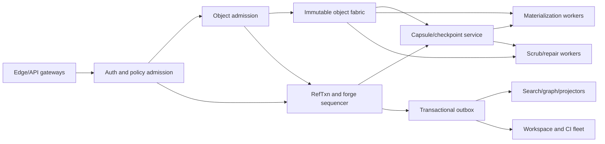
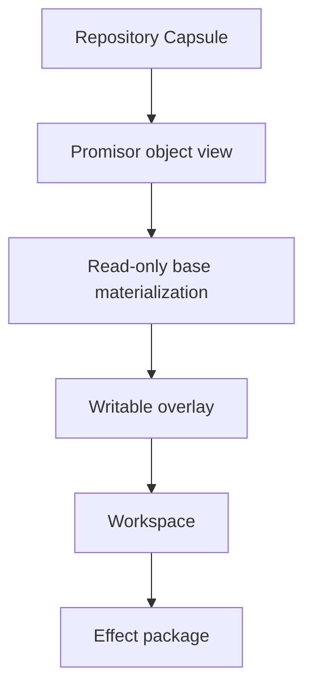

# Comprehensive Plan for the Design of FrankenGit

**Document status:** public architecture draft
**Project status:** pre-implementation
**Date:** 2026-08-19
**Primary author:** Jeffrey Emanuel, with initial synthesis and drafting assistance
**Repository:** `Dicklesworthstone/frankengit`
**Target service:** `FrankenGit.com`

---

<!-- BEGIN GENERATED TOC -->
## Table of contents

- [0. Reading contract](#0-reading-contract)
- [1. Executive conclusion](#1-executive-conclusion)
- [2. Why a new forge is justified](#2-why-a-new-forge-is-justified)
- [3. Product definition](#3-product-definition)
- [4. Scope](#4-scope)
- [5. Design constitution](#5-design-constitution)
- [6. Inheritance from the Franken family](#6-inheritance-from-the-franken-family)
- [7. Requirements](#7-requirements)
- [8. Failure, adversary, and trust model](#8-failure-adversary-and-trust-model)
- [9. System topology](#9-system-topology)
- [10. Canonical state model](#10-canonical-state-model)
- [11. Identity model](#11-identity-model)
- [12. Git object admission](#12-git-object-admission)
- [13. Immutable object fabric](#13-immutable-object-fabric)
- [14. Repository Capsule](#14-repository-capsule)
- [15. RefTxn protocol](#15-reftxn-protocol)
- [16. Parallel mutation and conflict certificates](#16-parallel-mutation-and-conflict-certificates)
- [17. Materialization plane](#17-materialization-plane)
- [18. Git transport and compatibility](#18-git-transport-and-compatibility)
- [19. Garbage collection and retention](#19-garbage-collection-and-retention)
- [20. RaptorQ permeation and repair](#20-raptorq-permeation-and-repair)
- [21. Checkpoint, backup, and recovery](#21-checkpoint-backup-and-recovery)
- [22. Replication and multi-region](#22-replication-and-multi-region)
- [23. Federation and local-first operation](#23-federation-and-local-first-operation)
- [24. Forge event model](#24-forge-event-model)
- [25. Pull requests, reviews, and merge](#25-pull-requests-reviews-and-merge)
- [26. Agent-native collaboration](#26-agent-native-collaboration)
- [27. Context Packets and repository intelligence](#27-context-packets-and-repository-intelligence)
- [28. Safe Markdown and document protocol](#28-safe-markdown-and-document-protocol)
- [29. CI, workflows, and runners](#29-ci-workflows-and-runners)
- [30. Artifacts, releases, and packages](#30-artifacts-releases-and-packages)
- [31. APIs and interfaces](#31-apis-and-interfaces)
- [32. Authorization and policy](#32-authorization-and-policy)
- [33. Statistical decision support and conformal e-processes](#33-statistical-decision-support-and-conformal-e-processes)
- [34. Observability and evidence](#34-observability-and-evidence)
- [35. Security architecture](#35-security-architecture)
- [36. Resource governance, quotas, and abuse](#36-resource-governance-quotas-and-abuse)
- [37. Operations](#37-operations)
- [38. Performance architecture](#38-performance-architecture)
- [39. Economic architecture](#39-economic-architecture)
- [40. Formal methods and deterministic simulation](#40-formal-methods-and-deterministic-simulation)
- [41. Verification and claim governance](#41-verification-and-claim-governance)
- [42. Data and protocol versioning](#42-data-and-protocol-versioning)
- [43. Prospective implementation architecture](#43-prospective-implementation-architecture)
- [44. Delivery roadmap](#44-delivery-roadmap)
- [45. Work breakdown and dependency graph](#45-work-breakdown-and-dependency-graph)
- [46. Risk register](#46-risk-register)
- [47. Open decisions and decision procedures](#47-open-decisions-and-decision-procedures)
- [48. Success metrics](#48-success-metrics)
- [49. Definition of done](#49-definition-of-done)
- [50. Immediate execution sequence](#50-immediate-execution-sequence)
- [51. References and research inputs](#51-references-and-research-inputs)
- [52. Closing position](#52-closing-position)

<!-- END GENERATED TOC -->

## 0. Reading contract

This document is a plan, not a launch announcement and not an implementation report.

The plan is intentionally detailed because a code forge is a correctness-critical distributed system whose apparent simplicity hides several different databases, consistency models, interpreters, security boundaries, and economic workloads. Starting with a thin README and “figuring it out in code” would almost guarantee accidental contracts that become expensive to remove.

### 0.1 Epistemic labels

Every material claim in this document should be read under one of these labels:

| Label | Meaning |
|---|---|
| **Fact** | Directly supported by an existing implementation, specification, or executed inspection |
| **Constraint** | A project rule that implementations must satisfy |
| **Proposal** | A concrete design that is not yet validated |
| **Hypothesis** | A prediction that requires experiment or measurement |
| **Target** | A desired result, not a measured result |
| **Open decision** | A bounded choice whose decision procedure is specified |
| **Rejected** | Considered and excluded unless new evidence changes the premise |

A proposal does not become a fact because it appears in a comprehensive document. Each critical proposal has a falsifier and an evidence path in [VERIFY_SPEC.md](VERIFY_SPEC.md).

### 0.2 Normative language

`MUST`, `MUST NOT`, `SHALL`, `SHOULD`, `SHOULD NOT`, and `MAY` are used normatively when capitalized. “Canonical” means required to recover externally observable state, not merely important. “Derived” means reconstructable from canonical state and therefore disposable.

### 0.3 Constitutional hierarchy

When documents conflict, the order is:

1. executable conformance and formalized invariants accepted by the project;
2. this comprehensive plan;
3. accepted architecture decision records;
4. `ARCHITECTURE.md`, `VERIFY_SPEC.md`, and `SECURITY_THREAT_MODEL.md`;
5. protocol schemas and generated documentation;
6. README and explanatory material;
7. implementation comments.

A discovered contradiction is a defect. Implementations MUST NOT silently choose the convenient interpretation.

---

## 1. Executive conclusion

FrankenGit should be built.

It should not be built as “GitHub, but in Rust,” and it should not be built as a novel source-control system that asks users to abandon Git. The opportunity is deeper:

> **Build a complete Git-compatible forge whose durable repository truth is immutable, compact, repairable, verifiable, and independent of any particular POSIX materialization; whose mutable names are changed through narrow serializable transactions; and whose collaboration model is native to both humans and autonomous software agents.**

The design has five mutually reinforcing pillars.

### 1.1 Git at the edge, a smaller truth at the center

Normal Git clients, object bytes, object identifiers, protocols, signatures, packs, filters, and workflows remain first-class. Internally, FrankenGit does not make a mutable bare repository directory the only durable copy of truth.

Canonical repository state consists of:

1. exact immutable Git objects;
2. immutable manifests and envelopes that locate, verify, encrypt, and repair them;
3. a committed transaction history for references;
4. event streams for forge state;
5. signed Repository Capsules that commit to recoverable roots and event positions.

Bare repositories, worktrees, pack indexes, commit graphs, search indexes, relational projections, and build directories are materializations. They can be cached on NVMe, rebuilt lazily, moved between workers, or destroyed.

### 1.2 Fine-grained mutation instead of repository-wide serialization

Object creation is immutable and naturally parallel. Reference mutation is not. FrankenGit therefore serializes the exact mutable names and invariants involved in an operation, not every operation against a repository.

A `RefTxn` carries:

- a base capsule or state epoch;
- a read set of expected reference values;
- a write set;
- required object commitments;
- policy identity;
- actor capability;
- idempotency identity;
- optional evidence requirements.

Disjoint transactions do not conflict semantically and may perform object admission, policy-independent computation, preparation, and shard-local writes in parallel. Every accepted transaction still has a precise linearization point. The G1 baseline may use a very small per-cell sequencer; physical parallel commit across disjoint ref shards is admitted only after the sharded-MVCC model proves snapshot and capsule semantics. Overlapping or invariant-linked transactions are ordered deterministically, and atomic multi-ref pushes remain atomic.

### 1.3 Repair is a normal protocol

Checksums detect corruption; replicas survive some failures; backups recover some disasters. None automatically answers whether a specific repository capsule is reconstructable now.

FrankenGit treats repair as a first-class, continuously exercised protocol:

- content and manifests are hashed;
- roots are signed where required;
- bulk objects have declared RaptorQ profiles or explicit exemptions;
- symbols are distributed across named failure domains;
- scrubbing produces addressable evidence;
- recovery drills reconstruct selected capsules from the same materials operators would use after an incident;
- `doctor` can explain, fetch, reconstruct, verify, and attest.

RaptorQ is used where fountain-code properties fit: large immutable segments, checkpoint bundles, artifacts, backups, and lossy/heterogeneous transfers. It does not replace transactional metadata replication or cryptographic integrity.

### 1.4 Agents become governed actors, not scripts with owner tokens

An autonomous agent is an identity operating under an explicit capability and budget. Each run is tied to an immutable base, objective, constraints, tool set, network and secret policy, publication authority, and evidence requirement.

FrankenGit makes cheap speculative workspaces, source-linked context packets, structured reviews, attestations, deterministic replay, and proposer/verifier separation native. Repository text is untrusted input, not an instruction channel with authority.

### 1.5 Every extraordinary claim has an evidence ladder

FrankenGit will make unusual claims about compatibility, crash behavior, repair, concurrency, agent safety, and economics. Each claim must progress through unit/property evidence, deterministic simulation, differential conformance, multi-node fault campaigns, and production canaries as appropriate.

No subsystem may use “eventual consistency,” “AI,” “erasure coding,” “zero-copy,” “lock-free,” “self-healing,” or “formally verified” as an exemption from specifying observable semantics.

---

## 2. Why a new forge is justified

### 2.1 The forge has become the operating system for software production

A modern forge controls far more than version history:

- identity and authorization;
- branch and tag policy;
- pull-request state machines;
- human and automated review;
- CI scheduling and execution;
- package publication;
- artifact retention;
- webhook fan-out;
- issue and project state;
- release provenance;
- security scanning;
- search and code intelligence;
- billing and quotas;
- automation credentials;
- organization-wide audit.

A failure can block deployment, lose accepted work, publish untrusted artifacts, expose secrets, rewrite provenance, or create a false belief that a change was reviewed.

The source-control layer and the collaboration layer therefore need a single explicit model of truth, authority, evidence, and recovery.

### 2.2 Agent workloads change the economics

Human-centric forge design assumes relatively few active branches, worktrees, review events, and builds per user. Agents invert that ratio.

A single human may sponsor dozens or hundreds of concurrent workers. Those workers may:

- search a repository repeatedly;
- create many speculative branches;
- read overlapping files;
- build similar dependency graphs;
- run overlapping tests;
- abandon most candidate changes;
- issue retries after cancellation or context loss;
- require independent verification;
- generate large logs and evidence;
- need machine-readable policy responses.

The cost bottleneck moves from human seats to active materializations, index reads, build execution, object transfer, context assembly, and coordination.

A forge designed for this workload should make:

- base state immutable and heavily shared;
- writable state sparse and copy-on-write;
- object admission deduplicated;
- context retrieval incremental and source-linked;
- cancellation exact;
- credentials narrow;
- evidence reusable;
- abandoned speculation cheap;
- publication scarce and strongly governed.

### 2.3 Existing categories each leave an opening

#### Conventional self-hosted forges

Gitea, Forgejo, GitLab, SourceHut, and related systems prove that self-hosting is valuable and that broad forge features can be open to public inspection. They also inherit substantial assumptions from a world of durable filesystem repositories, conventional application databases, and human-paced automation.

FrankenGit should learn from their compatibility and product breadth rather than dismiss them. Its reason to exist is not a prettier issue tracker. It is a different canonical storage and agent-execution substrate.

#### Large centralized forges

GitHub and GitLab demonstrate enormous ecosystem value: familiar workflows, APIs, integrations, CI, packages, security features, and network effects. FrankenGit must interoperate with those expectations and support migration.

It should not copy their internal complexity blindly. A new project can make rebuildability, signed capsules, evidence schemas, and capability-bounded agents constitutional from the beginning.

#### Local-first and peer-to-peer forges

Radicle demonstrates signed identities, Git-backed collaborative objects, peer replication, and local-first sovereignty. Those are important lessons.

FrankenGit will support offline/local-first collaboration and federation for suitable event types, while retaining strongly ordered semantics for canonical refs. Labels and comments can merge causally; a protected branch head cannot become “both values” without an explicit higher-level object describing that condition.

#### Hyperscale Git materialization systems

Cursor’s “Git at Any Scale” provides the most direct architectural catalyst. Cursor describes:

- ordinary Git repositories as disposable local materializations;
- immutable object storage as durable truth;
- a linearizable append-only log built from object-store conditional writes;
- metadata pointers in a database;
- local NVMe caching;
- repository leases and generation fencing;
- incremental Git bundles;
- reconstruction on arbitrary workers.

That is a powerful proof that ordinary Git execution and object-store durability can be separated.

FrankenGit adopts the separation and challenges several remaining constraints:

1. **Coarse leases.** Target read-only work without leases and mutations scoped to ref read/write sets.
2. **Full-repository hydration.** Make partial clone, promisor access, sparse overlays, and object paging part of the primary architecture.
3. **Single-worker mutation execution.** Permit parallel object creation and eventually parallel effect execution with deterministic conflict certificates.
4. **Durability without explicit repair semantics.** Add Merkle commitments, signed capsules, RaptorQ reconstruction profiles, scrub evidence, and recovery drills.
5. **Git-only state.** Unify repository, forge, artifact, build, and agent lineage under event-sourced, rebuildable projections.
6. **Agent ergonomics as an application concern.** Make context packets, capability scopes, budgets, and evidence first-class protocols.

This is a leapfrog only if the additional mechanisms earn their complexity under failure and cost tests.

### 2.4 The opportunity is architectural, not merely commercial

A self-hosted, agent-native, repairable forge could reduce dependence on a small number of centralized providers, preserve software history, improve reproducibility, and make powerful automation safer for small teams.

The hosted service can fund the work. The public contribution is the ability for others to run, inspect, repair, migrate, and extend the system without asking permission.

---

## 3. Product definition

### 3.1 Product promise

FrankenGit promises a path to:

- host ordinary Git repositories;
- collaborate through a modern web and API forge;
- run it locally, on-premises, in a private cloud, or as a service;
- recover accepted state from independently verifiable materials;
- understand why a mutation was accepted;
- give agents useful access without giving them ambient authority;
- scale repository serving and speculative work economically;
- export back to standard Git.

### 3.2 Primary personas

#### Individual developer

Needs a single executable, simple backup, fast local UI, SSH/HTTP access, integrated issues and CI, and no cluster expertise.

#### Small team

Needs organizations, permissions, protected branches, reviews, runners, packages, backups, and reliable upgrades at low operational cost.

#### Large enterprise

Needs SSO, SCIM, audit, compliance, retention, legal hold, network controls, tenancy isolation, regional placement, migration, and predictable SLOs.

#### Open-source project

Needs public hosting, forks, issues, contribution workflows, abuse controls, mirrors, releases, packages, provenance, and low-cost archival.

#### Human agent sponsor

Needs to create or authorize agents, assign budgets and objectives, inspect evidence, revoke access, compare candidates, and preserve accountability.

#### Autonomous coding agent

Needs bounded context, stable snapshots, sparse workspaces, deterministic tools, machine-readable policy and review, fast retries, and a publication protocol.

#### CI/build agent

Needs hermetic inputs, cache lookup, source and dependency provenance, secret scoping, cancellation, artifact upload, and reproducible attestations.

#### Operator

Needs cells with bounded blast radius, capacity controls, scrub and repair, upgrades, rollback, audit, observability, and recovery drills.

#### Auditor or incident responder

Needs immutable event history, policy snapshots, signatures, evidence roots, object lineage, secret-access records, and proof of recovery.

### 3.3 Workload classes

The system MUST model workloads explicitly:

| Class | Examples | Dominant concern |
|---|---|---|
| Metadata read | refs, permissions, PR status | latency and cacheability |
| Object read | clone, fetch, file view | bandwidth and locality |
| Object write | push, artifact upload | deduplication and durable admission |
| Ref mutation | push, merge, tag | serializability and policy |
| Forge event | comment, label, review | causal order and indexing |
| Workspace | checkout, agent edit | startup time and sparse COW |
| Build | CI, test, package | isolation, cache, provenance |
| Search/graph | code query, impact | freshness, relevance, attribution |
| Repair | scrub, reconstruct, migrate | correctness and bounded load |
| Archive | release, legal hold | retention and independent recovery |
| Agent orchestration | intent, tools, evidence | capability and budget enforcement |

### 3.4 Scale envelopes

The architecture should not assume one deployment scale. Initial envelopes:

| Profile | Repositories | Active ops/s | Canonical bytes | Concurrent workspaces |
|---|---:|---:|---:|---:|
| Personal | 1–1,000 | 10 | 10 TB | 20 |
| Team | 1,000–100,000 | 1,000 | 1 PB | 5,000 |
| Hosted cell | 10,000–1,000,000 | 10,000 | 10 PB | 50,000 |
| Global service | millions | 100,000+ | exabytes over time | 1,000,000+ |

These are topology stress targets, not v1 capacity promises. The cell design must scale horizontally without requiring one global repository sequencer.

---

## 4. Scope

### 4.1 v1 functional scope

A useful v1 MUST include:

1. repository creation/import/export;
2. SSH and smart HTTP Git access;
3. protocol v2 clone/fetch/push;
4. branch/tag listing and atomic ref updates;
5. users, organizations, teams, tokens, deploy keys;
6. protected refs and policy snapshots;
7. pull requests, reviews, comments, labels, merge;
8. issues and discussions;
9. webhooks and an event API;
10. safe Markdown rendering;
11. basic lexical and symbol search;
12. CI workflow execution with artifact and cache support;
13. agent identities, Intent Runs, workspaces, and evidence bundles;
14. backup, capsule export, scrub, verify, and restore;
15. single-node and object-store-backed deployment;
16. GitHub import and a documented compatibility matrix.

### 4.2 Subsequent scope

- packages and container registry;
- advanced semantic and graph search;
- merge queue and stacked changes;
- organization-wide provenance and dependency analysis;
- offline/local-first issue/review replication;
- federation and mirrors;
- multi-region durability and read serving;
- managed elastic runners;
- advanced e-process gates;
- GitHub Actions compatibility expansion;
- enterprise identity and compliance;
- migration at very large scale.

### 4.3 Non-goals

The following are rejected for the initial architecture:

- replacing Git objects with a proprietary object graph;
- making every forge event strongly globally ordered;
- using a network filesystem as canonical repository storage;
- storing every blob as an independent object-store request without aggregation;
- requiring a Kubernetes cluster for small deployments;
- requiring an external vector database, graph database, search cluster, queue, and cache merely to run one node;
- permitting arbitrary repository hooks in the truth-plane process;
- automatic protected-branch publication based only on a model score;
- cross-region active-active ref mutation before single-home semantics are proved;
- opaque “self-healing” that mutates canonical state without a repair record;
- a universal agent token;
- compatibility claims based on happy-path clone/push alone.

---

## 5. Design constitution

### 5.1 Canonical state must be small and explicit

A byte or record is canonical only when external state cannot be recovered without it. Canonical categories are enumerated and versioned. Everything else has a rebuild recipe.

### 5.2 Immutable data first

Objects, manifests, events, attestations, evidence, and capsules are immutable. Mutable views are pointers into immutable history or projections with replaceable generations.

### 5.3 Mutation is transactional and idempotent

Every externally visible mutation has:

- an identity;
- preconditions;
- authorization and policy version;
- durability profile;
- result;
- retry semantics;
- audit event.

“At least once request” must produce “exactly once effect.”

### 5.4 No ambient authority

A process, agent, runner, plugin, and webhook receives only the capabilities needed for its scope and duration. Repository membership is not equivalent to secret access or publication authority.

### 5.5 Cancellation is a protocol

Every operation declares child tasks, cleanup obligations, commit boundaries, and what cancellation means before and after those boundaries. No detached work may outlive its owning region without an explicit supervised service identity.

### 5.6 Derived state may fail open; canonical state fails closed

Search can be stale and report staleness. A UI count can be rebuilt. A ref update cannot guess.

### 5.7 Statistical systems advise; deterministic mechanisms decide truth

E-processes, risk models, embeddings, and agents cannot alter object identity, transaction preconditions, signature validity, or durability acknowledgements.

### 5.8 Repairability must be executed

A repair format is not accepted until tests remove or corrupt source material, reconstruct it from admitted recovery material, verify the result, and record resource bounds.

### 5.9 Compatibility is observed behavior

FrankenGit compares behavior with supported Git versions and clients. It does not define compatibility as “we use the same file extension.”

### 5.10 Honest degradation

If a configured durability, policy, or verification level cannot be met, the operation refuses with a typed reason. No hidden downgrade.

### 5.11 Economic claims include operations

A design that reduces storage but doubles operator burden may be a loss. Benchmarks include compute, storage, transfer, tail latency, recovery time, and human operational work.

### 5.12 Escape is always possible

Repository content and history can be exported to standard Git. Forge events and evidence have documented, versioned export formats. Hosted-only metadata cannot be required to read source history.

### 5.13 Complexity must be paid for

Every subsystem needs:

- owner;
- failure modes;
- metrics;
- test strategy;
- capacity model;
- migration path;
- removal condition.

---

## 6. Inheritance from the Franken family

FrankenGit is not a monorepo merge of sibling projects. It will consume stable crates where appropriate, copy no proprietary material without permission, and reimplement only when the boundary or performance demands it.

### 6.1 Asupersync

**Inherited concepts**

- structured concurrency regions;
- typed `Outcome` semantics;
- capability-bearing operation contexts;
- cancellation and quiescence protocols;
- obligations and cleanup tracking;
- deterministic scheduler, clock, RNG, and fault simulation;
- evidence and decision modules;
- RaptorQ transport and adaptation;
- bounded resources and backpressure;
- conformance harnesses.

**FrankenGit use**

- request, push, workspace, CI, agent-run, and repair scopes;
- supervised services;
- cancellation-safe subprocess and upload handling;
- capability propagation;
- deterministic network/storage fault campaigns;
- adaptive transfer;
- evidence collection.

**Boundary**

Asupersync does not determine repository semantics. FrankenGit’s truth protocol sits above it and is specified independently.

### 6.2 FrankenSQLite

**Inherited concepts**

- pure-Rust transactional storage;
- MVCC and snapshot discipline;
- WAL and recovery invariants;
- exactly-once effect under retried promises;
- fail-closed corruption handling;
- repair-aware byte paths;
- explicit critical-invariant documents;
- RaptorQ permeation map and typed encoded objects;
- conformance against a reference implementation;
- strict unsafe and dependency policy.

**FrankenGit use**

- single-node metadata and projections;
- local agent/runner state;
- transaction and migration patterns;
- durable queue/outbox patterns;
- repair and verification tooling;
- implementation discipline.

**Boundary**

FrankenSQLite alone does not provide the distributed linearizable RefTxn service. A replicated or conditional-write protocol remains necessary.

### 6.3 FrankenFS

**Inherited concepts**

- immutable content-addressed blocks;
- snapshots and copy-on-write;
- journals, MVCC, and versioned state;
- signed roots and continuity;
- deterministic crash replay;
- repair and doctor tooling;
- FUSE/materialization surfaces;
- resource quotas and backpressure;
- conflict prediction and expected-loss decisions;
- local-first synchronization.

**FrankenGit use**

- sparse workspace overlays;
- immutable build inputs;
- local materialization cache;
- signed snapshot continuity;
- scrub and repair UX;
- offline operation.

**Boundary**

Filesystem conflict resolution cannot define Git ref truth. Ref conflicts remain explicit source-control events.

### 6.4 FrankenSearch

**Inherited concepts**

- lexical, fuzzy, structural, semantic, and metadata retrieval;
- evidence fusion;
- query planning and bounded promotion;
- source-linked answer windows;
- diversity and deduplication;
- tiered indexes and durable generations;
- active learning and calibration;
- agentic retrieval with budgets;
- e-process canary gates.

**FrankenGit use**

- code, issue, review, commit, artifact, and documentation search;
- Context Packets;
- reviewer and owner discovery;
- impact analysis inputs;
- index-generation canaries.

**Boundary**

Search indexes are projections. Search results never establish authorization or canonical object existence without truth-plane verification.

### 6.5 Franken Markdown

**Inherited concepts**

- deterministic CommonMark/GFM parsing;
- human, agent, and compact output profiles;
- AST and source maps;
- safe HTML and URL handling;
- UTF-8, recursion, node, regex, and resource limits;
- structured extraction of headings, code, links, metadata, and summaries;
- versioned schemas;
- fail-open/fail-closed plugin policies.

**FrankenGit use**

- README, issue, PR, review, release, and documentation rendering;
- machine-readable document views;
- source-mapped comments;
- safe untrusted content;
- bounded agent context.

**Boundary**

Rendering is presentation. Original source bytes and event records remain canonical.

### 6.6 FrankenGraphDB

**Inherited concepts**

- event-sourced causal state;
- HLC and sparse causal metadata;
- canonical encoding and content hashing;
- append-only segments and Merkle footers;
- content-addressed staging;
- writer manifests;
- root-last checkpoints;
- deterministic reconstruction;
- graph projections;
- calibration/e-process modules;
- evidence and claim registries;
- named unsafe boundaries;
- spec-first crate admission.

**FrankenGit use**

- forge event streams;
- dependency, ownership, provenance, review, artifact, and agent-lineage graphs;
- checkpoint/capsule mechanics;
- causal offline events;
- evidence registries;
- repository-cell reconstruction.

**Boundary**

The Git object graph remains Git. FrankenGraphDB projections add queryability and lineage without replacing Git identifiers.

### 6.7 Mechanism placement matrix

| Mechanism | Correct job | Forbidden misuse |
|---|---|---|
| Git OID | external object identity and compatibility | hidden replacement with BLAKE3 |
| BLAKE3 | internal payload/manifest digest and fast verification | claiming Git-client identity |
| Signature | authenticity and authorization evidence | corruption repair |
| Merkle root | compact set/segment commitment | ordering mutable refs |
| RefTxn | serializable ref mutation | bulk blob storage |
| Event stream | immutable forge history | arbitrary global serialization |
| Repository Capsule | recoverable root/checkpoint | containing every byte inline |
| RaptorQ | erasure repair and flexible transfer | authentication or tiny metadata replication |
| Replication | low-latency availability | proof that backups recover |
| Backup/archive | disaster and retention recovery | hot serving alone |
| E-process | anytime-valid drift/anomaly evidence | correctness or guilt |
| ML/ranking | prioritization and retrieval | authority |
| CRDT/causal merge | suitable offline social state | protected branch heads |
| NVMe cache | fast disposable materialization | sole durable copy |
| Object store | durable immutable bytes/manifests | assuming identical semantics across vendors |
| FrankenSQLite | local transactional state/projections | magical distributed consensus |
| Asupersync | execution and cancellation discipline | repository semantics |

---

## 7. Requirements

### 7.1 Correctness requirements

C1. An acknowledged RefTxn MUST survive every failure included in its selected durability profile.

C2. A retry with the same idempotency identity MUST return the same committed result or the same terminal refusal.

C3. No two committed capsules may claim incompatible values for the same serialized ref position.

C4. Every ref target MUST refer to admitted objects whose reachability requirements are satisfied under policy.

C5. Atomic multi-ref updates MUST be externally all-or-nothing.

C6. Policy evaluation MUST be pinned to a content-addressed policy snapshot.

C7. A derived projection MUST expose its source capsule/event watermark.

C8. Canonical corruption MUST produce a typed refusal or repair workflow, never silent substitution.

C9. Import/export MUST preserve exact supported Git-visible object semantics.

C10. Garbage collection MUST never delete an object retained by any live ref, retention root, legal hold, capsule horizon, in-flight admitted transaction, or configured safety window.

### 7.2 Availability requirements

A1. Read-only operations SHOULD continue from verified snapshots during brief sequencer unavailability.

A2. Loss of a materialization worker MUST NOT lose canonical data.

A3. Loss of an entire cache generation MUST be recoverable by deterministic rebuild.

A4. Repair work MUST be rate-limited and preemptible so it cannot starve foreground repository operations.

A5. Cell failure MUST have a tested failover and restore path.

### 7.3 Security requirements

S1. Every mutation MUST identify an authenticated actor and effective capability.

S2. Agents and runners MUST use short-lived, scope-bound credentials.

S3. Secret access MUST be explicit, audited, and unavailable to untrusted fork workflows by default.

S4. Repository content MUST be treated as untrusted data in agent contexts.

S5. Untrusted code MUST execute outside truth-plane processes.

S6. Cross-tenant deduplication MUST NOT create a content-existence oracle.

S7. Encryption domains and deduplication domains MUST be explicit.

S8. Supply-chain provenance MUST cover server, runner, client, and migration binaries.

### 7.4 Operability requirements

O1. Every canonical format MUST have version, validator, migration, and rollback policy.

O2. Every background controller MUST expose queue depth, age, budget, failure, and cancellation state.

O3. Operators MUST be able to inspect a repository capsule without mounting a Git repository.

O4. Backup and restore MUST use the same public verification code as normal recovery.

O5. Capacity exhaustion MUST refuse work predictably before corrupting state.

O6. Upgrades MUST be staged by cell and support mixed-version protocol windows where declared.

### 7.5 Agent requirements

G1. An Intent Run MUST be reproducibly bound to a base capsule.

G2. Tool, network, secret, compute, token, and publication budgets MUST be enforceable independently.

G3. Every agent-authored mutation MUST preserve sponsor and agent identity.

G4. Agent evidence MUST distinguish observed facts, executed results, inferences, and unresolved assumptions.

G5. Independent verification policies MUST be able to prohibit the proposer from satisfying its own verifier requirement.

G6. Cancellation MUST revoke or expire capabilities and reconcile all obligations.

G7. Context Packets MUST include source locations and freshness.

G8. An agent MUST be able to operate without parsing a visual web page.

### 7.6 Economic requirements

E1. Small deployments MUST not require a fleet of external services.

E2. Hosted storage amplification MUST be measurable per repository and tenant.

E3. Object-store request count MUST be controlled through segment aggregation and indexes.

E4. Cold repositories SHOULD consume near-canonical storage plus configured repair/replication overhead, not persistent full worktrees.

E5. Speculative branches and workspaces SHOULD share immutable bases and deduplicate objects.

E6. Cost attribution MUST include storage, requests, compute, transfer, CI, search, and repair.

E7. A feature whose cost cannot be metered SHOULD NOT be sold as “unlimited.”

---

## 8. Failure, adversary, and trust model

### 8.1 Failure classes

FrankenGit assumes:

- process crash at any instruction boundary;
- machine loss;
- disk and memory corruption;
- partial writes and torn local state;
- object-store timeout, duplicate response, stale proxy, throttling, and partial regional outage;
- packet loss, duplication, delay, reorder, partition, and asymmetric reachability;
- clock skew and rollback;
- cancellation during every protocol phase;
- out-of-order event delivery;
- worker reuse after stale lease/capability;
- cache eviction and generation loss;
- failed upgrade and schema mismatch;
- operator error;
- backup incompleteness;
- malicious or buggy clients;
- compromised agent or runner;
- dependency and build compromise;
- denial-of-service and resource exhaustion.

### 8.2 Trust boundaries

1. **Client boundary:** Git clients, browsers, CLIs, bots, and agents are untrusted inputs.
2. **Gateway boundary:** admission authenticates and normalizes but cannot invent truth.
3. **Truth boundary:** canonical mutation code has the smallest dependency and capability set.
4. **Materialization boundary:** Git subprocesses and worktrees may process malicious repositories.
5. **Runner boundary:** user code is hostile.
6. **Intelligence boundary:** models, embeddings, parsers, and retrieved text may be wrong or adversarial.
7. **Object-store boundary:** storage may fail or return incorrect bytes; hashes verify content.
8. **Operator boundary:** privileged actions are authenticated, dual-controlled where appropriate, and logged.
9. **Tenant boundary:** names, keys, deduplication, caches, metrics, and billing cannot leak across tenants.
10. **Federation boundary:** remote peers are independently administered and may equivocate.

### 8.3 Trust minimization

The truth plane should not need to trust:

- search relevance;
- graph completeness;
- CI success labels without attestations;
- materialized Git directory health;
- wall-clock ordering alone;
- an agent’s prose;
- object-store ETags as cryptographic identity;
- RaptorQ repair symbols without digest verification;
- a cache’s claim of completeness;
- a webhook receiver;
- a remote federation peer beyond signed records and local policy.


---

## 9. System topology

### 9.1 Repository Cells

A **Repository Cell** is the unit of canonical ownership, failure isolation, capacity planning, upgrade, and evacuation.

A cell owns a partition of repository IDs and contains logical roles:



Logical roles need not be separate processes in a personal deployment. One binary may host all roles against local storage. In a hosted cell they may scale independently.

### 9.2 Cell invariants

- Each repository has exactly one authoritative home cell for ref mutation at a time.
- Cell assignment is canonical metadata, changed through a fenced relocation protocol.
- A cell MUST be able to reconstruct its repository truth from declared durable stores and checkpoints without relying on materialization disks.
- Global services MUST NOT bypass the cell’s canonical mutation interface.
- A cell’s failure MUST NOT prevent unrelated cells from serving or committing.
- Cell capacity and repair debt MUST be observable before admission.
- Cross-cell moves use source and destination capsule handoff, not directory copy as truth.

### 9.3 Global services

Global or regional services may include:

- identity and organization directory;
- repository routing directory;
- public key and policy distribution;
- billing and quota aggregation;
- global object CDN;
- notification and webhook delivery;
- global search federation;
- package registry routing;
- public discovery;
- audit export.

Global services consume signed/canonical cell outputs. A global index may be stale. It cannot advance a branch.

### 9.4 Personal topology

The personal profile combines:

- embedded HTTP/SSH server;
- local FrankenSQLite metadata;
- filesystem or S3-compatible object backend;
- in-process sequencer;
- local capsule log;
- local materializer;
- built-in search;
- local runner.

The on-disk directory is documented and backupable. A user can export a capsule and ordinary Git repository without a running control plane.

### 9.5 Hosted topology

Hosted FrankenGit.com uses:

- globally distributed edge termination;
- regional identity and policy caches;
- repository-home routing;
- many cells per region;
- disaggregated object storage;
- retained local NVMe pools for hot materializations;
- elastic workspace and CI workers;
- regional search/graph projectors;
- cross-region capsule and repair placement;
- a separate administrative plane with dual-control operations.

Cells are intentionally boring units. Global cleverness must not create one global failure mode.

---

## 10. Canonical state model

### 10.1 Canonical categories

The complete canonical state for a repository is the union of:

1. **Git object corpus**
   - exact Git object bytes;
   - Git object format;
   - object admission records;
   - internal envelopes and segment manifests.

2. **Repository commit history**
   - admitted RefTxn and forge-command intents;
   - atomic Repository Commit Records containing ref deltas and/or canonical event batches;
   - ref-state roots and aggregate-version roots;
   - transaction results and permanent idempotency map;
   - exact policy/evidence/durability receipts.

3. **Forge streams**
   - repository settings;
   - pull requests and reviews;
   - issues, comments, labels, milestones, and projects;
   - teams and repository-scoped permissions;
   - webhooks and delivery intents;
   - releases, artifacts, packages, and retention;
   - CI workflow and run records;
   - agent Intent Runs and evidence;
   - audit events.

4. **Recovery roots**
   - Repository Capsules;
   - segment/checkpoint manifests;
   - encryption and key-version references;
   - RaptorQ object transmission information;
   - signatures;
   - legal hold and retention roots.

5. **Routing and tenancy**
   - repository stable ID;
   - tenant/encryption/dedup domain;
   - home cell and relocation epoch;
   - billing attribution;
   - deletion state.

### 10.2 Derived categories

Derived state includes:

- local bare repositories;
- loose-object and pack layouts;
- pack indexes;
- commit graphs and bitmaps;
- worktrees and overlays;
- diff caches;
- file-view caches;
- relational tables projected from events;
- search, vector, symbol, and graph indexes;
- notification inbox views;
- aggregate counters;
- dashboards;
- CI cache indexes;
- CDN copies;
- RaptorQ repair symbols that can be regenerated when placement policy allows, unless a durability profile explicitly counts them as required recovery material.

A derived object MUST declare its source roots and rebuild procedure.

### 10.3 Canonical event rules

Canonical events are:

- immutable;
- canonically encoded;
- versioned;
- content-addressed;
- attributable to an actor/service;
- ordered within the stream scope that needs order;
- linked to prior stream position or checkpoint;
- idempotently appendable;
- validated before commit.

Events MUST NOT embed nondeterministic serialization, process-local identifiers, or unverifiable wall-clock claims.

Canonical event bytes are sealed before admission, but a repository-local event becomes admitted only through an atomic `RepositoryCommitRecord`. The same record may contain a ref delta and an event batch, allowing operations such as pull-request merge to commit the protected-ref movement and `MergeCommitted` event as one logical state transition. Per-aggregate stream indexes and physical event segments may be built or compacted later; their canonical order and identities are recoverable from commit records.

### 10.4 Hybrid logical clocks

HLC timestamps provide useful causal metadata and total-order tie-breaking for forge events. They do not establish authorization or replace sequencer order.

Each event includes:

- physical component clamped by policy;
- logical counter;
- writer identity;
- stream sequence or causal parent set.

Clock anomalies are recorded. A client’s HLC is advisory until admitted.

### 10.5 Stream scopes

Different data needs different order:

| State | Ordering model |
|---|---|
| Ref mutation | serializable per declared ref/invariant set |
| Repository settings/policy | totally ordered per repository |
| PR lifecycle | ordered per PR with references to repository/ref state |
| Review/comment | causal per object; deterministic merge for concurrent social events |
| Issue labels | causal add/remove semantics with policy |
| CI run | ordered per run; jobs form a DAG |
| Artifact publication | transactional name/version claim |
| Notifications | derived, at-least-once delivery |
| Audit | append-only per authority domain plus signed checkpoints |
| Global search | eventual projection |

A single deployment-global sequence is rejected. It would create unnecessary coordination and a global availability dependency. Each `RepositoryCommitRecord.commit_position` is ordered only within its declared authority domain. Cross-domain causality uses immutable references; cross-domain atomicity requires an explicit admitted coordinator and is not inferred from timestamps.

### 10.6 Canonical encodings

Canonical structures use a versioned deterministic encoding, initially canonical CBOR with an independently implemented validator and golden corpus.

Requirements:

- maps have canonical key order;
- integers use the shortest valid form;
- floats are forbidden in truth-plane schemas unless a format defines canonical bit representation and semantics;
- strings are UTF-8 and normalization policy is field-specific;
- unknown required fields fail;
- unknown optional extension fields are preserved or rejected according to schema;
- hashes include domain separation and schema version;
- signatures bind purpose, tenant/repository scope, and expiration where relevant.

JSON is an API representation, not the hashed canonical representation.

---

## 11. Identity model

### 11.1 Stable repository identity

Repository names and paths are mutable aliases. A repository receives a random, stable 128- or 256-bit `RepositoryId` at creation/import.

All canonical records bind to:

- tenant ID;
- repository ID;
- repository incarnation;
- cell epoch.

Deletion and recreation under the same human-readable name produce a new incarnation so stale references cannot revive old state.

### 11.2 Object identities

FrankenGit maintains distinct identities deliberately.

#### Git object ID

The Git OID is computed exactly under the repository’s object format:

- SHA-1 for SHA-1 repositories;
- SHA-256 for SHA-256 repositories;
- compatibility mappings where supported by Git’s transition rules.

This is the externally visible identity.

#### Payload digest

`PayloadDigest = BLAKE3(domain || exact_git_object_bytes)`

This provides fast internal verification and a modern digest independent of Git’s transition state.

#### Envelope ID

`EnvelopeId = BLAKE3(domain || canonical_envelope_without_id)`

The envelope binds object identity, payload digest, codec, length, storage manifest, encryption domain, and provenance.

#### Segment ID

`SegmentId = BLAKE3(domain || canonical_segment_manifest)`

#### Event ID

`EventId = BLAKE3(domain || canonical_event)`

#### Transaction ID

`TxnId = BLAKE3(domain || canonical_reftxn_intent)`

#### Capsule ID

`CapsuleId = BLAKE3(domain || canonical_capsule)`

No interface may accept an untyped hash string where multiple identity kinds are possible.

### 11.3 SHA-1 safety

For SHA-1 repositories:

- object parsing and hashing use a collision-detecting SHA-1 implementation compatible with Git expectations;
- suspicious collision patterns fail admission;
- the exact SHA-1 OID remains visible;
- BLAKE3 payload digests provide an additional internal commitment;
- optional SHA-256 compatibility mappings follow Git’s documented transition format;
- signatures and Franken envelopes SHOULD bind a stronger digest.

FrankenGit must not claim that adding BLAKE3 invisibly upgrades historical Git signatures. It adds independent evidence.

### 11.4 Actor identities

Actor kinds:

- human;
- service;
- agent;
- runner;
- deploy key;
- federation peer;
- operator;
- migration tool.

An event records both the immediate actor and sponsorship/delegation chain.

Example:

```text
human sponsor
  -> agent registration
      -> IntentRun capability
          -> workspace service capability
              -> RefTxn proposal
```

Each link has scope, expiry, issuer, and revocation semantics.

### 11.5 Key rotation and continuity

Identities may rotate keys without changing identity by publishing a signed continuity record under policy. Recovery keys and administrative rotation require stronger thresholds.

Deleted or revoked keys remain referenced by historical signatures. Verification resolves keys at the event’s policy epoch, not merely current state.

---

## 12. Git object admission

### 12.1 Admission pipeline

Incoming objects enter quarantine.

```mermaid
flowchart LR
    RX[Receive pack/upload]
    Q[Quarantine bytes]
    PARSE[Parse and inflate]
    OID[Verify Git OID]
    SAFE[Collision and structural checks]
    REACH[Connectivity/reachability]
    ENV[Build Franken envelopes]
    SEG[Aggregate into segments]
    DUR[Durability placement]
    CAT[Publish object catalog]
    REF[Eligible for RefTxn]

    RX --> Q --> PARSE --> OID --> SAFE --> REACH --> ENV --> SEG --> DUR --> CAT --> REF
```



No ref may point to an object that has not reached the required admission state.

### 12.2 Parsing rules

Admission validates:

- pack framing, version, counts, checksums;
- delta base existence and cycle/expansion bounds;
- zlib/resource limits;
- object header and length;
- tree entry ordering, mode, and path rules under the selected compatibility profile;
- commit and tag references;
- object-format consistency;
- excessive nesting and adversarial compression;
- maximum declared sizes and tenant policy;
- collision detection.

Compatibility sometimes requires preserving unusual but historically accepted objects. The parser therefore has profiles:

- `strict-create`: new FrankenGit-generated objects;
- `git-compatible-import`: objects accepted by supported reference Git versions;
- `forensic-readonly`: quarantined inspection without making refs eligible.

Rejected bytes remain in a bounded quarantine only if policy requires forensic retention.

### 12.3 Reachability admission

A push need not make every uploaded object reachable immediately, but a ref update must prove required connectivity.

The admission service computes:

- newly introduced objects;
- known object membership;
- referenced parents/trees;
- thin-pack requirements;
- policy-sensitive object types/sizes;
- required reachable closure or a verified connectivity certificate.

For enormous pushes, closure checks use segment indexes, bitmaps, commit graphs, and cached reachability certificates pinned to capsule/object roots.

### 12.4 Object catalog

The catalog maps typed Git OIDs to one or more verified placements:

```text
ObjectCatalogEntry {
    repository_or_dedup_domain
    object_format
    git_oid
    payload_digest
    object_type
    length
    placements[]
    admission_state
    first_seen_event
    retention_class
}
```

Catalog metadata is canonical only to the extent needed to locate durable content. Rebuildable accelerators are separate.

### 12.5 Cross-repository deduplication

Deduplication levels:

1. none;
2. within repository;
3. within tenant;
4. within explicit shared object pool/fork network;
5. global public-object domain.

Private cross-tenant deduplication is disabled by default because it can create existence, timing, billing, and deletion side channels.

Encryption and dedup domains align. A ciphertext copied across incompatible key domains is not considered a valid placement.

### 12.6 Segment construction

Individual Git objects may be too small for economical object-store requests and RaptorQ coding. The segmenter groups immutable admitted objects according to:

- tenant/encryption/dedup domain;
- repository or shared pool;
- object format;
- size class;
- access temperature;
- retention class;
- creation horizon;
- codec;
- maximum segment and index size.

A segment contains:

- header and version;
- ordered object records;
- per-record offset, type, length, Git OID, payload digest;
- optional compression dictionary identity;
- index;
- Merkle tree/root;
- segment digest;
- RaptorQ profile/OTI if encoded;
- footer and signatures where required.

Segmenting is deterministic for a given manifest policy or records the exact nondeterministic packing decision as canonical manifest data.

### 12.7 Small-object lane

Latency-sensitive small writes may first land in an immutable microsegment or append-safe staging object. They become visible only after the staging object is durably committed and catalogued.

Compaction creates new segments without changing Git object identity. Old placements remain until retention and capsule safety permit deletion.

### 12.8 Large blobs and LFS

Large Git blobs are supported, but policy can recommend or require LFS-compatible pointer objects. FrankenGit’s artifact/object fabric can serve LFS objects with the same integrity and repair contracts.

A large blob is never silently rewritten into an LFS pointer because that changes Git history.

---

## 13. Immutable object fabric

### 13.1 Storage interface

The object fabric is defined by behavior, not vendor name.

Required primitive classes:

- immutable put-if-absent;
- read by immutable key/range;
- list or manifest discovery that is not required for correctness;
- metadata/head;
- deletion with generation precondition where supported;
- retention/object lock where configured;
- conditional pointer update or an external linearizable metadata service;
- explicit consistency capability report.

Backends may include:

- local filesystem;
- S3;
- S3-compatible stores;
- Azure Blob;
- Google Cloud Storage;
- on-premises object systems;
- FrankenFS;
- test/fault backend.

The backend adapter must declare which semantics it actually satisfies. “S3-compatible” is not a proof of conditional linearizability.

### 13.2 Object keys

Keys are content-derived and partition-friendly:

```text
/v1/{domain}/{kind}/{digest-prefix}/{digest}
```

Mutable human names never become object keys.

### 13.3 Placement records

A placement binds:

- object/segment ID;
- backend;
- bucket/container;
- key;
- region;
- failure domain;
- encryption key version;
- storage class;
- byte range if packed;
- created epoch;
- verification state.

A placement is admitted only after read-after-write verification appropriate to the backend and durability profile.

### 13.4 Encryption

- TLS in transit.
- Envelope encryption at rest.
- Per-tenant or policy-selected key domains.
- Key IDs in manifests, never raw keys.
- Short-lived decrypt capabilities.
- Optional customer-managed keys.
- Key rotation by rewrapping or controlled re-encryption.
- Recovery procedures include key availability tests.
- Deleted keys are treated as destructive deletion and require equivalent controls.

Convergent encryption across private tenants is rejected by default.

### 13.5 Immutability and retention

Content keys are immutable. A conflicting put under an existing digest key is a critical integrity incident.

Retention classes:

- transient quarantine;
- ordinary repository;
- branch safety window;
- release;
- archive;
- legal hold;
- evidence/audit;
- tombstoned pending GC.

Backend object lock may supplement, not replace, canonical retention roots.

### 13.6 Tiering

Hotness affects placement, not identity:

- hot: NVMe/cache and standard object storage;
- warm: object storage with normal retrieval;
- cold: lower-cost storage plus manifest/index;
- archive: immutable retention with tested restore;
- repair: parity/symbol placements.

A policy cannot move the last recoverable source below its acknowledgement contract without creating and verifying replacement recovery material.

### 13.7 Integrity verification

Read path:

1. locate an admitted placement;
2. fetch bytes/range;
3. verify storage framing;
4. verify record digest;
5. verify Git OID when returning a Git object;
6. optionally verify Merkle proof to segment root;
7. record placement health.

Cache bytes are untrusted until digest verification or admission under a verified cache extent.

### 13.8 Corruption handling

- Mark the placement suspect.
- Do not mark the logical object corrupt if another verified placement exists.
- Serve from a healthy placement.
- enqueue bounded repair;
- reconstruct or copy;
- verify;
- atomically add replacement placement;
- quarantine/delete the bad placement under policy;
- emit repair evidence.

If no recoverable placement exists, canonical reads fail with an explicit `ObjectUnavailable`/`RecoveryInsufficient` outcome and incident state.

---

## 14. Repository Capsule

### 14.1 Purpose

The Repository Capsule is the common unit for:

- stable snapshot identity;
- workspace base;
- backup;
- replication;
- recovery;
- audit;
- migration;
- search/graph watermark;
- agent context freshness;
- retention.

### 14.2 Capsule schema

Proposed canonical schema:

```text
RepositoryCapsuleV1 {
    repository_id
    incarnation
    cell_epoch
    capsule_sequence
    previous_capsule_id?
    ref_state_root
    ref_txn_log_position
    object_manifest_roots[]
    forge_stream_positions{}
    forge_checkpoint_roots{}
    policy_snapshot_id
    retention_root
    encryption_domain
    durability_profile
    placement_summary_root
    created_hlc
    producer_version
    signer_policy
    signatures[]
}
```

The capsule has an unsigned canonical body and a signature envelope. `CapsuleId` is the domain-separated digest of the canonical body **excluding** `signatures[]`; each signature authenticates that ID plus its signer role and policy context. This avoids circular identity and prevents a second valid signature encoding from creating a different repository snapshot.

`placement_summary_root` binds the immutable durability acknowledgement witness used when the capsule was committed. It is not the live placement map. Current placements, scrub status, and repaired replicas/symbols evolve in a separately authenticated operational manifest while preserving the capsule's required durability profile. Verification compares current recoverability with the historical witness.

`created_hlc` is audit metadata produced by the commit authority. It does not order transactions, settle conflicts, or override `capsule_sequence` and `ref_txn_log_position`; untrusted client clocks never enter canonical ordering.

### 14.3 Root-last publication

Capsule creation follows root-last discipline:

1. all referenced immutable objects/manifests/checkpoints are written;
2. their digests and placements are verified;
3. a candidate capsule is constructed;
4. invariants and reachability policy are checked;
5. signatures are produced;
6. the immutable capsule is written;
7. the current-capsule pointer advances conditionally;
8. the prior capsule remains valid.

A current pointer never references unwritten children.

### 14.4 Capsule frequency

Not every social event must produce a full repository capsule synchronously. There are:

- **ref capsules**, created for committed ref state;
- **forge checkpoints**, created by stream thresholds/time;
- **composite capsules**, binding both for backup/recovery;
- **release capsules**, explicit immutable milestones.

Workspace and source operations pin to a ref capsule plus required forge checkpoint positions.

### 14.5 Verification

`frankengit capsule verify` supports levels:

- metadata: hashes, signatures, sequence, manifest existence;
- sampled: deterministic sample of objects/placements;
- full: all referenced source bytes;
- reconstruction: remove selected placements and decode/copy from recovery material;
- export: materialize ordinary Git and run reference `git fsck`;
- application: rebuild forge projections and compare checkpoint roots.

Verification output is a signed/hashed evidence record.

### 14.6 Capsule pinning

Pins protect state from GC:

- open pull request;
- active workspace;
- active Intent Run;
- in-flight build;
- release;
- legal hold;
- backup horizon;
- operator incident hold;
- migration;
- policy safety window.

Pins have owners and expiry/reconciliation rules. Leaked pins are visible obligations, not silent permanent retention.

---

## 15. RefTxn protocol

### 15.1 Why refs require a separate protocol

Git objects are immutable. References are names whose values change. Correct ref semantics must handle:

- compare-and-swap;
- force push;
- delete;
- symbolic refs;
- atomic multi-ref push;
- protected refs;
- fast-forward policy;
- tag immutability;
- merge queue;
- concurrent users;
- retries;
- stale workers;
- hooks/policy;
- durable acknowledgement;
- audit.

Treating a repository directory as the transaction boundary is simple but coarse. RefTxn makes the actual mutable state explicit.

### 15.2 Schema

```text
RefTxnIntentV1 {
    repository_id
    incarnation
    cell_epoch
    protocol_version
    base_capsule_id?
    read_set: [
        { ref_name, expected: Oid | Absent | AnyAuthorized }
    ]
    write_set: [
        { ref_name, operation: Set(Oid) | Delete | SetSymref(Name) }
    ]
    atomic_groups[]
    required_object_manifest_root
    actor_chain
    capability_id
    policy_snapshot_id
    push_options[]
    client_certificate?
    evidence_root?
    idempotency_key
    client_hlc
    expires_at?
    signature
}
```

The service canonicalizes and validates the intent before deriving identity. The protocol separates:

- `IntentBodyId = H(domain, canonical intent body excluding signatures and transport framing)`;
- actor signatures over `IntentBodyId` plus repository/incarnation/audience context;
- `TxnId = H(domain, repository_id, incarnation, actor principal, idempotency_key, IntentBodyId)`.

A second valid signature over the same body does not create a different transaction. Reusing an idempotency key with a different `IntentBodyId` produces terminal `IDEMPOTENCY_CONFLICT`; it never selects one request nondeterministically. `client_hlc` is audit input only and has no ordering authority.

### 15.3 Atomic Repository Commit Record

`RefTxnIntent` is a command. The canonical linearization artifact is a broader internal record that can atomically admit reference and forge-state effects:

```text
RepositoryCommitRecordV1 {
    authority_domain
    repository_id
    incarnation
    cell_epoch
    commit_position
    previous_commit_id
    txn_id
    intent_body_id
    ref_delta_root
    canonical_event_batch_root
    resulting_ref_state_root
    resulting_aggregate_versions_root
    policy_snapshot_id
    policy_decision_root
    evidence_root?
    durability_receipt_root
    outbox_intent_root
    candidate_capsule_body_id
    commit_receipt
}
```

`authority_domain` scopes `commit_position` and `previous_commit_id`. FrankenGit does not require one deployment-global sequence. Initial authority domains include repository mutation/policy state, organization membership, package-name claims, and selected social aggregates. Policy-relevant pull-request merge state is deliberately co-located with the repository mutation domain or represented by immutable expected-version roots checked during commit; high-volume comments and other causally mergeable attachments may live in independent streams.

Before the commit point, every child named by the record is immutable, content-addressed, and verified. Admission of the record at `commit_position` is the transaction's linearization point. A reserved position is never reused: failure before admission leaves an explicit abort/gap witness or uses a reservation protocol whose recovery deterministically proves the position uncommitted. The record has an unsigned canonical body and a receipt/signature envelope; `RepositoryCommitRecordId` excludes `commit_receipt`, which authenticates the body ID and position without creating circular identity. It supports three cases under one model:

- **ref-only:** ordinary push or tag update with an empty canonical event batch except required audit events;
- **forge-only:** an issue/review/policy command with an empty ref delta;
- **combined:** a merge, release, protected deployment, or other operation whose ref and forge-state effects must be atomic.

Canonical event bytes are not an outbox side effect. They are children of the committed record and carry expected aggregate versions. Physical per-aggregate streams, segments, and query projections may be assembled later because the commit record is sufficient to recover their admission order. `outbox_intent_root` is reserved for derived or external delivery such as search, notifications, webhooks, and CI scheduling.

For a combined pull-request merge, either both the protected-ref update and `MergeCommitted` event are admitted, or neither is. A crashed projector may delay the UI, but replay cannot produce a canonically merged PR without its ref update or a ref update without its merge decision.

Organization-wide or cross-repository commands use the same pattern within their declared authority domain. Cross-domain atomic transactions are not assumed; they use explicit sagas/causal links unless an admitted coordinator protocol provides a stronger contract.

### 15.4 State machine

```text
RECEIVED
  -> AUTHENTICATED
  -> VALIDATED
  -> OBJECTS_DURABLE
  -> POLICY_AUTHORIZED
  -> CANONICAL_EFFECTS_SEALED
  -> PREPARED
  -> COMMITTED
  -> PUBLISHED
```

Terminal refusals:

```text
REJECTED_AUTH
REJECTED_SCHEMA
IDEMPOTENCY_CONFLICT
REJECTED_OBJECT
REJECTED_POLICY
CONFLICT
EXPIRED
CANCELLED_BEFORE_COMMIT
INTERNAL_REFUSAL
```

After `COMMITTED`, client cancellation does not undo the transaction. The server completes publication and returns/reconciles the committed result by idempotency identity.

### 15.5 Read sets

Default push semantics use exact expected old values. Policy may permit `AnyAuthorized` for an explicitly authorized force push, but the transaction still reads the current value for audit and conflict ordering.

Read sets may include policy-linked pseudo-keys:

- protected-ref policy version;
- merge queue head;
- required check set;
- tag namespace rule;
- repository read-only state;
- migration epoch.

This makes hidden invariants explicit.

### 15.6 Write sets

Ref names are normalized and validated according to Git rules plus configured policy.

No write may:

- escape repository namespace;
- create invalid symref cycles;
- target an unadmitted object;
- violate object-format;
- bypass a required atomic group;
- target a stale incarnation/cell epoch.

### 15.7 Conflict relation

Two transactions conflict when any of the following holds:

- one writes a key the other reads;
- both write the same key;
- a declared invariant group intersects both write sets;
- policy marks the operations mutually exclusive;
- migration/cell epoch changes;
- transaction order affects required evidence validity.

Object uploads do not conflict merely because they contain the same object.

### 15.8 Commit ordering

Within a cell, the RefTxn service provides a serializable commit order for conflicting transactions.

Possible implementations behind the same interface:

1. a replicated log with deterministic state machine;
2. a transactional metadata database;
3. an object-store conditional append log with a verified linearizable primitive;
4. a hybrid sequencer whose committed records land in immutable object storage.

The initial implementation decision is evidence-driven. The protocol does not assume all object stores have identical conditional semantics.

### 15.9 Optimistic algorithm

Reference algorithm:

```text
propose(intent):
    body, signatures = validate_and_canonicalize(intent)
    intent_body_id = hash_domain("frankengit/ref-intent/v1", body)
    verify_actor_signatures(intent_body_id, signatures, body.actor_chain)
    txn_id = derive_txn_id(body.repository_id, body.incarnation,
                           body.actor_chain.principal, body.idempotency_key,
                           intent_body_id)

    if idempotency_key_exists(body.actor_chain.principal, body.idempotency_key):
        recorded = load_by_idempotency_key(...)
        require(recorded.intent_body_id == intent_body_id, IDEMPOTENCY_CONFLICT)
        return recorded.terminal_or_pending_status

    if result_exists(txn_id):
        return recorded_result

    auth = authenticate(canonical.actor_chain, canonical.capability_id)
    require(auth.scope covers repository/ref/write/evidence)

    require(cell_epoch == current_cell_epoch)
    require(objects_durable(canonical.required_object_manifest_root,
                            selected_durability_profile))

    policy = load_exact(canonical.policy_snapshot_id)
    decision = evaluate(policy, canonical, current_snapshot)
    require(decision.authorized)

    prepared = append_prepare_if_absent(txn_id, canonical, decision)

    loop:
        snapshot = read_ref_snapshot()
        if not read_set_holds(canonical.read_set, snapshot):
            return record_terminal(CONFLICT, observed_values)

        certificate = derive_conflict_certificate(canonical, snapshot)
        effects = seal_canonical_effects(body, decision, snapshot)
        candidate_capsule = build_candidate_capsule_body(snapshot, effects)
        commit_record = build_repository_commit_record(
            txn_id, intent_body_id, effects, decision,
            certificate, candidate_capsule
        )

        result = conditional_commit(
            expected_snapshot_root = snapshot.root,
            expected_aggregate_versions = effects.expected_aggregate_versions,
            record = commit_record
        )

        if result.committed:
            publish_capsule_and_outbox(result)
            return result

        if result.same_txn_committed:
            return result

        if retry_budget_exhausted_or_expired:
            return record_terminal(CONFLICT_RETRY_EXHAUSTED)
```

Actual implementations may batch and shard indexes, but observable results must match the model.

### 15.10 Exactly-once effect

Idempotency identity is scoped to actor, repository incarnation, and operation class. Its terminal mapping is permanent for that repository incarnation, either as an individual transaction record or as a compacted authenticated idempotency index retained with the transaction checkpoints. Garbage collection may compact the proof but cannot make an old canonical transaction identity reusable.

Retries after timeout return one of:

- committed with the exact resulting capsule;
- terminal refusal with the exact reason;
- a retryable `StatusTemporarilyUnavailable` response when the status service itself is unreachable.

`StatusTemporarilyUnavailable` is not a terminal transaction outcome and does not authorize the client to assume success or failure. Every RefTxn-conformant deployment MUST retain or reconstruct one terminal result by transaction identity. A profile that can permanently lose the distinction between committed and refused does not implement RefTxn semantics.

### 15.11 Durability boundary

A RefTxn may be `COMMITTED` only after:

- required objects are durably admitted;
- the Repository Commit Record is durable at its linearization position;
- every canonical event child and ref delta named by the record is durable;
- resulting ref-state and aggregate-version roots are durable;
- resulting capsule/body is durable or its deterministic publication is committed under a protocol that guarantees completion;
- the derived/external outbox intent root is durable.

Search indexing, notifications, webhooks, and materialization are not in the commit path.

### 15.12 Push response

The response includes:

- transaction ID;
- per-ref status;
- resulting capsule ID;
- policy snapshot ID;
- durability profile achieved;
- evidence root;
- server receipt/signature where configured;
- typed warnings;
- projection watermarks if available.

### 15.13 Hooks

Arbitrary in-process server hooks are rejected.

Supported policy extension forms:

- declarative rules;
- WASM components with deterministic resource limits and no ambient I/O;
- external admission service with signed request/response, timeout, fail policy, and snapshot identity;
- CI/evidence requirements evaluated against immutable attestations.

Hook results become part of the policy decision record.

### 15.14 Force push

Force push is not a protocol exception. It is a policy-authorized transaction with:

- observed prior value;
- explicit force permission;
- retention safety root for displaced history;
- audit event;
- optional notification and review requirement.

### 15.15 Deletion

Repository deletion is a staged state machine:

1. mark read-only/deletion requested;
2. revoke new capabilities;
3. create final deletion capsule;
4. apply retention/legal hold;
5. tombstone routing;
6. wait safety window;
7. collect derived state;
8. collect canonical objects only when all roots and shared-dedup constraints allow;
9. emit deletion completion evidence.

Name reuse creates a new incarnation.

---

## 16. Parallel mutation and conflict certificates

### 16.1 Goal

Permit large numbers of independent writers and agents without sacrificing Git-visible semantics.

### 16.2 Levels of parallelism

1. **Object parallelism:** always; immutable objects upload and validate concurrently.
2. **Workspace parallelism:** isolated overlays against a pinned capsule.
3. **Ref parallelism:** disjoint ref transactions perform expensive work and shard-local preparation in parallel and never conflict merely because they share a repository; every accepted transaction retains an explicit linearization point.
4. **Operation parallelism:** independent Git computations run concurrently.
5. **Delta merge:** proposed future path where effects computed against a shared base are merged after deterministic validation.

### 16.3 Logical order versus physical concurrency

Serializability requires a legal order of accepted transactions; it does not require a repository lease around object transfer, Git execution, testing, policy-independent computation, or unrelated shard writes.

The initial safe design is:

1. perform immutable object admission and effect computation without a ref lease;
2. evaluate a transaction against a snapshot;
3. enter a tiny metadata commit section that assigns the linearization point and installs the ref-state version;
4. construct/publish the resulting capsule root-last;
5. release derived outbox work asynchronously.

This already removes the dominant false serialization of a coarse repository lease. A later implementation MAY shard the persistent ref map and let disjoint shard writes commit physically in parallel using MVCC and a commit-timestamp/cut protocol. That path must prove:

- snapshot reads choose one consistent cut;
- a capsule identifies an exact complete ref map at that cut;
- multi-shard atomic pushes are all-or-nothing;
- policy and invariant pseudo-keys participate in conflict detection;
- failover cannot publish two incompatible roots for one transaction identity;
- recovery produces an equivalent legal serial history.

Until those properties close in the reference model and simulator, “parallel” refers to the expensive work outside the small linearization point, not to an unproved multi-writer root update.

### 16.4 Conflict certificate

A conflict certificate is a compact commitment to:

- base capsule;
- refs and pseudo-keys read;
- refs written;
- object closure introduced;
- path/symbol effects if computed;
- policy snapshot;
- semantic assumptions;
- operation result digest.

Only ref and policy read/write sets are required for truth. Path/symbol information helps scheduling and review but does not replace ref conflict checks.

### 16.5 Delta execution

A worker may execute ordinary Git in an ephemeral materialization and return:

- new objects;
- proposed refs;
- exact old refs;
- operation transcript;
- Git version/profile;
- conflict certificate;
- evidence.

The canonical service independently validates objects, preconditions, and policy. It does not trust the worker’s claim that the operation is safe.

### 16.6 Merge queue

A merge queue is a serializable scheduler over a protected ref:

- candidates pin base capsules;
- speculative merge results can be computed in parallel;
- tests run against candidate heads;
- when earlier candidates commit, later candidates are rebased/recomputed or invalidated according to policy;
- evidence is bound to the exact candidate capsule;
- final RefTxn compares the protected ref and required queue state.

### 16.7 Correctness criterion

A parallel path is admissible only if its externally observable accepted histories are equivalent to a legal serial execution under the reference model.

Performance is irrelevant until this criterion is demonstrated by model checking, property tests, differential execution, and fault campaigns.


---

## 17. Materialization plane

### 17.1 Purpose

The materialization plane runs software that expects POSIX Git repositories and working directories without making those directories canonical.

Materialization types:

- bare Git repository;
- read-only object view;
- sparse worktree;
- writable copy-on-write workspace;
- merge/rebase/cherry-pick workspace;
- CI checkout;
- release/export repository;
- forensic repository.

### 17.2 Materialization identity

```text
MaterializationKey {
    repository_id
    capsule_id
    git_version_profile
    object_format
    filter_spec
    sparse_spec
    pack_policy_generation
    platform_profile
}
```

A materialization is immutable with respect to its base key. Writable state lives in a separate overlay identified by workspace/run.

### 17.3 Base plus overlay



The base may contain only required objects. Missing objects are fetched through a promisor service and verified before insertion.

### 17.4 Ordinary Git execution

During bootstrapping, FrankenGit may invoke a pinned reference Git binary for complex operations. It does so inside a capability-limited worker with:

- exact environment;
- no ambient credentials;
- controlled hooks;
- bounded filesystem and process tree;
- deterministic or recorded configuration;
- cancellation supervision;
- transcript and resource accounting;
- output object validation.

Native Rust implementations may replace hot paths only after differential conformance.

### 17.5 Workspace lifecycle

1. authorize Intent Run/user action;
2. pin capsule;
3. derive sparse/filter requirements;
4. choose warm base or create one;
5. create overlay;
6. issue scoped workspace capability;
7. execute tools;
8. collect changed files/objects/evidence;
9. propose RefTxn or PR;
10. reconcile subprocesses, uploads, secrets, and pins;
11. destroy overlay;
12. retain evidence under policy.

No workspace is durable source truth.

### 17.6 Local NVMe cache

Workers use local or attached NVMe for:

- verified object extents;
- packfiles;
- materializations;
- build inputs;
- dependency caches;
- derived indexes.

Cache entries record digest, source, generation, verification, size, access, and tenant domain. Admission uses size-aware policies such as ARC/GDSF-class algorithms rather than naïve LRU alone.

A cache hit is trusted only within its verification policy. Silent disk corruption is detected by extent and object digests.

### 17.7 Retained ephemeral volumes

Hosted workers may retain ephemeral volumes after pod/process death to preserve expensive warm state, as Cursor’s design demonstrates. FrankenGit treats retention as an optimization:

- volume identity and generation are fenced;
- no canonical acknowledgement depends on retained cache;
- stale volume content cannot publish refs;
- reattachment verifies cache metadata;
- reclamation is quota-controlled.

### 17.8 Materialization scheduling

Scheduler inputs:

- capsule locality;
- object/pack locality;
- workspace size estimate;
- tenant isolation;
- secret/network class;
- platform/architecture;
- queue priority;
- cache value;
- repair/maintenance pressure;
- expected runtime;
- cancellation/preemption policy.

The scheduler should prefer reuse without creating repository-wide affinity that prevents horizontal scaling.

### 17.9 File reads without full checkout

File view uses object/tree traversal or `git show`-equivalent logic against a capsule. It does not require a writable worktree.

Directory listing, blame, history, and diff have native read paths over verified objects and indexes, with a reference-Git fallback for compatibility during implementation.

---

## 18. Git transport and compatibility

### 18.1 Supported protocols

- SSH with upload-pack/receive-pack semantics;
- smart HTTP;
- Git protocol v2;
- optional stateless edge negotiation;
- bundle and bundle URI;
- packfile URI;
- partial clone filters;
- promisor remote;
- shallow clone;
- LFS batch API;
- mirroring.

Native FrankenGit APIs are separate and versioned.

### 18.2 Protocol gateway

The gateway:

1. authenticates transport identity;
2. resolves repository and cell epoch;
3. negotiates Git capabilities;
4. converts request into fetch plan or RefTxn proposal;
5. streams packs through bounded workers;
6. returns standard Git responses;
7. emits typed native diagnostics through sideband/server options only where compatible.

### 18.3 Fetch planning

Inputs:

- wanted refs/OIDs;
- haves;
- shallow boundaries;
- filters;
- client capabilities;
- object format;
- packfile URI support;
- cached reachability;
- geography;
- bandwidth/latency;
- tenant policy.

Outputs:

- inline pack objects;
- external pack/segment URIs;
- promised objects;
- reachability proof inputs;
- transfer/RaptorQ profile for native clients;
- cache directives.

### 18.4 Partial clone as a primary path

Git’s partial clone lets a client omit objects and demand-fetch them from a promisor remote. FrankenGit extends the same concept internally:

- materializers are promisor clients;
- agents request path/symbol cones;
- CI workflows declare input cones where possible;
- file/history APIs page objects;
- large repositories need not hydrate fully to serve common operations.

Correctness requirements:

- promised-object state is explicit;
- missing-object errors identify the promisor path;
- offline requirements can prefetch a closure;
- GC retains promised objects in the authoritative store;
- export/full verification can demand complete closure.

### 18.5 SHA-1 and SHA-256

FrankenGit follows Git’s documented object-format semantics. It does not mix hashes inside one Git repository arbitrarily.

The internal catalog may store mappings and stronger envelope digests. Conversion and compatibility mappings are validated by round-trip and `git fsck` evidence.

### 18.6 Pack generation

Pack strategies:

- reuse verified existing packs when compatible;
- assemble from segment records;
- delta selection by object similarity and client haves;
- reachability bitmaps;
- commit graph;
- multi-pack index;
- hot-path precomputed packs;
- packfile URI offload;
- CPU/bandwidth/cost-aware planning.

Generated packs are derived artifacts. Their checksums are verified; they can be discarded.

### 18.7 Push certificates and signatures

FrankenGit preserves Git signatures and push certificates where supported. Native receipts additionally bind:

- actor/capability;
- transaction;
- policy;
- result capsule;
- durability profile.

A Franken receipt does not retroactively make an unsigned Git commit signed.

### 18.8 Compatibility corpus

The corpus includes:

- repositories from many Git versions;
- unusual legal object forms;
- alternate object formats;
- shallow histories;
- partial clones;
- submodules;
- replace refs and notes under declared support;
- signed commits/tags;
- atomic and non-atomic pushes;
- force pushes;
- hidden refs;
- protocol capability combinations;
- corruption/adversarial packs;
- large monorepos;
- fork networks;
- LFS;
- hooks/policies;
- Unicode/path edge cases;
- platform differences.

Every supported feature has positive and negative differential tests.

### 18.9 Compatibility tiers

- **Tier A:** exact protocol/observable parity required;
- **Tier B:** compatible core semantics with documented diagnostic/performance differences;
- **Tier C:** import/export only;
- **Unsupported:** explicit refusal.

The UI and marketing must not collapse these tiers into “100% compatible.”

---

## 19. Garbage collection and retention

### 19.1 GC is a distributed safety protocol

Deleting immutable objects requires proof that no canonical or safety root retains them.

Root classes:

- current refs;
- retained ref history;
- open PR heads;
- release/tag policy;
- capsules;
- legal holds;
- archive roots;
- active workspaces and runs;
- in-flight transactions;
- federation/mirror obligations;
- fork/shared-pool references;
- quarantine/incident holds;
- grace periods.

### 19.2 Mark model

Reachability uses a snapshot of roots at a GC epoch.

```text
GcEpoch {
    epoch_id
    repository_or_pool
    root_set_digest
    capsule_horizon
    started_hlc
    collector_version
}
```

Objects created after the snapshot are protected by creation epoch. Transactions pin their required manifests before commit.

### 19.3 Shared pools

Fork networks may share objects through an explicit pool with independent identity and retention accounting. Repository deletion removes its roots, not shared bytes still retained elsewhere.

Pool membership and detach operations are transactional. GitLab’s documented warnings around object-pool replication illustrate why hidden filesystem relationships are unacceptable.

### 19.4 Tombstones

GC first writes immutable tombstone candidates. A sweeper deletes placements only after:

- grace period;
- root recheck;
- legal/retention check;
- replication/repair policy check;
- no active read lease where backend semantics require it;
- deletion authorization.

Logical object deletion and physical placement deletion are separate.

### 19.5 Safety windows

Force-pushed and deleted refs retain displaced history for configurable recovery windows. Safety roots are visible and billable.

### 19.6 Deletion evidence

A deletion report includes:

- epoch and root set;
- object/byte counts;
- shared references;
- skipped legal/retention items;
- placements deleted;
- failures/retries;
- verification that current capsules still resolve.

### 19.7 Compaction

Compaction rewrites physical segments, not logical Git objects.

Procedure:

1. select candidate segments;
2. enumerate live records under a pinned GC epoch;
3. write replacement segment and indexes;
4. generate/verify repair material;
5. atomically publish new placements;
6. update catalog;
7. retain old segment through safety window;
8. delete old placements under evidence.

Cancellation before publication leaves unreferenced replacement material; after publication cleanup is an obligation.

---

## 20. RaptorQ permeation and repair

### 20.1 Charter

RaptorQ solves flexible erasure recovery for immutable byte objects and transfer batches. RFC 6330 defines a systematic fountain code: source symbols remain directly available and additional repair symbols can be generated.

FrankenGit uses it for:

- immutable repository segments;
- capsule/checkpoint bundles;
- large CI artifacts;
- package/release blobs;
- backup shards;
- cross-region or peer transfer batches;
- air-gapped export sets.

### 20.2 Non-charter

RaptorQ does not provide:

- authentication;
- authorization;
- byzantine correctness;
- ordering;
- transactions;
- encryption;
- semantic validation;
- protection against a malicious encoder without a digest;
- automatic geographic independence.

Hashes, signatures, transaction logs, encryption, placement, and policy remain required.

### 20.3 Encoded object

```text
RepairObjectV1 {
    logical_object_id
    source_length
    source_block_count
    symbol_size
    alignment
    source_symbol_counts[]
    repair_symbol_policy
    source_digest
    manifest_digest
    placement_set
    encoder_version
}
```

Parameters are canonical and versioned. A decoder must not infer them from filenames.

### 20.4 Systematic reads

Normal reads use source symbols/segment bytes. Repair decoding is exceptional. This prevents every read from paying decode cost.

### 20.5 Placement

Source and repair symbols are placed across failure domains:

- device;
- host;
- rack;
- availability zone;
- region;
- provider;
- account/credential domain;
- offline medium.

“Three copies” or “20% repair overhead” is meaningless without placement independence.

### 20.6 Adaptive repair budget

Inputs:

- observed loss and corruption;
- backend reliability;
- repair latency;
- retrieval cost;
- object value/retention;
- geography;
- decode CPU/memory;
- current repair debt;
- transfer packet loss.

A bounded controller chooses repair symbol count within policy floors/ceilings. Statistical monitors can recommend or trigger reversible increases. They cannot lower below a contractual durability floor without an authorized policy change.

### 20.7 Reconstruction proof

An encoding profile reaches production only after tests:

1. generate source and repair symbols;
2. remove source symbols under deterministic and random erasure sets;
3. include duplicate, reordered, delayed, and corrupt symbols;
4. decode;
5. verify exact source digest;
6. verify segment/object structure;
7. verify Git OIDs;
8. measure CPU, memory, read amplification, and latency;
9. record failure boundary.

Parity-only tests do not count.

### 20.8 Repair scheduling

Repair is prioritized by expected loss:

\[
Priority \propto P(\text{further loss before repair})
\times Value(\text{object})
\times Irreplaceability
\div Cost(\text{repair})
\]

Policy floors override the ranking. Critical under-replicated objects are repaired before low-value cache artifacts.

### 20.9 Scrubbing

Scrub modes:

- metadata manifest verification;
- deterministic sample;
- full segment;
- cross-placement comparison;
- reconstruction rehearsal;
- export and Git fsck;
- capsule recovery.

Sampling schedules are reproducible from capsule/epoch seeds. Adversaries cannot freely predict all hosted-service schedules; operators can add secret sampling seeds while retaining audit commitments.

### 20.10 Repair evidence

Each repair records:

- detected symptom;
- affected placement;
- source and symbols used;
- decoder/version;
- resource use;
- reconstructed digest;
- replacement placement;
- validation result;
- policy decision;
- actor/service identity.

### 20.11 Permeation rule

Every byte-bearing channel must be listed in [docs/RAPTORQ_PERMEATION_MAP.md](docs/RAPTORQ_PERMEATION_MAP.md) as:

- `MUST_ENCODE`;
- `MAY_ENCODE`;
- `EXEMPT_WITH_JUSTIFICATION`.

No prose claim that “the system uses RaptorQ everywhere” is allowed.

---

## 21. Checkpoint, backup, and recovery

### 21.1 Recovery objectives

An acknowledged mutation’s RPO is determined by its durability profile. The normal hosted profile targets RPO 0 for acknowledged canonical state.

RTO is profile- and scale-dependent. It includes:

- routing failover;
- sequencer recovery;
- capsule verification;
- materialization warm-up;
- derived projection catch-up.

### 21.2 Checkpoint layers

1. **Ref checkpoint:** ref-state root and committed transaction position.
2. **Forge checkpoint:** stream positions and compact state roots.
3. **Object manifest checkpoint:** segment/catalog roots.
4. **Composite Repository Capsule:** binds layers.
5. **Deployment checkpoint:** cell routing, configuration, key references, and software versions.
6. **Archive checkpoint:** independently retained capsule and recovery material.

### 21.3 Deterministic startup

Cell startup:

1. load configured trust roots and backend capabilities;
2. resolve repository routing/cell epoch;
3. locate latest committed deployment and repository capsules;
4. verify capsule chain/checkpoint signatures;
5. verify required manifests/placements;
6. replay canonical logs after checkpoints;
7. reconstruct ref/forge state;
8. reconcile prepared/incomplete operations;
9. publish readiness only when configured invariants hold;
10. start derived projectors.

### 21.4 Prepared transaction recovery

Prepared but uncommitted transactions are either:

- found committed by transaction ID and finalized;
- proven uncommitted and expired/cancelled;
- retained for deterministic retry if policy permits.

A transaction never commits merely because objects exist.

### 21.5 Backup format

A portable backup contains:

- signed capsule(s);
- canonical object/segment manifests;
- source and required repair material;
- ref transaction range;
- forge event/checkpoint range;
- identity/policy/key references;
- export metadata;
- verification tool version and expected roots.

Backups can be incremental by capsule ancestry.

### 21.6 Restore

Restore may target:

- same cell;
- new cell;
- standalone node;
- alternate object backend;
- ordinary Git export plus forge archive;
- forensic read-only instance.

Restore verifies before publishing routing. It does not trust directory timestamps or file counts.

### 21.7 Recovery drills

Required drills:

- lose all materialization caches;
- lose one object-store failure domain;
- corrupt deterministic symbol sets;
- lose sequencer process/state replicas permitted by profile;
- restore to a clean account/region;
- recover with a rotated software version;
- export and run reference Git fsck;
- rebuild search/graph;
- validate PR/issues/evidence counts and roots;
- rehearse key recovery.

Drills produce evidence and SLO measurements.

### 21.8 Independent recovery

High-value profiles support an independently controlled archive/account/provider so a compromise of the primary administrative plane cannot erase all recovery material.

---

## 22. Replication and multi-region

### 22.1 Single-home mutation first

The first distributed design assigns each repository a home cell and region for canonical mutations.

Benefits:

- clear serial order;
- simpler policy and identity dependencies;
- understandable failover;
- no cross-region quorum on every push;
- predictable latency.

Immutable object reads, CDN, search, and read-only workspace creation may be global.

### 22.2 Durability profiles

Example:

```text
single-region-safe:
    transaction quorum in home cell
    object source placements across >= 2 AZs
    required repair floor
    root-last capsule

multi-region-safe:
    all single-region-safe requirements
    remote committed capsule
    remote source/repair threshold sufficient for recovery
    verified key access
```

The exact threshold is policy, not marketing prose.

### 22.3 Asynchronous remote durability

A push requesting only single-region durability may acknowledge before remote completion. The result states that fact.

A push requesting multi-region durability waits for the remote capsule and recovery threshold. Timeout returns an unambiguous committed-with-lower-profile only if the client explicitly allowed fallback before commit; otherwise it refuses or waits under the request contract. It never silently downgrades.

### 22.4 Failover

Failover changes cell epoch through a fenced protocol:

1. detect/declare home unavailable;
2. acquire administrative or automated failover authorization;
3. identify latest capsule satisfying failover profile;
4. verify transaction/object recovery;
5. increment cell epoch;
6. publish routing;
7. reject stale writers;
8. reconcile old home before rejoin.

If the profile allowed asynchronous remote lag, unacknowledged or lower-profile state may be absent; the incident report identifies the exact boundary.

### 22.5 Split brain

No two cells may both accept RefTxns for the same repository/cell epoch. Epoch authority is protected by a quorum/conditional root external to both candidates or by a conservative operator protocol.

Availability is sacrificed rather than accepting ambiguous protected-ref truth.

### 22.6 Branch-home research

A future model may place disjoint ref namespaces in different regions. It is not assumed.

Admission requires:

- explicit invariant partitioning;
- atomic multi-ref story;
- merge queue semantics;
- tag and policy handling;
- repository deletion/migration handling;
- formal model;
- latency/cost win over single-home;
- operator comprehension.

### 22.7 Global object distribution

Immutable objects can use:

- CDN;
- regional replicas;
- repair symbols;
- packfile URIs;
- peer-assisted transfer;
- tenant cache.

Object availability does not grant ref authority.

---

## 23. Federation and local-first operation

### 23.1 Goals

- self-hosted instances can mirror and collaborate;
- users can work offline;
- public projects can have resilient mirrors;
- social objects can replicate without one central UI;
- repository history remains ordinary Git.

### 23.2 Event classes

Federatable with causal merge:

- comments;
- reactions;
- labels under declared semantics;
- issue text revisions;
- review discussions;
- subscriptions;
- mirror announcements;
- public attestations.

Require authoritative home/policy:

- protected refs;
- repository permissions;
- secret policy;
- package version ownership;
- deletion/legal hold;
- billing;
- canonical merge decision.

### 23.3 Signed federation records

A remote record includes:

- origin instance and actor identity;
- repository identity mapping;
- event type/version;
- causal parents;
- content digest;
- signature;
- replay/expiry policy;
- attachments/manifests;
- moderation metadata.

Local policy decides admission and visibility.

### 23.4 Equivocation

Peers may equivocate. Signed conflicting records are retained as evidence and surfaced. FrankenGit does not assume a peer’s social stream is globally unique unless a protocol establishes it.

### 23.5 Offline work

A local client can:

- pin/export a capsule;
- create commits/branches normally;
- create local issues/reviews as signed events;
- queue a RefTxn proposal;
- reconnect and reconcile.

If the base ref changed, the transaction conflicts explicitly. Social events can merge causally.

### 23.6 Mirror integrity

Mirrors exchange capsule roots and object manifests. A mirror can prove which capsule it serves. Mirror lag is explicit.

---

## 24. Forge event model

### 24.1 Why event source

Forge state benefits from immutable events because:

- audit and causality matter;
- offline/federated events exist;
- projections evolve;
- APIs need history;
- repair/rebuild should not depend on one mutable schema;
- agent evidence references exact decisions;
- policy changes need temporal interpretation.

### 24.2 Aggregate types

- repository;
- organization/team membership;
- policy;
- pull request;
- review;
- issue/discussion;
- project/milestone;
- workflow;
- run/job;
- artifact;
- package/version;
- release;
- webhook;
- notification preference;
- agent registration;
- Intent Run;
- evidence bundle;
- audit case;
- retention/legal hold.

### 24.3 Command/event separation

Clients submit commands. Admission validates identity, current state, policy, and idempotency. Successful commands emit events. Clients cannot append arbitrary “accepted” events.

### 24.4 Projection

Projectors build:

- web/API tables;
- counts and timelines;
- inboxes;
- search documents;
- graph edges;
- billing usage;
- compliance exports.

Every projection stores source positions. Rebuild uses a new generation then atomically swaps.

### 24.5 Schema evolution

- immutable versioned event types;
- upcasters are deterministic and tested;
- old bytes remain verifiable;
- snapshots name the event schema and projector version;
- destructive reinterpretation requires a migration event/ADR;
- unknown required event types block an authoritative projection;
- non-authoritative views may skip declared optional extensions and report incompleteness.

### 24.6 Event storage

Small events are batched into append-only segments with:

- sequence ranges;
- writer/stream identity;
- CRC per frame;
- canonical event digests;
- Merkle footer;
- segment digest;
- optional RaptorQ encoding;
- checkpoint linkage.

The logical append protocol and physical segment compaction are separate.

### 24.7 Atomic admission and transactional outbox

Repository-local commands seal their canonical event bytes and expected aggregate versions before commit. A `RepositoryCommitRecord` atomically admits those events with any associated ref delta. Physical stream segments and projections may lag, but the canonical event cannot be lost or detached from the transaction that admitted it.

The transactional outbox is separate. Canonical commits atomically record intents for **derived or external** work: search, graph, notifications, webhooks, CI scheduling, caches, and federation delivery. Consumers are at least once and idempotent; their acknowledgements are not repository truth.

Outbox or projector lag never rolls back a RefTxn and never creates a second canonical event. A read requiring current forge state may replay commit records/event bytes or refuse on an insufficient watermark rather than silently trust a stale projection.

---

## 25. Pull requests, reviews, and merge

### 25.1 Pull request identity

A PR records:

- stable PR ID;
- repository;
- base ref and policy;
- head source repository/ref;
- creation base capsule;
- current observed head/base OIDs;
- author/sponsor chain;
- intent/scope;
- event stream;
- evidence requirements;
- merge state.

### 25.2 Diff identity

A review is bound to:

- base OID;
- head OID;
- diff algorithm/profile;
- path and source-map anchors;
- optional semantic symbol anchors.

A comment may be re-anchored to a later diff, but the original anchor remains.

### 25.3 Semantic and structural views

Derived views may include:

- syntax-aware changes;
- symbol changes;
- API changes;
- dependency impact;
- generated-file detection;
- ownership;
- test impact;
- provenance;
- agent explanation.

The raw Git diff remains available and canonical for changed bytes.

### 25.4 Review decisions

Review state distinguishes:

- comment;
- approve;
- request changes;
- dismiss;
- verified-by-job;
- verified-by-agent;
- policy exception.

A decision binds actor, exact head/base, policy epoch, and optional evidence. Head changes invalidate or retain reviews according to explicit policy.

### 25.5 Expected-loss routing

A decision module may rank reviewers using:

- code ownership;
- expertise graph;
- availability;
- change risk;
- historical defects;
- conflict of interest;
- false-positive/false-negative cost.

The recommendation is explainable and does not invent approval. Policy determines required reviewers.

### 25.6 Agent reviews

Machine-readable review output:

```text
ReviewFinding {
    finding_id
    review_run
    base_capsule
    head_oid
    location
    category
    severity
    claim
    evidence_refs[]
    reproduction?
    confidence_or_uncertainty
    proposed_fix?
    status
}
```

A model’s confidence is not calibrated merely because it is numeric. Findings should prefer executable reproduction.

### 25.7 Merge methods

- merge commit;
- squash;
- rebase-and-merge;
- fast-forward;
- policy-defined stacked integration.

Each method is executed against exact objects in a supervised workspace and returns an effect package. The final protected-ref update is submitted as a RefTxn, while the commit authority derives the PR's `MergeCommitted` canonical event. Both effects are admitted in one Repository Commit Record. Notifications, indexing, and deployment triggers remain outbox work.

### 25.8 Evidence freshness

Checks and approvals bind to exact candidate state. A policy declares which changes invalidate which evidence.

Reusable evidence may be content-addressed by:

- source capsule;
- dependency lock state;
- build environment;
- command;
- relevant path/symbol closure;
- tool version.

### 25.9 Autonomous merge

Autonomous merge may be allowed only under a named policy class with:

- scoped proposer identity;
- independent verifier(s);
- required deterministic checks;
- no unresolved blocking findings;
- bounded change class;
- exact evidence;
- merge queue;
- reversible canary where applicable;
- audit and notification;
- protected rollback policy.

Statistical risk or e-process evidence can tighten requirements or pause automation. It cannot waive deterministic mandatory checks.


---

## 26. Agent-native collaboration

### 26.1 Agent identity is not model identity

An agent identity is a forge principal with:

- stable ID;
- human or organizational sponsor;
- harness/runtime identity;
- declared model/provider metadata;
- public keys;
- allowed capability templates;
- policy class;
- status and revocation;
- audit history.

A model name is metadata, not authentication. Two runs using the same model are different actors unless explicitly linked.

### 26.2 Intent Run

Every governed agent session is an `IntentRun`.

Canonical intent:

```text
IntentRunV1 {
    run_id
    sponsor
    agent_id
    objective
    explicit_non_goals[]
    repositories[]
    base_capsules{}
    allowed_ref_patterns[]
    path_scope[]
    tool_capabilities[]
    network_policy
    secret_capabilities[]
    compute_budget
    token_budget
    storage_budget
    wall_deadline
    concurrency_budget
    evidence_requirements[]
    publication_authority
    verifier_separation
    retention_policy
    parent_run?
    signature
}
```

The objective is human-readable and structured. Constraints are enforceable where possible and evidence-visible otherwise.

### 26.3 Run state machine

```text
CREATED
  -> ADMITTED
  -> CONTEXT_READY
  -> WORKSPACE_READY
  -> RUNNING
  -> PROPOSING
  -> VERIFYING
  -> PUBLISHED | REJECTED | EXHAUSTED | CANCELLED | FAILED
  -> QUIESCED
```

`QUIESCED` means all tasks, subprocesses, uploads, secrets, pins, leases, and callbacks have been reconciled.

### 26.4 Capability model

Capabilities are typed tokens, not string scopes alone.

Examples:

- `ReadCapsule(repo, capsule)`;
- `ReadPath(repo, capsule, glob)`;
- `CreateWorkspace(repo, capsule, profile)`;
- `ProposeRef(repo, pattern)`;
- `CreatePullRequest(repo)`;
- `Comment(pr/issue)`;
- `RequestCI(workflow, budget)`;
- `ReadSecret(secret, purpose, job)`;
- `UseNetwork(destination_set)`;
- `PublishArtifact(namespace, version_rule)`;
- `MergeRef(repo, protected_ref, policy_receipt)`.

Capabilities carry issuer, subject, audience, scope, expiry, nonce, budget, delegation depth, and revocation epoch.

### 26.5 Prompt-injection boundary

Repository content, issues, comments, build logs, dependency docs, websites, and retrieved context are marked untrusted.

The agent runtime MUST keep:

- system/policy instructions;
- sponsor intent;
- tool schema;
- capability grants;
- retrieved content

in distinguishable channels or typed structures.

Untrusted text cannot grant tools, reveal secrets, change publication authority, or suppress evidence requirements.

### 26.6 Secret access

Secrets are not mounted wholesale into a general workspace.

Preferred flow:

1. job declares purpose;
2. policy evaluates source/fork/trust;
3. short-lived capability is minted;
4. a broker performs or mediates the narrow operation;
5. secret material is redacted from logs;
6. access is audited;
7. capability expires/revokes on cancellation.

Where raw secret delivery is unavoidable, it occurs in an isolated job with egress controls and no untrusted fork code by default.

### 26.7 Tool execution

Every tool call records:

- tool identity/version;
- normalized arguments or protected digest;
- input capsule/workspace;
- capability used;
- start/end/cancellation;
- resource use;
- exit/outcome;
- output/artifact digests;
- redaction metadata.

A tool result can be referenced in evidence without copying enormous logs into a PR.

### 26.8 Budget enforcement

Budgets are hierarchical:

```text
tenant
  -> sponsor
    -> agent
      -> IntentRun
        -> task/tool/job
```

Limits include:

- CPU time;
- memory;
- GPU;
- wall time;
- network bytes;
- object-store operations;
- disk;
- tokens/model spend;
- concurrent children;
- CI minutes;
- artifact retention;
- publication attempts.

A child cannot create a larger budget than its parent. Unused budget may return upward under policy.

### 26.9 Cancellation and cleanup

Asupersync regions enforce:

- cancellation propagation;
- shielded commit/finalization regions only where defined;
- child accounting;
- timeout;
- obligation completion;
- orphan detection;
- quiescence proof.

A cancelled agent cannot leave an unknown push in flight. It receives either a pre-commit cancellation or a reconciled transaction result.

### 26.10 Evidence ledger

An Intent Run produces an append-only evidence ledger containing:

- intent;
- context packet IDs;
- tool calls;
- observations;
- claims and source refs;
- changes;
- tests;
- failures;
- decisions;
- reviews;
- publication result;
- unresolved uncertainties;
- resource/cost record.

Private chain-of-thought is neither required nor treated as evidence. Useful evidence is reproducible inputs, outputs, sources, and explicit concise rationale.

### 26.11 Proposer/verifier separation

Policy may require:

- different agent identity;
- different harness or model family;
- different sponsor;
- hermetic deterministic job;
- human review;
- threshold combination.

The service verifies independence from identity/delegation metadata, not self-declared prose.

### 26.12 Agent-facing API

Agents receive structured endpoints/MCP tools for:

- resolve repository/capsule;
- request Context Packet;
- read exact file/range/object;
- search code/history/issues;
- create workspace;
- apply patch/write file;
- run bounded command/test;
- inspect diff/evidence;
- propose PR/RefTxn;
- request verifier;
- respond to findings;
- query policy;
- finalize/quiesce.

Every response includes stable IDs and typed refusal reasons.

### 26.13 Human oversight UX

Humans can see:

- sponsor-to-agent delegation;
- current objective and constraints;
- spend and remaining budget;
- context sources;
- live tasks without hidden authority;
- proposed changes;
- evidence and verification;
- policy blockers;
- cancellation/quiescence state;
- publication history.

The UI avoids anthropomorphic ambiguity: it shows which principal performed which act.

---

## 27. Context Packets and repository intelligence

### 27.1 Problem

Agents and humans often spend more time locating relevant context than modifying code. Unbounded context dumps are expensive, stale, and noisy. Search snippets without provenance are unsafe.

### 27.2 Context Packet schema

```text
ContextPacketV1 {
    packet_id
    repository_id
    capsule_id
    query_or_objective
    planner_version
    budget
    sections[]
    source_refs[]
    graph_paths[]
    omissions[]
    freshness{}
    retrieval_evidence
    policy_redactions[]
    digest
}
```

Each section contains exact source references and a transformation label:

- verbatim range;
- normalized AST;
- summary;
- graph-derived relation;
- search-ranked result;
- inferred hypothesis.

### 27.3 Retrieval stages

1. parse objective and constraints;
2. retrieve exact named entities/paths;
3. lexical and symbol search;
4. graph expansion;
5. historical/issue/review retrieval;
6. semantic retrieval if useful;
7. diversity and duplication control;
8. budgeted promotion from skim to full content;
9. source validation against capsule;
10. assemble packet and omissions.

### 27.4 FrankenSearch integration

Candidate channels:

- BM25F over code/docs/issues;
- exact identifier and path search;
- substring and typo-tolerant search;
- regex with resource limits;
- syntax/AST search;
- symbol definitions/references;
- commit/message/history;
- semantic embeddings;
- metadata and ownership;
- OCR for declared document assets;
- structure-aware document extraction.

Fusion records per-channel scores and evidence. Calibration may estimate relevance, but source locations remain primary.

### 27.5 FrankenGraphDB integration

Graph node types:

- repository;
- capsule;
- commit;
- tree/blob/path;
- symbol;
- package/dependency;
- build target;
- test;
- owner/team;
- PR/review/finding;
- issue/incident;
- artifact/release;
- agent/run/tool;
- policy/evidence.

Edges are source-linked and versioned:

- contains;
- defines;
- references;
- calls;
- depends_on;
- generated_by;
- tested_by;
- owned_by;
- changed_by;
- reviewed_by;
- fixes;
- introduced;
- supersedes;
- attests;
- derived_from.

### 27.6 Graph truth levels

- **canonical edge:** directly represented by canonical forge/Git event;
- **deterministic derived edge:** produced by versioned parser/build graph;
- **heuristic edge:** inferred by model/ranker;
- **user assertion:** signed claim;
- **stale edge:** source watermark behind request capsule.

Queries can filter by evidence class.

### 27.7 Bounded graph expansion

Context planning uses limits on:

- hops;
- node types;
- fanout;
- total bytes;
- token estimate;
- latency;
- privacy;
- freshness.

High-degree nodes use summaries/sketches before expansion.

### 27.8 Active learning

Users and agents can mark retrieved context useful, missing, or misleading. Feedback feeds offline evaluation and cautious policy updates. It does not directly rewrite current rankings without versioned rollout.

### 27.9 Privacy

Private code embeddings and graph data stay in the tenant’s declared domain. Hosted training or cross-tenant learning requires explicit policy and aggregation protections. Raw private code is not treated as a default product-improvement corpus.

### 27.10 Context correctness

A packet is stale if its capsule differs from the consumer’s base. It may still be useful, but the service flags changed sources and can refresh incrementally.

A packet never claims completeness unless a deterministic query over a declared bounded universe can establish it.

---

## 28. Safe Markdown and document protocol

### 28.1 Scope

Markdown appears in:

- README and docs;
- issues and PRs;
- comments/reviews;
- releases;
- workflow summaries;
- agent evidence;
- policies;
- imported content.

It is an untrusted programming-language-like input with links, HTML, images, code, and extensions.

### 28.2 Canonical source

Original Markdown source is canonical. Rendered HTML, AST indexes, summaries, and compact agent forms are derived.

### 28.3 Franken Markdown profiles

- **Human:** rich accessible HTML;
- **Agent:** structured AST/JSON with source ranges and safe link metadata;
- **Compact:** token-efficient normalized text;
- **Plain:** deterministic text;
- **Email:** restricted subset;
- **Evidence:** stable source-addressable rendering.

### 28.4 Safety

- sanitize or disable raw HTML by policy;
- block script/event attributes;
- validate protocols;
- proxy or restrict remote images;
- cap input size, nesting, nodes, tables, code blocks, and link count;
- resource-limit regex and syntax highlighting;
- no network fetch during canonical parsing;
- explicit mention/autolink behavior;
- deterministic Unicode handling;
- source maps for comments.

### 28.5 Agent instruction taint

Rendered agent content labels:

- repository text;
- quoted external content;
- user comment;
- policy text;
- trusted system metadata.

The parser can extract suspicious imperative content for display, but security does not depend on classifying language correctly.

### 28.6 Document identity

A document revision event binds:

- source digest;
- parser/schema version;
- author;
- parent revision;
- attachments;
- policy;
- timestamps.

Summaries name their source revision.

---

## 29. CI, workflows, and runners

### 29.1 Workflow model

A workflow is a versioned graph of jobs and steps, not arbitrary control-plane code.

```text
WorkflowRun {
    workflow_source_oid
    trigger_event
    source_capsule
    actor
    policy
    jobs_dag
    secret_policy
    budget
    cache_policy
    artifact_policy
}
```

### 29.2 Compatibility

FrankenGit should support a useful GitHub Actions-compatible YAML subset and common action interfaces, while defining a native workflow schema with stronger typing, capability, and reproducibility.

Compatibility is versioned by feature matrix. Unknown or unsafe semantics fail explicitly.

### 29.3 Runner isolation

Profiles:

- local trusted;
- container;
- microVM;
- dedicated host;
- customer-managed;
- air-gapped;
- GPU;
- privileged exceptional.

Untrusted public/fork code defaults to the strongest practical isolation without secrets.

### 29.4 Hermetic inputs

A job binds:

- exact source capsule/OID;
- workflow source;
- action/tool images by digest;
- dependency/cache inputs;
- environment;
- platform;
- network policy;
- secrets by capability;
- clock/randomness policy where applicable.

Hermeticity level is reported, not assumed.

### 29.5 Cache keys

Cache identity includes all declared inputs and schema version. The cache service distinguishes:

- trusted deterministic cache;
- tenant-private opportunistic cache;
- public dependency cache;
- build result;
- compiler incremental state.

A cache hit never substitutes unverified output. Artifact digest and provenance are checked.

### 29.6 Attestation

Each job emits a signed attestation:

```text
JobAttestation {
    run/job identity
    source capsule
    environment/tool digests
    declared inputs
    command graph
    outcome
    output digests
    tests/findings
    resource use
    network/secret grants
    runner identity
}
```

Attestations can map to SLSA/in-toto-compatible forms.

### 29.7 Cancellation

Cancelling a run:

- stops unscheduled jobs;
- propagates to running job regions;
- revokes new secret grants;
- bounds grace periods;
- collects terminal logs/outputs under policy;
- kills process trees;
- reconciles uploads and caches;
- records quiescence.

### 29.8 Flaky tests

FrankenGit records per-test outcomes when available. A conformal/e-process monitor can detect changes in failure behavior under continuous observation.

Policies may:

- quarantine;
- require rerun;
- pause autonomous merge;
- increase verifier requirements;
- alert owners.

They may not rewrite a failed deterministic required check as passed.

### 29.9 Build graph

Build targets, inputs, outputs, tests, and dependencies feed the graph projection. This enables:

- affected-test selection;
- context packets;
- cache reuse;
- provenance;
- ownership;
- impact analysis.

Heuristic test selection is policy-labeled. Protected changes may still require a deterministic full suite.

### 29.10 Runner marketplace and hosted economics

Managed FrankenGit can offer CPU, memory, GPU, architecture, and isolation classes. Pricing maps to resource use and cache/storage/transfer, with hard budget controls.

Customer-managed runners remain first-class and produce verifiable attestations.

---

## 30. Artifacts, releases, and packages

### 30.1 Unified blob substrate

Artifacts and packages use the immutable object fabric with domain-specific metadata. They do not become Git objects unless the user commits them.

### 30.2 Artifact identity

- payload digest;
- media/type;
- length;
- producing job attestation;
- source capsule;
- retention;
- encryption/dedup domain;
- repair profile;
- name/alias events.

Names are mutable metadata; payload identity is immutable.

### 30.3 Publication transaction

Publishing a package version or release asset is a transaction over a namespace:

- expected absence/current state;
- payload admitted;
- provenance policy;
- signer;
- immutability/yank rules;
- retention;
- result receipt.

Concurrent claims serialize on the package/version key.

### 30.4 Repair and tiering

Large artifacts are natural RaptorQ candidates. Hot releases may have CDN copies; old CI artifacts may be cold or expired; legal/release artifacts may have archive profiles.

### 30.5 Package formats

Phased support:

- generic;
- OCI/container;
- npm;
- Cargo;
- PyPI;
- Maven;
- NuGet;
- Go proxy;
- Helm.

Each format has conformance and security tests. Package parsing stays outside the ref truth path.

### 30.6 Provenance graph

Edges connect:

```text
source capsule
 -> workflow
 -> job attestation
 -> artifact
 -> package version
 -> release
 -> deployment attestation
```

Users can query and export this lineage.

---

## 31. APIs and interfaces

### 31.1 Interface families

- Git wire protocols;
- REST;
- GraphQL where useful;
- streaming/event API;
- CLI;
- SSH command surface;
- MCP/agent tools;
- webhooks;
- federation protocol;
- administrative API;
- export/import formats.

### 31.2 Native API rules

- versioned schemas;
- stable IDs;
- idempotency keys for mutations;
- explicit pagination snapshot/watermark;
- typed errors/refusals;
- policy and capsule identity in mutation results;
- no unbounded list endpoints;
- budget/cost hints;
- conditional requests;
- capability-oriented authorization;
- generated clients.

### 31.3 GitHub compatibility API

A compatibility layer maps high-value GitHub API concepts:

- repositories;
- users/orgs/teams;
- branches/tags;
- pull requests/reviews;
- issues/comments/labels;
- workflows/runs/jobs/artifacts;
- releases;
- webhooks;
- packages where feasible.

The layer preserves GitHub identifiers only as imported aliases. FrankenGit stable IDs remain separate.

Behavior gaps are documented in a machine-readable matrix. The service does not return success for ignored fields.

### 31.4 MCP

MCP tools are narrow operations, not a generic “execute admin API” tool.

Example tool groups:

- repository discovery;
- capsule/file reads;
- search/context;
- workspace;
- diff/review;
- CI;
- PR/issue;
- evidence;
- policy;
- budget;
- publication.

Tool schemas encode capability and refusal types.

### 31.5 Webhooks

Webhook delivery:

- canonical delivery intent;
- signed payload;
- idempotency/delivery ID;
- retry schedule;
- bounded queue;
- secret rotation;
- tenant egress policy;
- replay;
- dead-letter inspection;
- source event/capsule.

Receiver failure never blocks canonical commit unless a policy explicitly uses a synchronous admission service, which is a different contract.

### 31.6 CLI

Prospective commands:

```text
fg auth
fg repo
fg clone
fg capsule
fg workspace
fg pr
fg issue
fg search
fg context
fg run
fg evidence
fg policy
fg admin
fg doctor
fg backup
fg restore
fg migrate
```

Porcelain commands coexist with machine-stable JSON/NDJSON output. Exit codes are documented and typed outcomes are emitted without scraping prose.

### 31.7 UI

Human UI principles:

- fast server-rendered core;
- accessible;
- exact source/capsule identity visible;
- evidence and policy explanations;
- agent sponsorship and budget visible;
- no dark patterns;
- degraded projection freshness shown;
- raw Git and structured views available;
- operations have stable deep links;
- mobile review and oversight supported.

The UI is a client of public APIs, not a privileged bypass.

---

## 32. Authorization and policy

### 32.1 Authorization layers

1. identity authentication;
2. tenant/org membership;
3. repository role;
4. capability scope;
5. resource policy;
6. mutation-specific policy;
7. evidence/check requirements;
8. rate/budget;
9. contextual restrictions such as fork, network, or incident mode.

A pass at one layer cannot bypass another.

### 32.2 Policy snapshots

Policy source is compiled into a deterministic, content-addressed snapshot:

```text
PolicySnapshot {
    source_revision
    compiler_version
    normalized_rules
    referenced_team/key/check sets
    extension modules
    digest
    activation_event
}
```

RefTxns bind the exact snapshot.

### 32.3 Policy language

The native policy language should be:

- declarative;
- deterministic;
- bounded;
- explainable;
- statically validated;
- testable with examples;
- capable of referencing typed facts/evidence;
- incapable of ambient network/filesystem access.

WASM extensions are exceptional and sandboxed.

### 32.4 Protected refs

Rules may require:

- allowed actors;
- fast-forward;
- signed commits/tags;
- required reviews;
- independent verifier;
- required status checks;
- merge queue;
- linear history;
- change size/path restrictions;
- time windows;
- release authority;
- no unresolved findings;
- durability profile;
- human confirmation for high-risk classes.

### 32.5 Break glass

Emergency mutation requires:

- named reason;
- stronger authentication;
- threshold approval where configured;
- narrow time/resource scope;
- immutable audit;
- notification;
- post-event review;
- retention of displaced state.

Break glass cannot disable evidence of its own use.

### 32.6 Policy testing

Repositories can run policy in:

- simulation;
- shadow;
- warn;
- enforce.

Activation uses canaries and exact policy diffs. A policy change cannot retroactively alter why an old transaction was accepted.

---

## 33. Statistical decision support and conformal e-processes

### 33.1 Charter

Statistical systems help choose where to inspect, when to pause, and which reversible policy to tighten.

Candidate applications:

- corruption-rate drift;
- repair demand;
- cache/latency regressions;
- packer/index canary;
- CI flakiness;
- merge rollback/incidence;
- context retrieval quality;
- spam/abuse load;
- cost anomalies;
- runner compromise signals;
- reviewer-routing calibration.

### 33.2 E-process record

```text
EProcessDefinition {
    monitor_id
    hypothesis/null
    observations
    filtration/information policy
    betting/e-value construction
    calibration data
    assumptions
    reset/version rule
    thresholds
    actions
    maximum action
    missing-data rule
    owner
}
```

### 33.3 Anytime validity

Because service metrics are inspected continuously and interventions may occur at data-dependent times, ordinary fixed-horizon p-values are often misused. E-processes can provide evidence valid under optional stopping under their assumptions.

This is valuable, not magical. Nonstationarity, dependence, selection, instrumentation changes, and adversarial adaptation still require explicit handling.

### 33.4 Action ladder

Example:

| Evidence/action level | Permitted response |
|---|---|
| low | annotate dashboard |
| moderate | increase sampling/verification |
| high | pause rollout or route to challenger/control |
| very high | disable reversible optimization |
| incident | human/operator protocol using deterministic evidence |

Permanent deletion, identity punishment, or canonical history mutation is outside the statistical controller’s authority.

### 33.5 Conformal prediction

Possible bounded uses:

- predict workspace/build resource intervals;
- repair latency intervals;
- expected reviewer response;
- likely affected tests;
- retrieval coverage scores;
- anomaly intervals.

Coverage claims must match calibration regime and report failures.

### 33.6 Incumbent/challenger

New packers, schedulers, retrieval policies, or repair controllers run against:

- frozen baseline;
- shadow traffic;
- deterministic replay;
- canary cells;
- bounded traffic;
- rollback trigger;
- e-process and hard SLO gates.

A challenger never writes canonical state differently unless semantic equivalence has separate deterministic proof.

### 33.7 Decision ledger

Every automated policy adjustment records inputs, evidence state, action, bounds, expiry, and rollback. Operators can replay the decision.

---

## 34. Observability and evidence

### 34.1 Three telemetry classes

1. **Operational telemetry:** metrics, logs, traces.
2. **Canonical audit:** immutable security/mutation records.
3. **Verification evidence:** addressable results proving claims.

Operational telemetry may be sampled. Canonical audit and required evidence follow retention/integrity policy.

### 34.2 Correlation identity

Trace context includes typed IDs:

- request;
- repository;
- capsule;
- transaction;
- Intent Run;
- workspace;
- workflow/job;
- object/segment;
- repair;
- policy;
- actor.

Sensitive IDs are protected in cross-tenant views.

### 34.3 Required metrics

Truth plane:

- RefTxn rate/latency/conflicts;
- commit queue;
- durability wait;
- prepared age;
- capsule lag;
- policy latency/refusals;
- object admission;
- catalog inconsistencies.

Object fabric:

- bytes/requests;
- cache hit;
- corrupt placements;
- repair debt;
- symbol availability;
- scrub age;
- storage amplification;
- retrieval classes.

Materialization:

- warm hit;
- creation latency;
- object faults;
- disk pressure;
- cleanup obligations;
- stale/fenced workers.

Forge/projectors:

- event lag;
- rebuild generation;
- failed/dead-letter deliveries;
- search/graph freshness.

Agents/CI:

- active runs;
- budgets;
- cancellations/quiescence;
- secret grants;
- publication attempts;
- cache hit;
- test flakes;
- verifier independence.

### 34.4 Structured logs

Logs are typed, bounded, redacted, and schema-versioned. Raw user code, secrets, tokens, and full pack bytes are not logged by default.

### 34.5 Audit checkpoints

Audit streams periodically publish signed Merkle roots to an independently retained location. This makes silent history rewriting detectable.

### 34.6 Evidence registry

Claims such as `FG-COMPAT-PARTIAL-CLONE-001` map to:

- definition;
- owner;
- code/spec version;
- evidence artifacts;
- environment;
- last run;
- status;
- known limitations;
- expiry/revalidation rule.

Marketing documentation may reference only claims whose evidence state permits it.


---

## 35. Security architecture

The detailed threat model lives in [SECURITY_THREAT_MODEL.md](SECURITY_THREAT_MODEL.md). This section fixes the architectural consequences.

### 35.1 Trusted computing base

The smallest critical TCB includes:

- canonical codecs and validators;
- Git object parser/admission;
- object catalog and placement verifier;
- RefTxn state machine;
- policy evaluator;
- capsule/checkpoint code;
- identity/capability verification;
- encryption/key interfaces;
- audit writer;
- recovery verifier.

Search, web rendering, graph extraction, CI user code, agents, and materialized Git workers are outside the canonical TCB.

### 35.2 Process separation

Hosted production separates:

- edge;
- authentication;
- truth-plane sequencer;
- object admission;
- materialization;
- runner;
- intelligence;
- administrative operations.

A compromise in a renderer or runner does not yield storage credentials capable of rewriting canonical roots.

### 35.3 Supply chain

Requirements:

- locked dependencies;
- source and license inventory;
- reproducible or independently verifiable release builds;
- signed releases;
- provenance attestations;
- dependency marginal-value ledger;
- vulnerability monitoring;
- no dynamic plugin loading in truth processes;
- minimal base images;
- staged upgrades and rollback;
- compiler/toolchain pinning;
- review of build scripts and proc macros.

### 35.4 Unsafe Rust

Workspace default: `unsafe_code = "forbid"`.

If a measured hot path requires unsafe:

1. create a named boundary crate;
2. keep API safe and narrow;
3. document every unsafe block invariant;
4. run Miri/sanitizers/fuzzers where applicable;
5. provide portable safe fallback;
6. benchmark the marginal gain;
7. maintain an unsafe ledger;
8. permit policy to disable the path.

No unsafe is admitted for architectural convenience.

### 35.5 Cryptography

- use established algorithms and crates;
- domain-separate hashes/signatures;
- version algorithms;
- avoid homemade encryption;
- distinguish content digest, MAC, signature, and password hashing;
- support key rotation;
- bind signatures to tenant/repository/purpose;
- protect against replay;
- verify before decompression/interpretation where possible;
- retain crypto agility without “algorithm = arbitrary string” downgrade paths.

### 35.6 Object-store credentials

Workers receive narrow credentials:

- read specific prefixes/ranges;
- put immutable candidate objects;
- no delete unless scrub/GC role;
- no current-pointer update unless sequencer;
- short expiration;
- tenant/domain scoping.

Signed URLs are bounded by object, method, length, expiry, and audience where possible.

### 35.7 Decompression and parser bombs

All parsers use:

- compressed and expanded byte limits;
- ratio limits;
- nesting/depth limits;
- object count;
- delta chain depth;
- CPU/time budget;
- cancellation;
- streaming verification;
- quarantine.

### 35.8 Tenant isolation

Isolation covers:

- identity;
- keys;
- object namespace;
- cache;
- search/vector indexes;
- logs/metrics;
- runner network;
- billing;
- repair placement;
- dedup domain;
- support access.

A tenant-controlled object digest is never sufficient to read another tenant’s bytes.

### 35.9 Administrative operations

High-risk actions use:

- strong authentication;
- just-in-time privilege;
- reason and ticket;
- dual control/threshold policy;
- session recording where appropriate;
- immutable audit;
- bounded command set;
- post-action review.

### 35.10 Vulnerability handling

Security reports receive private intake, severity triage, coordinated patches, signed advisories, and reproducible affected-version determination. Recovery and key-rotation procedures are tested before incidents.

---

## 36. Resource governance, quotas, and abuse

### 36.1 Why resource correctness is correctness

An attacker or runaway agent can exhaust:

- object-store requests;
- pack CPU;
- delta memory;
- refs;
- branches;
- event streams;
- search fanout;
- graph expansion;
- runner capacity;
- artifact bytes;
- webhook queues;
- repair bandwidth.

Exhaustion can become an availability or durability incident. Every unbounded collection is a defect.

### 36.2 Hierarchical quota

Quota dimensions:

- repositories;
- canonical bytes;
- repair/replica bytes;
- cache bytes;
- ref/event rate;
- object count;
- pack CPU;
- API/search;
- workspaces;
- CI resource-seconds;
- artifacts;
- egress;
- webhook deliveries;
- agent tokens/model spend;
- retained evidence;
- pins/retention.

Limits inherit tenant -> org -> repo -> actor/run.

### 36.3 Admission control

Requests receive one of:

- admitted;
- queued with deadline;
- degraded optional work;
- rejected with retry hint;
- rejected by hard policy.

Canonical mutations are not admitted if the durability path has insufficient capacity.

### 36.4 Backpressure

Backpressure is end-to-end:

- edge stops reading oversized pushes;
- object admission bounds quarantine;
- segmenter bounds pending bytes;
- sequencer bounds prepared transactions;
- outbox bounds lag and can shed optional consumers;
- projectors checkpoint;
- runners stop spawning;
- repair yields to foreground floors without violating critical debt thresholds.

### 36.5 Fairness

Schedulers combine:

- tenant share;
- operation class;
- age;
- cost;
- urgency;
- paid policy;
- incident priority;
- starvation prevention.

One giant clone or repair cannot monopolize a cell.

### 36.6 Abuse controls

- rate limits;
- content and malware scanning in non-truth lanes;
- public-signup reputation/friction;
- fork/workflow restrictions;
- egress controls;
- spam ranking;
- quarantine;
- moderation events;
- appeals/audit.

Statistical detectors can triage. Permanent enforcement requires policy and review proportional to impact.

---

## 37. Operations

### 37.1 Operator surfaces

- `fg admin` CLI;
- web operations console;
- metrics/traces/logs;
- capsule/transaction/object inspectors;
- queue and budget inspector;
- `doctor`;
- backup/restore;
- cell evacuation;
- key rotation;
- policy simulation;
- migration;
- evidence registry.

### 37.2 Readiness

A service is ready only when required dependencies and invariants pass. Examples:

- truth plane: current epoch, quorum/conditional primitive, object backend, keys, capsule verification;
- materializer: object read, cache health, Git profile;
- projector: checkpoint and event source;
- runner: isolation profile, capacity, secret broker.

Readiness is not “process accepts TCP.”

### 37.3 Cell states

```text
BOOTSTRAPPING
READ_ONLY
SERVING
DRAINING
DEGRADED_READ
REPAIRING
EVACUATING
FAILED
RETIRED
```

Transitions are audited and have admission consequences.

### 37.4 Upgrades

- protocol and schema compatibility matrix;
- canary personal/test cells;
- shadow replay;
- one hosted canary cell;
- bounded cohort;
- e-process and hard SLO gates;
- automatic reversible rollback;
- capsule compatibility verification;
- migration checkpoints;
- no irreversible migration without independently tested restore.

### 37.5 Repository relocation

1. mark relocation intent;
2. pin source capsule;
3. copy/verify object recovery threshold;
4. replay forge/ref state to destination;
5. freeze mutation briefly or use a bounded handoff log;
6. produce destination candidate capsule;
7. atomically change routing/cell epoch;
8. source rejects stale writes and serves redirects/reads;
9. verify;
10. retire source after safety window.

### 37.6 Capacity planning

Per cell:

- repositories and active set;
- canonical bytes/growth;
- hot materialization bytes;
- object request/throughput;
- RefTxn peak;
- pack CPU/memory;
- event/projector lag;
- workspace/CI demand;
- repair debt;
- failure-domain headroom;
- restore throughput.

Admission reserves failure headroom, not just average utilization.

### 37.7 Incident modes

- object corruption;
- sequencer outage;
- key outage;
- policy outage;
- cache/materializer loss;
- projection lag;
- runner compromise;
- secret exposure;
- region loss;
- abusive tenant;
- bad release.

Each runbook identifies canonical safety, availability choices, evidence to collect, and recovery exit criteria.

### 37.8 Doctor

`frankengit doctor` subcommands:

```text
doctor repo
doctor capsule
doctor refs
doctor objects
doctor segment
doctor repair
doctor forge-stream
doctor projection
doctor workspace
doctor runner
doctor federation
doctor backup
doctor cell
```

Reports are machine-readable, source-linked, and optionally signed.

### 37.9 No hidden operator writes

Operators cannot edit repository directories or database rows and expect the system to notice. All supported repair/mutation goes through canonical protocols. Unsupported manual edits are detected as divergence and quarantined.

---

## 38. Performance architecture

### 38.1 Performance principles

- optimize after semantic reference path;
- immutable sharing before clever caching;
- batch small durable records;
- avoid full hydration;
- parallelize independent objects and refs;
- keep hot indexes compact;
- move bulk bytes off coordinators;
- use zero-copy/range reads where safe;
- preserve cancellation and backpressure;
- measure tail and cost.

### 38.2 Hot paths

1. ref lookup;
2. small file/tree read;
3. clone/fetch negotiation;
4. pack assembly/stream;
5. push object admission;
6. RefTxn commit;
7. workspace creation;
8. diff;
9. search/context;
10. CI cache/artifact.

Each has a budget and flamegraph/profile evidence.

### 38.3 Ref lookup

Ref snapshots use immutable compact maps/tries and an atomic current root. Readers pin a root without a write lease.

Frequently accessed refs and policy summaries are edge/region cached with capsule identity.

### 38.4 Object lookup

Typed OID -> catalog/index -> segment range. Optimizations:

- prefix/fanout tables;
- Bloom/Xor filters with exact fallback;
- segment-local sorted indexes;
- hot object map;
- coalesced range reads;
- pack/extent cache;
- prefetch by tree/commit locality.

False positives affect performance only.

### 38.5 Pack planning

Pack planning balances:

\[
Cost = \alpha CPU + \beta Bytes + \gamma Latency + \delta StoreRequests
\]

Coefficients depend on client/network/tenant. A precomputed larger pack may be cheaper than CPU-heavy delta generation; a nearby client may prefer inline bytes; a remote client may prefer packfile URIs.

### 38.6 Workspace startup

Target path:

- route;
- authorize;
- resolve/pin capsule;
- attach warm base if available;
- create sparse overlay;
- lazily fault objects;
- return capability.

No blocking full clone.

### 38.7 SIMD

Potential safe/named-boundary SIMD:

- BLAKE3 already optimized;
- GF(256)/RaptorQ;
- CRC;
- byte search;
- compression;
- pack delta;
- index scan.

Portable path remains normative. Unsafe SIMD must show whole-workload gain.

### 38.8 Memory

- streaming pack/object parse;
- bounded delta resolution;
- spill large structures;
- arena ownership inside request/region;
- no unbounded per-repo resident graph;
- compact IDs;
- memory budgets;
- cache admission by byte value.

### 38.9 WASM/browser

Browser/WASM may support:

- Markdown;
- local diff;
- capsule/evidence verification;
- policy preview;
- lightweight Git object inspection;
- encrypted local workspace helpers.

The browser is not trusted to assert canonical mutation without server verification.

---

## 39. Economic architecture

### 39.1 Cost centers

- canonical storage;
- replicas/repair;
- object requests;
- transfer/CDN;
- NVMe cache;
- CPU/memory;
- CI/workspace;
- search/embeddings;
- graph;
- logs/evidence;
- backups/archive;
- operator/support.

### 39.2 Storage amplification

For each repository:

\[
SA = \frac{canonical + repair + replica + retained\ derived}{logical\ reachable\ Git\ bytes}
\]

Report by class. A single aggregate hides pathologies.

### 39.3 Cold-repository target

A cold repository should retain:

- canonical segments;
- required repair/replica material;
- compact ref/forge checkpoints;
- minimal catalog/routing;
- archive policy.

No permanent worktree or full per-replica mutable repository is required.

### 39.4 Hot-repository target

Hot repositories consume more NVMe/pack/index state, justified by measured access. Cache eviction cannot lose truth.

### 39.5 Small-object economics

Object stores charge per request. Segment aggregation and range indexes are mandatory for economic viability. Segment targets will be chosen empirically across:

- repository size;
- object distribution;
- read locality;
- compaction;
- RaptorQ block memory;
- cold retrieval;
- GC amplification.

### 39.6 Agent economics

Meter:

- context retrieval bytes/tokens;
- workspace lifetime;
- tool CPU/GPU;
- CI;
- model spend;
- object writes;
- artifact retention;
- concurrent runs.

Deduplicated base/context and reusable evidence should lower marginal cost for parallel agents.

### 39.7 Hosted pricing principles

Possible dimensions:

- included canonical storage;
- active compute/workspace;
- CI;
- transfer;
- package/artifact;
- archive/retention;
- enterprise identity/compliance;
- support/SLO;
- agent orchestration/evidence.

Pricing should reward efficient use, expose budgets, and avoid surprise egress.

### 39.8 Open self-hosted posture

The self-hosted system should include core correctness, Git, PR/issues, CI, agents, search, backup, and repair. Hosted differentiation is operation at scale, global infrastructure, managed runners, compliance, support, and convenience.

### 39.9 Buy-versus-build gates

Every custom subsystem compares against existing components on:

- semantics;
- performance;
- cost;
- dependencies;
- operations;
- portability;
- repair;
- evidence;
- strategic control.

“Franken” does not mean “rewrite every commodity.”

---

## 40. Formal methods and deterministic simulation

### 40.1 Formal targets

Model at least:

- RefTxn serializability and idempotency;
- capsule root-last publication;
- cell epoch/failover fencing;
- GC root safety;
- prepared transaction recovery;
- multi-ref atomicity;
- relocation handoff;
- capability delegation/revocation;
- outbox exactly-once effect/idempotent delivery;
- RaptorQ placement threshold logic.

TLA+/PlusCal, state-machine property models, or equivalent tools may be used. A model’s assumptions are checked against implementation.

### 40.2 RefTxn properties

- safety: no incompatible committed values at one serial position;
- atomicity: all writes or none;
- precondition: committed read set held at serialization point;
- idempotency: same transaction cannot commit twice with different result;
- fencing: stale cell epoch cannot commit;
- durability: committed result has required durable roots;
- liveness under bounded healthy conditions.

### 40.3 Simulation

Asupersync deterministic lab injects:

- crash at yield/fault points;
- cancellation;
- network partition;
- delay/reorder/duplicate/drop;
- storage timeout/error/corruption;
- clock anomalies;
- resource exhaustion;
- stale worker;
- retry storms;
- concurrent GC/compaction/repair;
- upgrade interleavings.

A failing seed is replayable.

### 40.4 Linearizability checking

Histories record invocation/response and internal commit IDs. Checkers validate RefTxn and namespace publication against the model.

### 40.5 Jepsen-style campaigns

Multi-node campaigns exercise real processes and stores with:

- partitions;
- process kill;
- node loss;
- disk fill;
- clock skew;
- object-store faults/proxy;
- failover;
- concurrent pushes;
- restore.

Results and harness are public where safe.

### 40.6 Fuzzing

Targets:

- Git pack/object parser;
- protocol packets;
- canonical CBOR;
- policy parser/evaluator;
- Markdown;
- event schemas;
- segment/index;
- RaptorQ manifests/symbols;
- import/export;
- API decoders;
- workflow parser;
- capability tokens.

Structure-aware and differential fuzzing are required.

### 40.7 Metamorphic tests

Examples:

- pack order/layout changes do not change object set;
- materialization/repack does not change refs/history;
- retry/cancellation schedules preserve terminal result;
- object placement permutation preserves reads;
- source/repair symbol ordering preserves decode;
- projection rebuild preserves canonical query results;
- import/export round trip preserves Git OIDs;
- cache loss preserves behavior except latency;
- concurrent disjoint RefTxns commute.

---

## 41. Verification and claim governance

### 41.1 Evidence ladder

As introduced in README:

- E0 design;
- E1 local tests;
- E2 deterministic fault simulation;
- E3 differential/conformance;
- E4 real multi-node fault;
- E5 production canary/recovery.

Critical claims declare required level before release.

### 41.2 Claim registry

Example:

```yaml
claim_id: FG-REF-ATOMIC-001
statement: Atomic multi-ref push is all-or-nothing across crash and retry.
scope:
  protocol: RefTxnV1
  deployment: [single-node, clustered]
required_evidence: E4
artifacts:
  - model-check-report
  - property-corpus
  - deterministic-fault-report
  - multi-node-history
owner: fg-ref
status: proposed
limitations: []
```

Registry validation runs in CI.

### 41.3 Evidence colors

Public summaries may use:

- **Verified:** required evidence met for declared scope;
- **Validated:** strong empirical evidence but not full required scope;
- **Estimated:** model/benchmark estimate;
- **Proposed:** not implemented/proved;
- **Refuted:** evidence contradicts claim.

### 41.4 No evidence laundering

A sibling project’s successful RaptorQ test does not prove FrankenGit’s segment integration. It may validate a library component; the end-to-end claim requires FrankenGit evidence.

### 41.5 Benchmark rules

Every benchmark records:

- commit;
- configuration;
- dataset/corpus digest;
- hardware/OS;
- dependency/tool versions;
- warm/cold state;
- sample count;
- distribution and tails;
- baseline;
- correctness validation;
- cost inputs;
- known confounders.

### 41.6 Regression gates

Hard correctness first. Performance gates use noise-aware comparison and canary evidence. A statistically significant tiny gain does not justify complexity; an uncertain result is not a win.

### 41.7 Readiness matrix

A feature is not “done” until:

- semantics/spec;
- implementation;
- tests;
- faults;
- observability;
- security;
- capacity;
- docs;
- migration;
- rollback;
- operator runbook;
- evidence claim

are complete for its release tier.

---

## 42. Data and protocol versioning

### 42.1 Version surfaces

- Git compatibility profile;
- canonical object envelope;
- segment;
- RaptorQ profile;
- RefTxn;
- capsule;
- forge events;
- checkpoints;
- capability token;
- policy snapshot;
- evidence bundle;
- Context Packet;
- workflow;
- federation;
- API.

### 42.2 Version rules

- parsed versions are explicit;
- unknown major refuses;
- optional extensions are capability-negotiated;
- canonical bytes never silently reinterpret;
- migrations are deterministic;
- writers may dual-write only under a bounded, tested transition;
- old readers fail safely;
- downgrade behavior is tested;
- format removal waits beyond retention/restore horizons.

### 42.3 Compatibility windows

Hosted upgrades maintain a declared adjacent-version window among gateways, cells, projectors, and workers. Workers return their profile in effect packages so canonical validation can enforce support.

### 42.4 Schema registry

Checked-in schemas generate:

- Rust types;
- validators;
- canonical codecs;
- JSON/OpenAPI representations;
- TypeScript/Python clients;
- golden fixtures;
- compatibility tests;
- documentation.

Handwritten duplicate wire structs are prohibited.


---

## 43. Prospective implementation architecture

### 43.1 Layering

The prospective Rust workspace uses strict dependency layers.

```text
L0: types, canonical codecs, IDs, errors
L1: crypto, Git formats, segment/RaptorQ formats, policy IR
L2: object catalog, RefTxn state machine, event streams, capsules
L3: storage backends, Git protocol, materialization, forge aggregates
L4: cell orchestration, API, agents, CI, projectors
L5: server, CLI, hosted control plane, UI adapters
```

Sibling crates in a layer do not create cycles. Orchestration happens above them.

### 43.2 Crate admission rule

A crate enters the workspace only with:

- a real vertical slice;
- explicit owner;
- public API;
- invariants;
- tests;
- dependency justification;
- evidence target.

Empty placeholder crates are forbidden.

### 43.3 Prospective crate map

Names are proposals.

#### Foundation

- `fg-types`: typed IDs, names, epochs, clocks, outcomes.
- `fg-codec`: canonical CBOR and schema registry.
- `fg-crypto`: domain-separated hashes, signatures, key interfaces.
- `fg-resource`: budgets, quotas, size/time types.
- `fg-evidence`: evidence records and claim registry.
- `fg-policy-ir`: deterministic normalized policy types.

#### Git

- `fg-git-object`: object formats and OIDs.
- `fg-git-pack`: pack parse/write/delta with bounded resources.
- `fg-git-protocol`: packet lines, v2 negotiation, upload/receive.
- `fg-git-reachability`: commit graph, bitmap/certificates.
- `fg-git-conformance`: differential fixtures/harness.
- `fg-git-reference`: supervised reference-Git adapter.

#### Object fabric

- `fg-segment`: immutable segment/index/Merkle format.
- `fg-repair`: RaptorQ profiles, placement, reconstruction.
- `fg-object-catalog`: typed OID-to-placement catalog.
- `fg-object-store`: backend behavior trait.
- `fg-store-local`: local backend.
- `fg-store-s3`: S3 behavior adapter.
- `fg-scrub`: scrub/repair controller.
- `fg-gc`: root enumeration, epochs, tombstones, sweep.

#### Truth

- `fg-ref-model`: pure RefTxn state machine.
- `fg-ref-log`: RefTxn intent/result and ref-state interface.
- `fg-commit-record`: authority-domain Repository Commit Record model and log interface.
- `fg-ref-single`: single-node commit/ref implementation.
- `fg-ref-replicated`: clustered commit/ref implementation after evidence.
- `fg-capsule`: root construction/verification.
- `fg-events`: canonical forge event objects and stream indexes.
- `fg-checkpoint`: commit/ref/event checkpoints.
- `fg-outbox`: derived/external side-effect intents.
- `fg-identity`: actor/key/delegation.
- `fg-capability`: typed capability tokens.
- `fg-policy`: compiler/evaluator.

#### Materialization

- `fg-materialize`: base/overlay lifecycle.
- `fg-promisor`: demand object service.
- `fg-workspace`: user/agent workspace contract.
- `fg-cache`: verified byte/pack/materialization cache.
- `fg-git-worker`: supervised Git operation worker.
- `fg-fuse`: optional workspace filesystem, if justified.

#### Forge

- `fg-forge-model`: aggregates/commands/events.
- `fg-pr`: PR/review/merge queue.
- `fg-issues`: issues/discussions/projects.
- `fg-ci-model`: workflows/runs/jobs.
- `fg-artifact`: artifacts/releases/packages.
- `fg-webhook`: delivery.
- `fg-notify`: derived notifications.
- `fg-import`: GitHub/GitLab/Gitea/Forgejo import/export.

#### Intelligence

- `fg-index`: source documents and generation management.
- `fg-search`: FrankenSearch integration.
- `fg-graph`: FrankenGraphDB integration.
- `fg-context`: Context Packet planner.
- `fg-calibrate`: e-process/conformal monitors.
- `fg-review-intel`: reviewer/risk suggestions.
- `fg-markdown`: Franken Markdown adapter.

#### Agent and CI

- `fg-agent-model`: registration/Intent Run/evidence.
- `fg-agent-api`: machine tools/MCP.
- `fg-runner`: job lifecycle.
- `fg-sandbox`: isolation interface.
- `fg-secret-broker`: scoped secret operations.
- `fg-attest`: build/tool attestations.
- `fg-budget`: hierarchical metering.

#### Product and operations

- `fg-api`: REST/streaming schemas.
- `fg-github-compat`: GitHub API mapping.
- `fg-server`: single-node and cell service.
- `fg-cell`: hosted/cluster orchestration.
- `fg-cli`: `fg`.
- `fg-admin`: operator API.
- `fg-doctor`: inspection and repair.
- `fg-migrate`: format/deployment migration.
- `fg-sim`: deterministic system simulation.
- `fg-bench`: reproducible workload harness.

#### Named unsafe boundaries, only if admitted

- `fg-unsafe-mmap`;
- `fg-unsafe-simd`;
- `fg-unsafe-sandbox`.

### 43.4 Dependency direction

- truth crates may depend on foundation and format crates;
- truth crates MUST NOT depend on search, UI, agent models, or hosted control plane;
- agent/CI may propose canonical commands only through public truth interfaces;
- projectors consume outbox/events;
- storage backend quirks remain behind behavior tests;
- UI generated clients depend on schemas, not server internals.

### 43.5 External dependencies

First-party preference is not a ban on mature cryptography, compression, protocol, or platform crates. Each dependency records:

- function;
- alternatives;
- transitive size;
- build scripts/proc macros;
- unsafe surface;
- security history;
- maintenance;
- license;
- wasm/platform effects;
- removal cost.

### 43.6 Database use

FrankenSQLite is the preferred embedded transactional engine where its supported feature/evidence level fits:

- personal forge projections;
- local queues;
- runner/agent state;
- search metadata;
- checkpoints/catalog shards;
- test harness.

The distributed RefTxn path gets a dedicated conformance interface. No assumption that a local embedded transaction becomes distributed consensus.

### 43.7 Frontend

A prospective web UI may use a modern TypeScript/React/Next.js stack, but the server and APIs do not depend on it for correctness. The browser consumes generated clients and safe render output.

### 43.8 Build profiles

- `dev`;
- `test`;
- `sim`;
- `release-safe`;
- `release-perf`;
- `wasm`;
- `fuzz`;
- `sanitizer`;
- `conformance`;
- `hosted-hardened`.

Performance profile cannot disable verification without naming the semantic difference.

---

## 44. Delivery roadmap

The roadmap is capability- and evidence-gated rather than date-promised.

### Phase G0: Constitution and executable models

**Goal:** prove the problem statement is coherent before building a forge.

Deliverables:

- canonical terminology and schemas;
- RefTxn and atomic Repository Commit Record state-machine model;
- capsule/root-last model;
- object-envelope and segment format draft;
- RaptorQ permeation map;
- capability/Intent Run model;
- Git compatibility matrix;
- threat model;
- evidence registry;
- deterministic simulation skeleton;
- workload/benchmark corpus design;
- ADRs for critical choices.

Exit:

- no known internal contradiction;
- model explores key concurrency/failure cases;
- public review dispositions;
- top risks have falsifiers;
- no implementation claim beyond evidence.

### Phase G1: Single-node truth kernel

**Goal:** host and recover Git repositories on one node with canonical separation.

Vertical slices:

1. import repository -> admit objects -> capsule -> export -> exact OIDs;
2. receive push -> RefTxn -> Repository Commit Record -> capsule -> materialize -> fetch;
3. crash every phase -> deterministic recovery;
4. capsule backup -> clean restore -> `git fsck`;
5. GC safety roots;
6. local RaptorQ segment reconstruction;
7. audit/evidence.

Product:

- CLI and minimal web/API;
- users/keys/repositories;
- basic protected refs;
- `doctor`.

Exit:

- Tier A core clone/fetch/push compatibility for declared Git versions;
- E3 differential evidence;
- E2 crash/cancellation;
- full recovery drill;
- no data-loss defect open.

### Phase G2: Forge and agent kernel

**Goal:** useful human and agent collaboration on the single-node/disaggregated core.

Deliverables:

- PR/reviews/issues;
- safe Markdown;
- policy snapshots;
- sparse workspaces;
- Intent Runs/capabilities/budgets;
- evidence bundles;
- basic CI;
- lexical/symbol search;
- Context Packets;
- GitHub import;
- public APIs/MCP.

Exit:

- end-to-end agent change under sponsor policy;
- proposer/verifier separation;
- prompt-injection/secret boundary tests;
- cancellation/quiescence evidence;
- usable dogfood hosting of FrankenGit itself.

### Phase G3: Object-store and repository cells

**Goal:** horizontally scalable serving with bounded failure domains.

Deliverables:

- object-store backends and behavior probes;
- cell routing;
- replicated/linearizable authority-domain Repository Commit implementation;
- stateless gateways;
- NVMe caches;
- retained volume optimization;
- outbox/projectors;
- cell backup/failover;
- multi-node scrub/repair;
- tenant quotas/metering.

Exit:

- E4 linearizability/fault campaigns;
- acknowledged RPO contract demonstrated;
- cell loss/cache loss recovery;
- scale benchmark;
- cost model compared with conventional replicated Git storage.

### Phase G4: Full forge platform

**Goal:** credible self-hosted GitHub alternative.

Deliverables:

- merge queue/stacked changes;
- Actions-compatible workflows;
- artifacts/releases/packages;
- webhooks/integrations;
- org/team/enterprise identity;
- advanced search/graph;
- dependency/provenance;
- project management;
- notification;
- migration at scale;
- polished UI/mobile oversight;
- upgrade tooling.

Exit:

- compatibility matrix for target migration cohort;
- self-hosted production reference architecture;
- successful external pilot;
- documented operational SLOs.

### Phase G5: FrankenGit.com

**Goal:** managed global service.

Deliverables:

- multi-tenant cells;
- global edge/object delivery;
- managed elastic runners/workspaces;
- billing/budgets;
- support/admin;
- compliance/audit/retention;
- BYOK/private networking;
- public projects/abuse operations;
- regional durability profiles;
- status and incident transparency.

Exit:

- production recovery drills;
- paid customers;
- unit economics;
- external security assessment;
- staged rollout evidence.

### Phase G6: Federation and advanced multi-region

**Goal:** resilient, sovereign collaboration without semantic confusion.

Deliverables:

- signed federation;
- offline social events;
- public mirrors;
- capsule exchange;
- multi-provider archive;
- branch-home research if justified;
- peer-assisted/RaptorQ transfer;
- portable identity/evidence.

Exit:

- formal and fault evidence for every stronger mutation mode;
- clear interoperability spec;
- no weakening of standard Git escape.

### Phase G7: Ecosystem and research

- stable SDKs;
- plugin/WASM policy ecosystem;
- educational and research datasets;
- alternative clients;
- independently implemented protocol verifier;
- archive institutions;
- advanced agent markets/reviewer networks under capability policy;
- continued optimization and simplification.

---

## 45. Work breakdown and dependency graph

### 45.1 Critical path

```text
Canonical types/codecs
  -> Git object admission
    -> object fabric/segment
      -> RefTxn + forge command model
        -> Repository Commit Record
          -> root-last capsule
            -> Git receive/fetch
              -> backup/restore
                -> materialization/workspace
                  -> forge events/policy
                    -> PR/agent/CI
                      -> distributed cell
```

Search, graph, UI, and hosted operations can parallelize after stable event/object interfaces.

### 45.2 Gates

- No distributed work before single-node recovery semantics.
- No autonomous merge before capability/evidence/verifier model.
- No multi-region mutation before cell epoch/failover proof.
- No aggressive GC before root enumeration and restore.
- No adaptive repair reduction before fixed safe floor.
- No native Git optimization before differential reference.
- No broad Actions claim before compatibility corpus.

### 45.3 Issue structure

Each implementation issue includes:

- objective;
- scope/non-goals;
- contracts/invariants;
- dependency;
- artifacts;
- test/evidence;
- benchmark if relevant;
- observability;
- migration;
- rollback;
- completion conditions.

Beads or an equivalent dependency-aware tracker may manage the graph, but tracker state never substitutes for checked-in contracts.

---

## 46. Risk register

### R1. Scope explosion

**Risk:** building GitHub breadth, distributed storage, CI, agents, search, graph, and federation is too large.

**Control:** vertical slices, strict phase gates, reuse sibling crates, useful single-node product, explicit non-goals.

**Kill signal:** inability to produce a small recoverable Git host before forge breadth.

### R2. Git compatibility complexity

**Risk:** obscure Git behaviors dominate schedule.

**Control:** reference Git execution, tiered compatibility, corpus, differential tests, preserve object semantics.

**Kill signal:** architecture requires rewriting accepted Git history.

### R3. Object-store latency/cost

**Risk:** disaggregation causes request amplification and poor tails.

**Control:** segments, range reads, NVMe cache, pack reuse, workload benchmarks.

**Kill signal:** realistic cold/hot economics consistently worse than replicated local Git without compensating recovery/operational value.

### R4. RefTxn overengineering

**Risk:** fine-grained transactions add complexity but repository-level lease is sufficient.

**Control:** pure model, simple single-node reference, benchmark contention, ability to deploy coarse per-repo serialization behind same protocol initially.

**Kill signal:** real workloads show negligible concurrency benefit and higher failure burden.

### R5. RaptorQ complexity

**Risk:** repair coding costs more than replication.

**Control:** use only bulk immutable objects, explicit exemptions, measure storage/retrieval/decode/ops.

**Kill signal:** no target deployment where repair overhead/cost beats simpler copies at required RTO.

### R6. Metadata/object divergence

**Risk:** catalog claims placements that are missing or wrong.

**Control:** immutable manifests, verification, scrub, capsules, fail closed, reconstruction.

### R7. GC data loss

**Risk:** distributed roots omitted.

**Control:** epochs, root classes, pins, grace, model checking, delayed deletion, recovery drills.

### R8. Agent security

**Risk:** prompt injection, secret theft, overbroad tokens, misleading evidence.

**Control:** typed capabilities, taint boundary, brokered secrets, isolated runners, independent verification, immutable lineage.

### R9. Agent cost explosion

**Risk:** cheap branches create huge compute/storage load.

**Control:** hierarchical budgets, shared bases, context packets, dedup, admission and metering.

### R10. Statistical misuse

**Risk:** e-process language launders weak operational decisions.

**Control:** charter, assumptions, reversible actions, deterministic truth separation, decision ledger.

### R11. Franken dependency coupling

**Risk:** sibling projects move rapidly and create one unstable dependency universe.

**Control:** stable interfaces/version ranges, adapters, compatibility matrix, no unpublished path dependency in releases, component evidence.

### R12. Custom-license adoption

**Risk:** rider conflicts with users’ definition of open source or enterprise policy.

**Control:** explicit disclosure, public license decision before stable release, legal review, possible protocol/client/core licensing split.

### R13. Hosted operational burden

**Risk:** global forge operations exceed team capacity.

**Control:** cells, managed scope progression, dogfood, automation, no global multi-writer early.

### R14. Search/graph staleness

**Risk:** agents act on stale context.

**Control:** watermarks, capsule binding, refresh, source validation, omissions.

### R15. Supply-chain compromise

**Risk:** forge or runner release compromised.

**Control:** reproducible builds, signatures, provenance, staged canary, independent verification, minimal TCB.

### R16. Key loss

**Risk:** encrypted canonical data unrecoverable.

**Control:** key recovery drills, threshold recovery, BYOK warnings, archive policy, key availability in capsule verification.

### R17. Federation abuse/equivocation

**Risk:** spam, impersonation, conflicting records.

**Control:** signatures, local admission, reputation/moderation, equivocation evidence, no remote ref authority by default.

### R18. Formal model mismatch

**Risk:** model proves abstraction not implementation.

**Control:** trace refinement, implementation history checks, fault campaigns, assumption registry.

### R19. UI/product deficit

**Risk:** strong engine loses because collaboration UX is weak.

**Control:** public API, dogfood, human/agent parallel UX, migration priorities, product research.

### R20. Premature optimization

**Risk:** SIMD, coding, custom Git paths delay correctness.

**Control:** reference paths, evidence gates, profiler-driven boundary crates.

---

## 47. Open decisions and decision procedures

### D1. RefTxn persistence implementation

Candidates: FrankenSQLite+log, Raft-like replicated state machine, object-store conditional log, hybrid.

Decision evidence:

- model fit;
- p99 commit;
- failure history;
- operational complexity;
- supported backends;
- RPO;
- cost;
- implementation size.

Default for G1: simplest local append/transaction. G3 selected after prototypes.

### D2. Segment target sizes

Run trace-driven simulation and prototypes across object distributions, request pricing, range-read latency, GC/compaction, and RaptorQ memory. No universal constant.

### D3. RaptorQ library

Evaluate Asupersync implementation and any alternatives for RFC correctness, safe Rust, performance, deterministic behavior, memory, licensing, and wasm/platform support.

### D4. Native versus reference Git

Start with reference Git for complex operations, native parsers/read paths where required. Replace only measured hot paths after conformance.

### D5. Metadata store boundary

Define which canonical forge streams/logs use custom append segments and which current-state indexes use FrankenSQLite. Avoid two competing truths.

### D6. License

Before public stable release, explicitly decide among:

- existing Franken family rider;
- AGPL for server;
- permissive protocol/client plus stronger server license;
- commercial dual license.

Criteria: stated open-source goal, contributor expectations, hosted defense, sibling-code compatibility, legal clarity, adoption.

### D7. GitHub Actions compatibility

Prioritize by migration telemetry and common actions. Define native safer alternative. Do not promise arbitrary Marketplace action compatibility without runner/security tests.

### D8. UI stack

Choose based on accessibility, speed, maintainability, generated API integration, and self-hosted packaging. Not a truth-plane concern.

### D9. Federation identity

Evaluate DID/key formats versus project-native signed identities. Keep crypto and recovery simple; do not require blockchain.

### D10. Multi-region stronger writes

Remain single-home until workloads prove need and formal/operational evidence supports a specific stronger model.

### D11. Object-store backend minimum

Define a portable baseline and capability probes. Stronger conditional semantics enable simpler paths; weaker stores use external metadata coordination.

### D12. Cross-tenant public dedup

Allow only in explicit public domain with privacy and deletion semantics. Private default remains tenant-scoped.

### D13. Search embedding model

Versioned, swappable, local/open options. Exact/lexical functionality cannot depend on a hosted model provider.

### D14. Sandbox technology

Compare containers, microVMs, OS sandboxes, VMs, customer runners. Policy declares actual isolation, not brand.

### D15. Repository Capsule signing

Choose signer thresholds by deployment profile. Personal may use local key; hosted uses service/HSM and independent archive receipts for high-value tiers.

---

## 48. Success metrics

### 48.1 Correctness

- zero acknowledged canonical data loss;
- transaction ambiguity rate;
- restore success;
- capsule verification;
- conformance pass;
- GC safety incidents;
- repair success;
- stale-writer rejection.

### 48.2 Performance

- ref/file read tails;
- clone/fetch throughput;
- push metadata tail;
- workspace startup;
- cache hit;
- pack CPU;
- search/context latency;
- projection freshness.

### 48.3 Economics

- storage amplification;
- object requests per logical GB;
- active compute per operation;
- cold repo monthly cost;
- workspace/agent marginal cost;
- repair versus replication cost;
- operator hours per thousand repos.

### 48.4 Agent productivity and safety

- context bytes/tokens to accepted change;
- time to first useful edit;
- speculative branch cost;
- verification reuse;
- cancellation quiescence;
- capability violations;
- secret exposure;
- autonomous merge rollback/defect rate;
- human review load.

### 48.5 Product

- migration completion;
- active self-hosted instances;
- hosted retention;
- PR cycle;
- CI reliability;
- API compatibility;
- external contributions;
- time to recover/operate.

Metrics are segmented. Aggregate success cannot hide a catastrophic tail or high-risk cohort.

---

## 49. Definition of done

FrankenGit reaches **1.0** only when:

1. ordinary Git clone/fetch/push/export work across the declared Tier A matrix;
2. acknowledged canonical state has a demonstrated RPO contract;
3. clean-room restore from capsules and recovery material succeeds repeatedly;
4. RefTxn safety survives E4 fault campaigns;
5. GC has formal/property/fault evidence and safety windows;
6. repair reconstruction is exercised in production canaries;
7. single-node installation is documented and maintainable;
8. clustered deployment has bounded blast radius and tested failover;
9. PR/issues/reviews/CI/packages cover the declared product scope;
10. agent identities, capabilities, budgets, evidence, cancellation, and verifier separation work end to end;
11. security assessment and threat-model closure are complete;
12. upgrades and rollback are proven;
13. public API/schema compatibility policy exists;
14. observability and doctor surfaces support incidents;
15. performance and unit economics meet published scope;
16. license posture is explicit;
17. critical claim registry has no unqualified red claims;
18. the project hosts its own development without privileged exceptions;
19. at least one external organization has restored/migrated independently;
20. no known design contradiction is deferred as “implementation detail.”

---

## 50. Immediate execution sequence

The first public iteration should proceed in this order:

1. solicit adversarial review of canonical-state, RefTxn, capsule, and GC models;
2. assign claim IDs and create schema skeletons;
3. build a small executable RefTxn model;
4. build a Git corpus import/export verifier;
5. define segment and capsule golden fixtures;
6. prototype local object admission and exact export;
7. inject crashes/cancellation at every phase;
8. implement single-node `doctor` and recovery before web breadth;
9. measure local/object-store segment economics;
10. prototype sparse promisor workspace;
11. implement agent Intent Run/capability model only after workspace/cancellation;
12. dogfood on FrankenGit itself;
13. select distributed RefTxn design from evidence.

The first milestone is not a screenshot. It is:

> **Import a hostile/real repository, admit exact objects, commit a ref transaction, crash at every boundary, reconstruct from a signed capsule and repair material, export ordinary Git, and prove the object IDs and refs match.**

That vertical slice establishes whether the thesis is real.

---

## 51. References and research inputs

Primary design inputs:

- Cursor, “Git at Any Scale”: <https://cursor.com/blog/git-at-any-scale>
- Git partial clone: <https://git-scm.com/docs/partial-clone>
- Git protocol v2: <https://git-scm.com/docs/gitprotocol-v2>
- Git hash transition: <https://git-scm.com/docs/hash-function-transition>
- RaptorQ RFC 6330: <https://www.rfc-editor.org/rfc/rfc6330.html>
- Ramdas, Grünwald, Vovk, Shafer, “Game-theoretic statistics and safe anytime-valid inference”: <https://arxiv.org/abs/2210.01948>
- GitLab Gitaly/Praefect documentation: <https://docs.gitlab.com/administration/gitaly/praefect/>
- Radicle: <https://radicle.xyz/>
- Forgejo: <https://forgejo.org/>
- Asupersync: <https://github.com/Dicklesworthstone/asupersync>
- FrankenSQLite: <https://github.com/Dicklesworthstone/frankensqlite>
- FrankenFS: <https://github.com/Dicklesworthstone/frankenfs>
- FrankenSearch: <https://github.com/Dicklesworthstone/frankensearch>
- Franken Markdown: <https://github.com/Dicklesworthstone/franken_markdown>
- FrankenGraphDB: <https://github.com/Dicklesworthstone/frankengraphdb>

A source is inspiration or evidence for a specific fact, not authority over FrankenGit’s design. The project accepts better arguments and counterexamples regardless of origin.

---

## 52. Closing position

The central bet is that a forge can become both more scalable and more trustworthy by reducing the amount of state treated as sacred.

Keep exact Git objects. Keep a narrow, serializable history of mutable names. Keep forge events, policies, identities, evidence, and recoverable roots. Make everything else disposable.

Then use the resulting structure to give humans and agents something conventional forges struggle to provide simultaneously:

- ordinary Git compatibility;
- cheap speculative parallel work;
- explicit authority;
- evidence-carrying collaboration;
- independently testable recovery;
- honest degradation;
- economic cold storage;
- a complete escape hatch.

FrankenGit will deserve to exist only if these properties survive hostile repositories, concurrent writers, storage failures, cancellation, compromised workers, migrations, and real cost accounting.

That is the standard this plan sets.
