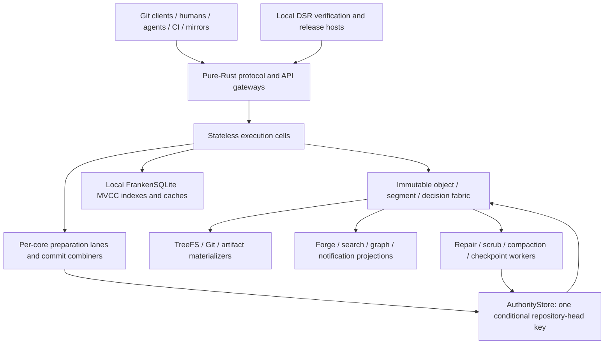

# Comprehensive Plan for the Design of FrankenGit

**Document version:** 3.0 — FrankenSuite deep-synthesis architecture  
**Document status:** public architecture draft  
**Project status:** pre-implementation  
**Last revised:** 2026-08-20  
**Project initiator:** Jeffrey Emanuel  
**Repository:** `Dicklesworthstone/frankengit`  
**Target service:** `FrankenGit.com`

> **Normative boundary:** [`docs/NORMATIVE_PROTOCOL_CONTRACTS.md`](docs/NORMATIVE_PROTOCOL_CONTRACTS.md) governs identity, admission, publication, cancellation, repair, authority, and release-blocking invariants. This comprehensive plan explains the complete system and implementation program. Any conflicting older example is defective and must be corrected rather than interpreted as an alternative mode.
>
> **Construction constitution:** FrankenGit is a clean-room, pure-Rust system on a dated current nightly toolchain. First-party code forbids `unsafe`; production never links or invokes C Git, `libgit2`, JGit, Dulwich, or another Git engine; Asupersync is the sole async runtime; and dependencies are restricted by [`docs/DEPENDENCY_AND_MEMORY_SAFETY_CONSTITUTION.md`](docs/DEPENDENCY_AND_MEMORY_SAFETY_CONSTITUTION.md).
>
> **Verification/release boundary:** GitHub-hosted Actions are not required for correctness or release. Repository-owned lanes execute locally and through Doodlestein Self-Releaser, with workflow YAML serving only as a portable adapter.

---

<!-- BEGIN GENERATED TOC -->
## Table of contents

- [0. Reading contract](#0-reading-contract)
- [1. Executive conclusion](#1-executive-conclusion)
- [2. Why a new forge is justified](#2-why-a-new-forge-is-justified)
- [3. Product definition](#3-product-definition)
- [4. Scope](#4-scope)
- [5. Design constitution](#5-design-constitution)
- [6. Inheritance from the Franken family](#6-inheritance-from-the-franken-family)
- [7. Requirements](#7-requirements)
- [8. Failure, adversary, and trust model](#8-failure-adversary-and-trust-model)
- [9. System topology](#9-system-topology)
- [10. Canonical state model](#10-canonical-state-model)
- [11. Identity model](#11-identity-model)
- [12. Git object admission](#12-git-object-admission)
- [13. Immutable object fabric](#13-immutable-object-fabric)
- [14. Repository Capsule](#14-repository-capsule)
- [15. RefTxn protocol](#15-reftxn-protocol)
- [16. Parallel mutation and conflict certificates](#16-parallel-mutation-and-conflict-certificates)
- [17. Materialization plane](#17-materialization-plane)
- [18. Git transport and compatibility](#18-git-transport-and-compatibility)
- [19. Garbage collection and retention](#19-garbage-collection-and-retention)
- [20. RaptorQ permeation and repair](#20-raptorq-permeation-and-repair)
- [21. Checkpoint, backup, and recovery](#21-checkpoint-backup-and-recovery)
- [22. Replication and multi-region](#22-replication-and-multi-region)
- [23. Federation and local-first operation](#23-federation-and-local-first-operation)
- [24. Forge event model](#24-forge-event-model)
- [25. Pull requests, reviews, and merge](#25-pull-requests-reviews-and-merge)
- [26. Agent-native collaboration](#26-agent-native-collaboration)
- [27. Context Packets and repository intelligence](#27-context-packets-and-repository-intelligence)
- [28. Safe Markdown and document protocol](#28-safe-markdown-and-document-protocol)
- [29. CI, workflows, and runners](#29-ci-workflows-and-runners)
- [30. Artifacts, releases, and packages](#30-artifacts-releases-and-packages)
- [31. APIs and interfaces](#31-apis-and-interfaces)
- [32. Authorization and policy](#32-authorization-and-policy)
- [33. Statistical decision support and conformal e-processes](#33-statistical-decision-support-and-conformal-e-processes)
- [34. Observability and evidence](#34-observability-and-evidence)
- [35. Security architecture](#35-security-architecture)
- [36. Resource governance, quotas, and abuse](#36-resource-governance-quotas-and-abuse)
- [37. Operations](#37-operations)
- [38. Performance architecture](#38-performance-architecture)
- [39. Economic architecture](#39-economic-architecture)
- [40. Formal methods and deterministic simulation](#40-formal-methods-and-deterministic-simulation)
- [41. Verification and claim governance](#41-verification-and-claim-governance)
- [42. Data and protocol versioning](#42-data-and-protocol-versioning)
- [43. Prospective implementation architecture](#43-prospective-implementation-architecture)
- [44. Delivery roadmap](#44-delivery-roadmap)
- [45. Work breakdown and dependency graph](#45-work-breakdown-and-dependency-graph)
- [46. Risk register](#46-risk-register)
- [47. Open decisions and decision procedures](#47-open-decisions-and-decision-procedures)
- [48. Success metrics](#48-success-metrics)
- [49. Definition of done](#49-definition-of-done)
- [50. Immediate execution sequence](#50-immediate-execution-sequence)
- [51. References and research inputs](#51-references-and-research-inputs)
- [52. Closing position](#52-closing-position)

<!-- END GENERATED TOC -->

## 0. Reading contract

This document is a plan, not a launch announcement and not an implementation report. It deliberately specifies the shape of the final abstractions before code exists, because a forge is simultaneously a version-control protocol implementation, a transactional system, an immutable object fabric, a hostile-input parser, a graph/search engine, a build service, an agent capability broker, and a long-lived archive.

### 0.1 Epistemic and claim classes

Every material statement belongs to one of the following classes:

| Class | Meaning |
|---|---|
| **Invariant** | Must hold on every admitted execution; violation is a correctness defect |
| **Proof** | Theorem inside a named formal model with explicit refinement boundary |
| **Bounded model** | Exhaustively checked only inside declared bounds |
| **Statistical** | Confidence statement under named population, filtration, selection, and regime assumptions |
| **SLO** | Empirical operational objective for a named deployment/profile |
| **Benchmark** | Measured result on pinned inputs, hardware, toolchain, and command |
| **Proposal** | Concrete design not yet supported by implementation evidence |
| **Open decision** | Bounded choice with a defined decision procedure |
| **Rejected / negative evidence** | Idea or hypothesis ruled out under recorded evidence and revisit conditions |

The project uses the claim lattice defined in `registries/claim_classes.tsv`: weaker evidence may inform policy but cannot justify a stronger claim. A benchmark cannot establish an invariant; a statistical alarm cannot authorize a ref update; a bounded model cannot establish unbounded liveness.

### 0.2 Normative language

`MUST`, `MUST NOT`, `SHALL`, `SHOULD`, `SHOULD NOT`, and `MAY` are normative when capitalized. “Canonical” means required to reconstruct externally observable accepted state. “Derived” means independently rebuildable from canonical state. “Authority” means a primitive whose successful result can change canonical state; it is not a synonym for a fast cache or preferred route.

### 0.3 Constitutional hierarchy

When documents or code disagree, the project resolves the contradiction in this order:

1. executable invariants and accepted canonical-format goldens;
2. [`docs/NORMATIVE_PROTOCOL_CONTRACTS.md`](docs/NORMATIVE_PROTOCOL_CONTRACTS.md);
3. checked-in constitutions and machine-validated registries;
4. accepted ADRs;
5. this comprehensive plan;
6. `ARCHITECTURE.md`, `VERIFY_SPEC.md`, and `SECURITY_THREAT_MODEL.md`;
7. explanatory README prose and implementation comments.

A lower layer cannot silently “choose” a convenient interpretation. The contradiction itself is a release-blocking defect.

### 0.4 Companion specifications

The plan is intentionally factored. The deepest contracts live in:

- [`docs/OBJECT_STORE_DECISION_LOG.md`](docs/OBJECT_STORE_DECISION_LOG.md)
- [`docs/ATP_GIT_PROFILE.md`](docs/ATP_GIT_PROFILE.md)
- [`docs/GIT_TREE_FS.md`](docs/GIT_TREE_FS.md)
- [`docs/GRAPH_INTELLIGENCE_ARCHITECTURE.md`](docs/GRAPH_INTELLIGENCE_ARCHITECTURE.md)
- [`docs/CALM_AND_OBLIGATIONS.md`](docs/CALM_AND_OBLIGATIONS.md)
- [`docs/FRANKEN_SUITE_DEEP_DIVE_SYNTHESIS.md`](docs/FRANKEN_SUITE_DEEP_DIVE_SYNTHESIS.md)
- [`docs/FRANKENSUITE_DEEP_AUDIT_2026-08-19.md`](docs/FRANKENSUITE_DEEP_AUDIT_2026-08-19.md)
- [`docs/FRESH_EYES_AUDIT_2026-08-19.md`](docs/FRESH_EYES_AUDIT_2026-08-19.md)
- [`docs/LOCAL_VERIFICATION_AND_RELEASE_PIPELINE.md`](docs/LOCAL_VERIFICATION_AND_RELEASE_PIPELINE.md)
- [`docs/NEGATIVE_EVIDENCE_LEDGER.md`](docs/NEGATIVE_EVIDENCE_LEDGER.md)

The comprehensive plan states how those mechanisms compose into one product.

---

## 1. Executive conclusion

FrankenGit should be built—not as “GitHub rewritten in Rust,” and not as a new incompatible VCS, but as the first forge whose canonical mutation, object transfer, sparse workspaces, graph intelligence, verification evidence, and agent authority were designed together.

The architecture is based on nine mutually reinforcing pillars.

### 1.1 Immutable decision stream, one tiny authority head

For each repository, canonical state is an immutable chain of `RepositoryDecisionBatch` objects plus one small authenticated `RepositoryAuthorityHead`. A mutation linearizes only when an `AuthorityStore` performs a successful conditional replacement of the exact predecessor head. Any cell may prepare or attempt a transaction. Rendezvous routing, per-core lanes, and flat combining make the healthy path fast; none is an authority assumption.

This removes the need to reconcile a mutable bare repository, a forge database, and a separate transaction log. FrankenSQLite implements the same authority interface in the embedded profile and supplies local MVCC indexes and projections in every profile; it is not a competing global truth.

### 1.2 Pure-Rust Git as a constitutional boundary

The production Git implementation is clean-room Rust: object framing, SHA-1/SHA-256 identity, pack/delta parsing, pkt-line, upload-pack, receive-pack, protocol negotiation, ref transactions, diff/merge primitives, commit graphs, bitmaps, partial clone, LFS adapters, and materialization. Upstream Git remains an external differential oracle only. Unsupported behavior returns a typed refusal; FrankenGit never shells out to Git or links a foreign engine as a hidden fallback.

### 1.3 Parallel preparation, minimal ordered residue

Object admission, pack validation, policy-independent analysis, graph construction, context retrieval, test evidence, and semantic effect construction execute in parallel. Per-core preparation lanes avoid central allocator and lock traffic. A combiner folds a bounded set of prepared transactions into a deterministic net-effect normal form and attempts one head CAS. CAS losers reuse valid work, refine conflict witnesses only when valuable, deterministically rebase, and retry the same sealed transaction.

The ordered residue is intentionally tiny: deciding which terminal outcomes and repository effects follow one exact predecessor. The rest of the system scales independently.

### 1.4 ATP-Git for object-graph transport

Asupersync’s Adaptive Transport Protocol becomes the native internal and FrankenGit-aware transfer substrate. ATP-Git understands Git object closure, receiver have-sets, unique byte payloads, immutable segments, path graphs, multipath racing, swarm rarity, endgame duplication, adaptive RaptorQ overhead, trust-scoped caches, budgets, cancellation, and replay. Ordinary Git clients still receive standard smart-HTTP/SSH pack streams from the pure-Rust engine.

### 1.5 TreeFS instead of clone-everything workspaces

Agents and CI consume a capability-scoped virtual filesystem over an immutable Git tree plus a sparse copy-on-write semantic overlay. Reads fetch only authorized objects. Writes become typed intents and a net effect, not ambient POSIX mutations whose meaning is reconstructed later. Every workspace exposes staged, visible, and durable epochs; cancellation drains tasks and effect obligations to quiescence.

### 1.6 Graph fabrics with deterministic decision witnesses

FrankenGit maintains separate typed graphs for commit ancestry, object reachability, files/symbols, dependencies, ownership, reviews, builds, agents, provenance, placement, and repair. Exact graphs, deterministic derived graphs, and statistical graphs never collapse into one unlabeled “knowledge graph.” Any graph algorithm that can influence ordering, reviewer selection, context assembly, placement, or risk names a tie-break policy and emits a decision-path/complexity witness.

### 1.7 Repair through the same authority as writes

RaptorQ and replicas can reconstruct bytes, but repaired data is accepted only after original commitments verify and the repair passes through the same authority/epoch rules as an ordinary placement mutation. A valid decode cannot overwrite newer state. Repair, compaction, generation activation, checkpoints, and releases all use body-first/root-last publication and explicit staged/visible/durable states.

### 1.8 Identity-bound adaptation, never statistical government

Conformal predictors, e-processes, no-regret controllers, change detectors, and Lyapunov/progress governors can adapt bounded operational policies. Their population, selection rule, exact sequence window, regime epoch, candidate, fallback, assumptions, and arithmetic/toolchain fingerprint are identity material. Missing support or regime drift selects a deterministic fallback. Statistical evidence cannot decide Git identity, authorization, ref atomicity, retention roots, or guilt.

### 1.9 Local-first verification and release

Repository-owned commands are the verification truth. `.github/workflows` only describe portable lanes that Doodlestein Self-Releaser and `act` can execute locally; macOS and Windows release lanes run on registered native hosts. A release is published root-last only after every requested target, exact asset, checksum, SBOM, signature, installer smoke test, and evidence pack verifies. GitHub Releases is a distribution adapter, not release authority.

### 1.10 Why the combination matters

Each mechanism is useful alone. Together they change the economics and trust model of software production:

- cold repositories require no durable local Git directory;
- thousands of agents share immutable bases instead of cloning them;
- pushes and forge transitions have one terminal decision and one publication point;
- object transfer follows content and topology rather than one TCP stream;
- indexes and graph views can be destroyed without losing truth;
- every optimization, adaptation, and repair carries bounded replayable evidence;
- self-hosters receive the same correctness architecture as the hosted service.

The radical ambition belongs in recoverability, algorithmic performance, sparse context, and evidence. The parts that decide truth must remain deliberately small, deterministic, and boring.

---

## 2. Why a new forge is justified

### 2.1 The forge is the operating system for software production

A modern forge controls identity, authorization, refs, pull requests, review, CI, packages, artifacts, deployment provenance, issue/project state, search, automation credentials, quotas, audit, and recovery. A fault can lose accepted work, publish untrusted bytes, disclose secrets, rewrite provenance, or merely create the dangerous belief that a state was reviewed or durable when it was not.

The source-control and collaboration layers therefore need one explicit model of identity, authority, evidence, and recovery—not a set of services reconciled by convention.

### 2.2 Agent workloads change the unit economics

A human-centric forge assumes relatively few simultaneous branches, worktrees, searches, and builds per person. One sponsor may now operate hundreds or thousands of concurrent agents that repeatedly read overlapping objects, assemble similar context, run similar tests, create speculative edits, abandon most attempts, and retry after cancellation or context loss.

The expensive units become:

- hydrated repositories/worktrees;
- object and pack transfer;
- context assembly and graph/search queries;
- build inputs and cache trust;
- evidence generation/verification;
- mutation coordination and retry waste;
- secret/effect authority;
- artifact/log retention.

A forge designed for this world shares immutable bases, makes writable overlays sparse, deduplicates transfer/content, reuses evidence, models cancellation exactly, and concentrates strong coordination only at publication.

### 2.3 Cursor Continuity establishes the architectural opening

Cursor’s “Git at Any Scale” demonstrates that ordinary Git repositories can be disposable NVMe materializations while durable push history lives as immutable objects in an S3-compatible store. A push becomes visible through a conditional write to the WAL index; any server can attempt it; rendezvous hashing is an efficiency hint; UDP gossip only accelerates cache freshness; readers verify against the object-store version token; and compaction can be performed once and shared. The design intentionally avoids an external relational database as source of truth.

FrankenGit adopts that smallest useful insight and extends it:

1. the immutable stream contains terminal repository decisions, not only Git delta bundles;
2. one decision atomically binds refs and forge events;
3. stable seals/outcomes make retries and cancellation unambiguous;
4. per-core preparation and microbatching reduce head-CAS frequency;
5. hierarchical witnesses and semantic normal form permit safe reuse/rebase after contention;
6. ATP-Git transfers object graphs across paths/peers rather than treating every operation as one pack over one connection;
7. TreeFS eliminates full hydration for most agent/CI work;
8. repair, checkpoint, generation, and release use the same root-last/anti-rollback law;
9. graph/search/statistical systems carry identity-bound evidence and cannot become hidden authority;
10. the production Git engine is clean-room pure Rust.

The result remains compatible at the edge while making canonical truth smaller and more reconstructable than a mutable repository directory plus database.

### 2.4 Existing forge categories still matter

- **Forgejo/Gitea/GitLab/SourceHut** demonstrate product breadth, migration expectations, self-hosting, and ecosystem contracts.
- **GitHub/GitLab at scale** demonstrate developer-network value, APIs, integrations, security products, and hosted operational expectations.
- **Radicle/local-first systems** demonstrate signed identities, offline collaboration, peer exchange, and sovereignty.
- **Object-store/LSM systems** demonstrate immutable logs, compaction, cache hierarchies, and disaggregated economics.

FrankenGit’s justification is not that these systems are poor. It is that none was originally designed around millions of sparse agent workspaces, effect capabilities, replay-complete evidence, repairable immutable generations, and one atomic source/forge decision stream.

### 2.5 Why building the strategic core is rational

The user’s FrankenSuite already contains unusually relevant machinery: a structured runtime and adaptive transport, a concurrent MVCC engine, a memory-safe filesystem/repair laboratory, progressive search, safe source-spanned rendering, graph storage/calibration/claim governance, deterministic graph algorithms, and a local release system. FrankenGit can reuse or factor those mechanisms inside one closed Rust universe instead of assembling a dozen external services with overlapping authority and runtime assumptions.

### 2.6 The public contribution

A self-hostable forge with portable truth, independently verifiable restore, pure-Rust protocol implementation, local release evidence, and agent-native capabilities would reduce dependence on a small number of providers and preserve software history more robustly. FrankenGit.com can fund operations and enterprise convenience without making the open/self-hosted correctness core depend on proprietary infrastructure.

The system is worthwhile only if every added mechanism earns its complexity under conformance, fault, security, performance, and economic evidence. “Alien artifact” means unusually coherent and verifiable—not maximal novelty per subsystem.

---

## 3. Product definition

### 3.1 Product promise

FrankenGit promises a path to:

- host ordinary Git repositories;
- collaborate through a modern web and API forge;
- run it locally, on-premises, in a private cloud, or as a service;
- recover accepted state from independently verifiable materials;
- understand why a mutation was accepted;
- give agents useful access without giving them ambient authority;
- scale repository serving and speculative work economically;
- export back to standard Git.

### 3.2 Primary personas

#### Individual developer

Needs a single executable, simple backup, fast local UI, SSH/HTTP access, integrated issues and CI, and no cluster expertise.

#### Small team

Needs organizations, permissions, protected branches, reviews, runners, packages, backups, and reliable upgrades at low operational cost.

#### Large enterprise

Needs SSO, SCIM, audit, compliance, retention, legal hold, network controls, tenancy isolation, regional placement, migration, and predictable SLOs.

#### Open-source project

Needs public hosting, forks, issues, contribution workflows, abuse controls, mirrors, releases, packages, provenance, and low-cost archival.

#### Human agent sponsor

Needs to create or authorize agents, assign budgets and objectives, inspect evidence, revoke access, compare candidates, and preserve accountability.

#### Autonomous coding agent

Needs bounded context, stable snapshots, sparse workspaces, deterministic tools, machine-readable policy and review, fast retries, and a publication protocol.

#### CI/build agent

Needs hermetic inputs, cache lookup, source and dependency provenance, secret scoping, cancellation, artifact upload, and reproducible attestations.

#### Operator

Needs cells with bounded blast radius, capacity controls, scrub and repair, upgrades, rollback, audit, observability, and recovery drills.

#### Auditor or incident responder

Needs immutable event history, policy snapshots, signatures, evidence roots, object lineage, secret-access records, and proof of recovery.

### 3.3 Workload classes

The system MUST model workloads explicitly:

| Class | Examples | Dominant concern |
|---|---|---|
| Metadata read | refs, permissions, PR status | latency and cacheability |
| Object read | clone, fetch, file view | bandwidth and locality |
| Object write | push, artifact upload | deduplication and durable admission |
| Ref mutation | push, merge, tag | serializability and policy |
| Forge event | comment, label, review | causal order and indexing |
| Workspace | checkout, agent edit | startup time and sparse COW |
| Build | CI, test, package | isolation, cache, provenance |
| Search/graph | code query, impact | freshness, relevance, attribution |
| Repair | scrub, reconstruct, migrate | correctness and bounded load |
| Archive | release, legal hold | retention and independent recovery |
| Agent orchestration | intent, tools, evidence | capability and budget enforcement |

### 3.4 Scale envelopes

The architecture should not assume one deployment scale. Initial envelopes:

| Profile | Repositories | Active ops/s | Canonical bytes | Concurrent workspaces |
|---|---:|---:|---:|---:|
| Personal | 1–1,000 | 10 | 10 TB | 20 |
| Team | 1,000–100,000 | 1,000 | 1 PB | 5,000 |
| Hosted cell | 10,000–1,000,000 | 10,000 | 10 PB | 50,000 |
| Global service | millions | 100,000+ | exabytes over time | 1,000,000+ |

These are topology stress targets, not v1 capacity promises. The stateless-cell design scales horizontally without one global order; each repository has its own independent authority head and immutable stream.

---

## 4. Scope

### 4.1 v1 functional scope

A useful v1 MUST include:

1. repository creation/import/export;
2. SSH and smart HTTP Git access;
3. protocol-accurate clone/fetch over upload-pack and push over receive-pack;
4. branch/tag listing and atomic ref updates;
5. users, organizations, teams, tokens, deploy keys;
6. protected refs and policy snapshots;
7. pull requests, reviews, comments, labels, merge;
8. issues and discussions;
9. webhooks and an event API;
10. safe Markdown rendering;
11. basic lexical and symbol search;
12. CI workflow execution with artifact and cache support;
13. agent identities, Intent Runs, workspaces, and evidence bundles;
14. backup, capsule export, scrub, verify, and restore;
15. single-node and object-store-backed deployment;
16. GitHub import and a documented compatibility matrix.

### 4.2 Subsequent scope

- packages and container registry;
- advanced semantic and graph search;
- merge queue and stacked changes;
- organization-wide provenance and dependency analysis;
- offline/local-first issue/review replication;
- federation and mirrors;
- multi-region durability and read serving;
- managed elastic runners;
- advanced e-process gates;
- broad hosted-workflow compatibility beyond the locally executable declared subset;
- enterprise identity and compliance;
- migration at very large scale.

### 4.3 Non-goals

The following are rejected for the initial architecture:

- replacing Git objects with a proprietary object graph;
- making every forge event strongly globally ordered;
- using a network filesystem as canonical repository storage;
- storing every blob as an independent object-store request without aggregation;
- requiring a Kubernetes cluster for small deployments;
- requiring an external vector database, graph database, search cluster, queue, and cache merely to run one node;
- permitting arbitrary repository hooks in the truth-plane process;
- automatic protected-branch publication based only on a model score;
- physically sharded/multi-head canonical mutation before refinement to the single-head authority model is proved;
- opaque “self-healing” that mutates canonical state without a repair record;
- a universal agent token;
- compatibility claims based on happy-path clone/push alone.

---

## 5. Design constitution

The constitution is enforced by code, registries, and compile/test gates rather than architectural mood.

### 5.1 Pure Rust, no hidden foreign engine

- Production code is Rust 2024 on the repository’s dated current nightly.
- Every first-party crate uses `#![forbid(unsafe_code)]`; there are no “temporary” unsafe islands.
- No production feature links or invokes C Git, `libgit2`, JGit, Dulwich, OpenSSL, libcurl, zlib, or another foreign implementation through FFI or subprocess fallback.
- Upstream Git and other forges run only as separately pinned conformance or migration peers.
- Safe portable SIMD, cache-aware layouts, dense IDs, bounded batching, and algorithmic specialization are the performance strategy.

### 5.2 One runtime and one dependency universe

- Asupersync is the sole async runtime and owns structured concurrency, cancellation, budgets, capabilities, deterministic lab execution, ATP, and obligation primitives.
- FrankenSuite crates are preferred when they already own a required mechanism.
- External dependencies are limited to fundamental, pure-Rust, registry-approved crates whose marginal capability and transitive cost are documented.
- Tokio, async-std, smol, rayon-as-runtime, foreign QUIC stacks, generic ORMs, general distributed databases, and convenience frameworks do not enter production graphs.
- Every dependency belongs to one version universe pinned by a constellation lock/evidence manifest.

### 5.3 Immutable bodies, minimal mutable roots

Large objects, decisions, events, indexes, graph generations, artifacts, manifests, evidence, and checkpoints are immutable. Mutable authority is restricted to small conditional roots, local ephemeral caches, revocation state, and bounded queues. Listings and mutable directory trees are never a recovery root.

### 5.4 One publication primitive per canonical domain

Canonical repository mutation uses the authority-head CAS. Derived generation activation uses a monotone generation authority. Release publication uses a signed root-last release manifest. No subsystem invents a second informal notion of “current.” The publication primitive registry names each domain and its exact anti-rollback law.

### 5.5 Intents before effects; effects before publication

Callers submit typed intents. Finalization evaluates them against one basis, applies read-your-own-writes, records statement-level failure policy, derives exact before/after effects, folds those effects into a target-disjoint net-effect normal form, and maps every source intent to a surviving effect or explicit no-op. Canonical bytes never preserve accidental request ordering or duplicate contradictory values.

### 5.6 CALM classification and obligations

Every operation is classified as monotone/coordination-free, bounded commutative, or coordinated. Effects that acquire responsibility—object placement, head-CAS attempt, secret lease, runner allocation, outbox delivery, workspace output, repair, billing reserve—create typed obligations that must commit, abort, transfer, or drain before region closure. “Fire and forget” is not a lifecycle state.

### 5.7 Root-last and anti-rollback

Bodies are written and verified before roots become visible. Two-slot or equivalent roots distinguish an interrupted latest publication from an older valid root; the system must not silently roll back when the highest acknowledged generation is corrupt or unresolved. Recovery either proves a unique latest root or fails closed with evidence.

### 5.8 Exact and statistical worlds remain typed apart

Exact safety, formal-model results, bounded-model evidence, statistical claims, SLOs, and benchmarks use separate types/registries. A weaker class cannot justify a stronger one. Adaptive policy always names a deterministic fallback and cannot silently cross into authorization or source-of-truth semantics.

### 5.9 Final-abstraction slices only

Early code may implement a subset of a final abstraction, never a substitute that must later be discarded. An in-memory map is not presented as durable storage; a fake Git parser that accepts only happy-path fixtures is not called a protocol engine; empty crates are forbidden. Each crate appears with one real vertical slice whose failure modes are the failure modes of the final system.

### 5.10 Negative evidence is retained

Failed performance hypotheses, disproven concurrency assumptions, abandoned storage shapes, cutover failures, and security dead ends are append-only evidence. Future agents must see not only what was chosen but what was tested and rejected, under what conditions, and what evidence would justify reopening it.

### 5.11 Local verification is the authority

All gates are runnable through repository-owned commands on the user’s machines. Workflow YAML may invoke those commands but cannot contain unique correctness or release logic. A hosted status badge is never evidence of a release invariant.

---

## 6. Inheritance from the Franken family

This section records mechanisms, not aesthetic resemblance. The complete source-by-source analysis and placement matrix is in [`docs/FRANKEN_SUITE_DEEP_DIVE_SYNTHESIS.md`](docs/FRANKEN_SUITE_DEEP_DIVE_SYNTHESIS.md).

### 6.1 Asupersync: runtime, ATP, obligations, and deterministic concurrency

FrankenGit imports:

- region-owned task trees and quiescent close;
- capability-bearing `Cx` contexts rather than ambient runtime authority;
- request → drain → finalize cancellation;
- two-phase reserve/commit effects;
- typed obligations and graded resource algebra;
- deterministic lab execution, virtual time, schedule replay, vector clocks, and DPOR/Mazurkiewicz reduction;
- CALM classification of coordination-free versus coordinated operations;
- conflict-absorbing CRDT state for advisory replicas;
- ATP manifests, delta planning, unique-content dedupe, path graphs, path racing, swarm piece tracking, trust-scoped caches, adaptive RaptorQ, and replayable autotuning.

FrankenGit does **not** merely “run on Asupersync.” Repository sessions, push validation, CAS attempts, outbox delivery, repair, workspaces, runners, and context assembly are modeled as Asupersync protocols with owned obligations.

### 6.2 FrankenSQLite: per-core lanes, semantic MVCC, and value-of-information

FrankenSQLite contributes:

- per-core writable → sealed → flushing lanes;
- flat combining and group commit;
- immutable snapshot/read views and explicit publication epochs;
- conflict witnesses, conservative first-write checks, and retry semantics;
- deterministic intent replay and structured patch/merge certificates;
- witness refinement chosen by expected value of information;
- conflict sketches (birthday model, AMS/F2, HLL, SpaceSaving) used only for routing/refinement budgets;
- Beta-Bernoulli expected-loss retry policy with starvation escalation and regime reset;
- exact invariant catalogs tied to evidence hooks.

In FrankenGit, these mechanisms prepare and combine repository decisions. FrankenSQLite also implements the embedded `AuthorityStore` profile and local MVCC projections. It is never a second distributed source of truth beside the decision log.

### 6.3 FrankenFS: staged/visible/durable state, repair serialization, and negative results

FrankenFS contributes:

- copy-on-write snapshots and safe epoch/RCU read views;
- explicit staged/visible/durable states with profile-specific transition graphs rather than one misleading universal ordering;
- crash matrices around body, checksum, sync, and visibility boundaries;
- repair through the normal write/serialization authority;
- typed repair evidence and scrub ledgers;
- adaptive redundancy refresh under expected-loss policy;
- mounted safety gates and kill switches;
- durable negative findings showing that removing one low-level lock does not prove end-to-end concurrency when a higher shared invariant still conflicts.

These become TreeFS workspace semantics, object placement publication, repair admission, and a permanent warning against claiming that different ref names imply independent repository transactions.

### 6.4 FrankenSearch: progressive retrieval and monotone generation authority

FrankenSearch contributes:

- immediate lexical/path/symbol results followed by semantic and graph refinement;
- explicit `Initial`, `Refined`, and `RefinementFailed` phases;
- Quill’s merge-by-concatenation over disjoint absolute IDs;
- columnar sort-based ingest and searchable in-memory delta generations;
- immutable generations with exact predecessor linkage, sequence+nonce identity, anti-rollback floor, and fail-closed recovery of unresolved publication;
- deterministic ordering, source-linked explanations, machine-streaming formats, and replay artifact packs;
- generation durability/repair separated from logical source identity.

FrankenGit uses the same generation authority for search, graph, code intelligence, review-anchor, and context-packet indexes. No query may silently mix shards from different generation roots.

### 6.5 franken_markdown: one source-spanned model and staged multi-output publication

franken_markdown contributes:

- parse once into a source-spanned canonical AST;
- render human, compact, API, and archival surfaces from one model;
- host-supplied capabilities rather than ambient file/network access;
- safe-by-default rendering and explicit resource ceilings;
- deterministic batch ordering independent of worker schedule;
- worker budgets derived from CPU, memory, mode, and variance;
- complete per-input receipts;
- staged all-or-nothing multi-output writes;
- optimization proof checklists and performance artifact schemas.

FrankenGit applies this lineage to issue/PR/review text, diff anchors, rendered documents, API spans, and agent context references. The same source span cannot mean one location in the UI and another in an agent packet.

### 6.6 FrankenGraphDB: immutable chronicle, graph-structured storage, policy epochs, and claim governance

FrankenGraphDB contributes:

- body-first commit records and marker/root-last publication;
- two-slot anti-rollback roots;
- a single version universe over one immutable stream;
- intent/effect separation and net-effect normal form;
- graph-structured LSM temperature tiers;
- deterministic graph/query plan certificates;
- identity-bound conformal, e-process, no-regret, OPE, change-point, Lyapunov, and progress evidence;
- stream-sequenced policy epochs with explicit effect classes;
- deterministic fallback under missing support or regime drift;
- compile-time/value-level claim lattice;
- replay completeness grades;
- closed registries and no empty prototype crates.

FrankenGit’s decision log, graph fabrics, adaptive policies, evidence envelopes, and registry checker directly inherit this discipline.

### 6.7 FrankenNetworkX: observable graph semantics and decision-path witnesses

FrankenNetworkX contributes:

- observable iteration order and tie-break behavior as part of the contract;
- dense integer adjacency for hot execution while preserving stable external IDs/order;
- closed tie-break policy vocabularies;
- per-run complexity and decision-path witnesses;
- revision-keyed immutable/cached views;
- strict fail-closed mode and bounded, registry-approved hardened recovery with decision records;
- a broad algorithm portfolio across reachability, SCCs, dominators, flows, cuts, matching, centrality, communities, DAGs, robustness, and temporal structure;
- parity ledgers and negative performance results.

FrankenGit uses these mechanisms for reachability/GC, dependency impact, reviewer/ownership analysis, merge planning, build scheduling, placement, repair, agent coordination, and GraphRAG context—without allowing a graph heuristic to become hidden authority.

### 6.8 Doodlestein Self-Releaser: local, resumable, root-last releases

DSR contributes:

- reusable workflow YAML executed locally through `act` or native hosts;
- platform-specific host routing;
- stable run/attempt identities;
- resume that reuses only exact verified target artifacts;
- withheld authoritative manifest until the entire requested matrix succeeds;
- exact asset contracts, checksum sidecars, companion-file allowlists, symlink/path/collision refusal;
- signed releases, SBOM, provenance, installer smoke, and remote reconciliation.

FrankenGit treats these as the release protocol, not merely an emergency fallback.

### 6.9 FrankenSuite composition law

Reuse occurs at the strongest stable abstraction available. FrankenGit may depend on a factored FrankenSuite crate when its version/evidence contract fits; otherwise it ports the mechanism and preserves the original project as an oracle. It never couples itself to a moving workspace merely to avoid writing a small adapter, and it never imports a sibling project’s aspirational README claim as implementation evidence.

---

## 7. Requirements

### 7.1 Correctness requirements

C1. One repository authority head and predecessor-linked decision stream MUST uniquely determine visible canonical state.

C2. A successful conditional head replacement MUST atomically terminalize every decision in its batch and expose the associated refs, forge state, outcomes, retention roots, and outbox roots.

C3. A retry using the same sealed logical identity MUST discover the same terminal outcome; a reused idempotency key with different semantics MUST fail closed.

C4. No client disconnect/cancellation response may imply non-commit without authority/outcome lookup.

C5. Every committed ref target MUST refer to admitted native Git objects satisfying closure/policy and hash-format rules.

C6. Atomic multi-ref push and ref-plus-forge transitions MUST be externally all-or-nothing.

C7. Policy evaluation MUST bind one exact authority basis and deterministic input root.

C8. Derived projections/materializations MUST expose the head/RCR/generation through which they are complete.

C9. Root-last protocols MUST recover old-complete or new-complete state; unresolved highest acknowledged publication MUST fail closed rather than silently roll back.

C10. Repair MUST verify original commitments and revalidate current authority before publishing a placement.

C11. Import/export MUST preserve all declared Git-visible object, ordering, refusal, and protocol semantics.

C12. GC MUST never delete an object retained by authenticated refs, forge roots, legal holds, capsules/backups, in-flight obligations, migration/federation roots, or safety windows.

### 7.2 Availability requirements

A1. Verified snapshot reads SHOULD continue during brief authority-store unavailability according to explicit current/bounded-stale/snapshot modes.

A2. Loss of any execution cell, local FrankenSQLite projection, cache, materialization, or bare repository MUST NOT lose canonical state.

A3. Loss of an entire derived generation MUST be recoverable by deterministic rebuild from canonical sources.

A4. Foreground service floors, repair debt, checkpoint debt, and outbox debt MUST be jointly budgeted; one background controller cannot starve the others.

A5. Authority backend, object placement, region loss, and complete restore/failover paths MUST be exercised under named profiles.

A6. Cold repositories SHOULD require no resident process or durable local Git directory.

### 7.3 Construction and memory-safety requirements

M1. First-party production crates MUST use `#![forbid(unsafe_code)]` without local exceptions.

M2. Production MUST NOT link or invoke C Git, `libgit2`, JGit, Dulwich, another Git engine, or a C/C++ library through FFI.

M3. Asupersync MUST be the sole async runtime.

M4. Dependency admission MUST satisfy the checked-in constitution/registry and one compatible constellation.

M5. Every untrusted parser/decoder MUST enforce declared byte, expansion, depth, work, allocation, and time bounds.

M6. Latest-nightly use MUST remain reproducible through a dated pin and intentional advancement evidence.

### 7.4 Security requirements

S1. Every authority attempt MUST identify an authenticated principal snapshot and effective capability root.

S2. Agents/runners MUST use short-lived attenuated credentials; delegation may only narrow.

S3. Secret access MUST be explicit, receipted, revocable, and unavailable to untrusted fork contexts by default.

S4. Repository/web/package/model content MUST be treated as untrusted data and cannot widen effect authority.

S5. Untrusted code MUST execute outside authority/truth processes with bounded isolation and egress.

S6. Cross-tenant deduplication/cache/search MUST NOT create content-existence, timing, deletion, or authorization oracles.

S7. Encryption, deduplication, identity, retention, and billing domains MUST be explicit and typed.

S8. Supply-chain provenance MUST cover server, client, runner, migration, verification, installer, and release artifacts.

### 7.5 Operability requirements

O1. Every canonical format/publication primitive MUST have version, validator, migration/mixed-version, anti-rollback, recovery, and removal policy.

O2. Every background controller MUST expose queue/debt/age/budget/obligation/failure/cancellation state.

O3. Operators MUST inspect/verify repository state without trusting or mounting a mutable Git directory.

O4. Backup/restore/repair MUST use the same public verification code and original commitments as normal reads.

O5. Capacity exhaustion MUST refuse/degrade before violating durability, bounded-resource, or authority invariants.

O6. Every runbook MUST state canonical safety, availability choice, evidence collected, and exit criteria.

### 7.6 Agent requirements

G1. An Intent Run MUST bind an exact authority head/RCR/capsule, objective, capabilities, budgets, disclosure, and evidence policy.

G2. Tool/network/secret/compute/storage/token/money/publication budgets MUST be independently enforceable.

G3. Every agent-authored effect MUST preserve sponsor, agent, model/harness (when supplied), context, and effect receipt lineage.

G4. Evidence MUST distinguish observed, executed, inferred, statistical, omitted, and unresolved classes.

G5. Verifier independence MUST be machine-classified and policy-enforced.

G6. Cancellation MUST revoke/stop authority, drain obligations, preserve complete evidence, and prove quiescence/containment.

G7. Context Packets MUST include source spans, authorization, generation/head position, transforms/ranks, and omissions.

G8. Agents MUST have complete machine-readable protocols and never need to scrape a visual UI.

### 7.7 Economic requirements

E1. Embedded deployment MUST not require external database/search/graph/queue/cache services.

E2. Storage/repair/request/compute/egress/materialization/search/CI/agent/evidence cost MUST be attributable per tenant/repository/run.

E3. Object-store request count MUST be controlled through segmentation, batching, range reads, shared compaction, and caches.

E4. Speculative workspaces SHOULD share immutable bases and pay primarily for deltas/effects.

E5. Hot-repository throughput MUST be measured as useful committed decisions per authority transition and reusable work after CAS loss.

E6. A feature whose cost or deletion/retention debt cannot be metered MUST NOT be sold as unbounded.

---

## 8. Failure, adversary, and trust model

### 8.1 Failure classes

FrankenGit assumes process crash at any instruction boundary; machine/cell/region loss; local disk and memory corruption; object/authority-store timeout, duplicate/ambiguous response, stale proxy, throttling, lifecycle/versioning anomaly, and partial outage; packet loss/reorder/partition/asymmetry; clock skew/rollback; cancellation during every phase; missed/duplicated/out-of-order gossip/outbox events; stale capabilities and local projections; cache/generation loss; mixed-version upgrade; operator error; incomplete backup; malicious/buggy clients, agents, runners, peers, and repair symbols; dependency/compiler/build compromise; and deliberate resource exhaustion.

### 8.2 Trust boundaries

1. **Client boundary:** Git/browser/API/CLI/bot/agent inputs are untrusted.
2. **Gateway boundary:** authentication/normalization may reject but cannot invent canonical state.
3. **Pure-Rust codec boundary:** Git/pack/archive/Markdown/workflow/package/webhook/object-store bytes are hostile and bounded.
4. **Authority boundary:** only a verified exact-version conditional head replacement can publish repository state.
5. **Immutable storage boundary:** storage may omit, corrupt, replay, or misroute bytes; original commitments verify them.
6. **Materialization boundary:** TreeFS adapters, bare repositories, packs, caches, indexes, and local SQLite views are derived/untrusted until receipted.
7. **Runner/workspace boundary:** user and generated code is hostile; host/metadata/secrets are non-ambient.
8. **Intelligence boundary:** parsers, graph/search models, embeddings, rankings, and retrieved text may be wrong or adversarial.
9. **Operator/key/release boundary:** privileged actions and artifacts require explicit capabilities, immutable audit, and anti-rollback.
10. **Tenant/federation boundary:** independently administered namespaces may equivocate and must not leak through dedup/cache/search/timing.

### 8.3 Trust minimization

Canonical publication does not trust routing preference, gossip, wall clock, local “current” rows, search relevance, graph inference, model output, CI green status, decoder success, storage listing order, or an operator-edited directory. Each may supply evidence to a typed acceptance rule.

### 8.4 Failure containment

Cells, transaction/agent/runner regions, object namespaces, caches, graph/search generations, and release attempts are independently attributable and discardable. A failure in a derived plane may reduce freshness/performance but cannot mutate authority. Any operation holding responsibility exposes an obligation that must commit, abort, transfer, or be reported unclosed.

### 8.5 Explicit non-assumptions

- clocks are not authority;
- “S3-compatible” by product name does not establish CAS semantics;
- content address alone does not establish authorship or tenant authorization;
- memory-safe Rust does not remove logic/resource/supply-chain bugs;
- signatures do not prove trustworthy code;
- backups without restore drills do not prove recoverability;
- local release hosts are untrusted until outputs verify.

---

## 9. System topology

### 9.1 Topology overview



### 9.2 Stateless execution cells

A cell is a failure and resource-management boundary, not a repository authority domain. It may contain gateways, pack/object validators, ATP endpoints, preparation workers, combiners, materializers, local MVCC projections, search/graph shards, and repair workers. It owns no canonical repository state merely because a request was routed there or a local bare repository is warm.

Any eligible cell may:

- read and verify the current authority head;
- prepare a sealed transaction;
- stage immutable bodies;
- submit to a preferred combiner;
- attempt a head CAS if the preferred path is unavailable;
- serve reads from a verified materialization whose receipt matches the required head/generation.

### 9.3 Preferred routing without primary authority

Rendezvous hashing assigns each repository to a preferred combiner set for locality and batch efficiency. UDP/gossip-style notifications announce newly observed head tokens and hot-object locations. These are hints only. Before serving an authority-sensitive read or attempting publication, a cell verifies the current authority head/version token through the `AuthorityStore`.

No lease expiry, home-cell clock, or materialization ownership is required for correctness. Stale cells lose CAS or fail receipt validation.

### 9.4 AuthorityStore

The authority substrate exposes strong create/read/conditional-replace over a known repository head key. Deployments choose a profile that passes the same conformance suite:

- **embedded:** FrankenSQLite plus local immutable object fabric;
- **object-store:** a backend with proven linearizable CAS semantics;
- **future authorityd:** a small pure-Rust replicated service implementing the same trait.

Provider listings, asynchronous notifications, and mutable catalog rows are not authority.

### 9.5 Local state inside a cell

Local state is aggressively useful and explicitly disposable:

- FrankenSQLite tables for head/object/forge/search/queue projections;
- verified object/segment/pack caches;
- TreeFS page/object caches;
- generation-root and graph-view caches;
- transfer trust ledgers and path models;
- in-flight seals, prepared capsules, and obligations;
- warm standard-Git materializations for compatibility serving.

Every durable-looking local file identifies its canonical source receipt. A cache without a verifiable receipt is untrusted bytes.

### 9.6 Failure domains

The topology distinguishes:

- process/worker failure;
- local disk loss;
- cell loss;
- authority-store unavailable or CAS-partitioned;
- immutable object placement loss;
- notification/gossip loss;
- derived projection lag;
- native release-host loss.

Availability may degrade differently in each case, but canonical safety must not. During authority unavailability, verified snapshot reads may continue according to profile; canonical mutation refuses or waits rather than inventing local authority.

### 9.7 Scale law

Repositories do not share one global sequencer. Each repository has an independent head key and immutable stream. One hot repository still has one logical order, but its expensive work is parallel and its head transitions are microbatched. Millions of ordinary repositories shard naturally by key and object placement; cold repositories require no running process or durable local Git directory.

---

## 10. Canonical state model

### 10.1 Canonical repository state

For repository `r`, canonical state is the closure reachable from the verified `RepositoryAuthorityHead`:

- immutable Git objects and internal envelopes;
- immutable transaction seals;
- immutable prepared-transaction capsules referenced as evidence;
- the ordered `RepositoryDecisionBatch` chain;
- committed `RepositoryCommitRecord` objects;
- canonical forge-event bodies admitted by those records;
- authenticated ref, forge-position, outcome-index, retention, outbox, configuration, and policy roots;
- checkpoint/capsule roots and their acknowledged durability evidence.

### 10.2 Decision order versus committed-source order

Two monotone sequences are distinct:

- `DecisionSequence` orders every terminal admitted decision, including refusals;
- `RepositorySequence` orders only committed repository-state transitions.

A refusal is canonical audit state but does not advance refs, forge state, retention, or repository source sequence. Keeping the sequences distinct makes idempotency, policy refusals, and incident replay observable without pretending they changed source history.

### 10.3 RepositoryAuthorityHead

The head body names:

- exact predecessor and monotone generation;
- decision tail and latest decision sequence;
- latest committed RCR and repository sequence;
- current authenticated roots;
- configuration/policy/format epochs;
- optional latest checkpoint.

The head ID is the hash of canonical unsigned bytes. The authority-store version token and monotone generation prevent ABA and stale publication.

### 10.4 RepositoryDecisionBatch

A batch binds one exact predecessor and a deterministic ordered vector of terminal decisions. It also carries the committed RCRs produced by those decisions and the resulting authenticated roots. A batch is built against scratch reference state; its normal form proves that each accepted effect is applicable in the selected order.

Batches are immutable before publication. Multiple candidates may exist; only the candidate whose head replacement wins becomes canonical. Unpublished candidates are garbage-collectable after evidence/retention policy.

### 10.5 RepositoryCommitRecord

Each committed transaction has one RCR binding:

- actor/principal snapshot and sealed request identity;
- basis head/RCR;
- exact ref delta and resulting ref root;
- exact admitted Git object closure;
- exact forge-event batch and resulting forge-position root;
- policy inputs/decision/evidence;
- retention and outbox effects;
- verifier/resource receipts;
- net-effect and conflict-witness roots.

A PR merge cannot publish its forge transition without its target ref update, and a merge ref update cannot publish without the forge transition. They are one RCR effect.

### 10.6 Staged, visible, and durable

Every published class exposes explicit epochs:

- **staged:** immutable body exists and verifies but is not selected by authority;
- **visible:** a canonical head/generation root references it;
- **durable:** the declared placement/replication/repair profile is acknowledged.

Visibility never implies the strongest durability profile unless the transaction policy required that profile before CAS. A system may allow “visible after hot quorum, archive durability later,” but the state and SLO are explicit, and the outstanding durability work is an obligation.

### 10.7 Derived state

The following are rebuildable and non-authoritative:

- local outcome lookup tables;
- bare Git repositories, packs, MIDX, bitmaps, commit graphs;
- FrankenSQLite read models;
- issue/PR relational views;
- search/vector/graph generations;
- notification feeds;
- counters, dashboards, billing projections;
- CI workspaces and caches.

Derived state carries the head/RCR/generation through which it is complete. It cannot authorize a mutation without canonical revalidation.

### 10.8 Recovery rule

Recovery starts from known authority/checkpoint keys, verifies the highest uniquely acknowledged head/capsule, follows immutable predecessor links, reconstructs missing bodies under the repair contract, and rebuilds projections. It never scans an eventually consistent bucket listing and guesses which object “looks newest.”

---

## 11. Identity model

### 11.1 Typed namespaces and incarnations

Every canonical record binds typed tenant, repository, security/dedup/encryption namespace, and repository incarnation. Deletion/recreation under the same human-readable owner/name creates a new incarnation; stale refs, tokens, caches, federation events, or object-location records cannot revive the prior repository.

### 11.2 Native Git IDs remain native

A Git object identity is `(GitHashAlgorithm, digest_bytes)`. SHA-1 and SHA-256 values are different types/domains even if bytes/hex happen to resemble one another. FrankenGit preserves the repository’s native object format and does not silently rewrite objects or synthesize cross-format equality.

Text APIs may omit the algorithm only when repository context fixes it unambiguously. Internal maps and wire schemas always retain the typed algorithm.

### 11.3 Internal immutable IDs

Internal objects use the normative domain-separated canonical-envelope rule and a versioned cryptographic registry. The typed ID carries algorithm, object domain, canonical-codec version, and digest bytes. Examples include:

- payload commitment;
- object envelope;
- segment/manifest;
- transaction seal/prepared capsule;
- repository decision/RCR/batch/head;
- forge event/checkpoint;
- policy/evidence/claim;
- graph/search/document generation;
- repository/release capsule.

Storage path, mutable placement acknowledgement, transport framing, and signatures are excluded unless that object’s schema explicitly makes them logical content.

### 11.4 Request, transaction, decision, and repository sequence

- `RequestId`: one network attempt; tracing only.
- `TxId`: one sealed logical mutation under the sole derivation in the normative contract.
- `DecisionSequence`: one terminal admitted decision order, including refusals.
- `RepositorySequence`: committed repository-state transition order only.
- `RepositoryCommitId`: immutable identity of one committed transaction effect.
- `RepositoryDecisionBatchId`: immutable identity of one candidate/canonical group publication body.
- `RepositoryAuthorityHeadId`: immutable identity of one selected repository state root.

These are not interchangeable integers or strings.

### 11.5 Actor and delegation identities

Actor classes include human, service, agent, runner, deploy key, federation peer, operator, migration tool, repair worker, and release host. Canonical actions bind immediate actor, sponsor/delegation chain, principal snapshot, authentication strength, and capability root. A model/harness identity may be present but never replaces the accountable principal.

### 11.6 Git SHA-1 collision defense

For SHA-1 repositories:

- compute native Git identity exactly;
- use a collision-detecting compatible SHA-1 path/profile;
- bind object type/length/exact bytes and a stronger internal payload commitment;
- fail closed on suspicious collision evidence;
- preserve the visible SHA-1 OID and historical signature semantics;
- use Git-defined transition mappings only where conformance supports them.

A stronger internal digest adds independent evidence; it does not invisibly upgrade old Git signatures or alter native history.

### 11.7 Canonical encoding requirements

Every identity-bearing schema has:

- one deterministic byte encoding;
- explicit version/domain/algorithm;
- canonical integer/string/map ordering and normalization;
- bounded decoder and unknown-version behavior;
- golden vectors across native/WASM targets;
- collision/domain-separation tests;
- migration and mixed-version rules.

No API accepts an untyped “hash string” where multiple identity domains are possible.

---

## 12. Git object admission

### 12.1 Admission pipeline

Incoming objects enter quarantine.

```mermaid
flowchart LR
    RX[Receive pack/upload]
    Q[Quarantine bytes]
    PARSE[Parse and inflate]
    OID[Verify Git OID]
    SAFE[Collision and structural checks]
    REACH[Connectivity/reachability]
    ENV[Build Franken envelopes]
    SEG[Aggregate into segments]
    DUR[Durability placement]
    CAT[Publish object catalog]
    REF[Eligible for RefTxn]

    RX --> Q --> PARSE --> OID --> SAFE --> REACH --> ENV --> SEG --> DUR --> CAT --> REF
```



No ref may point to an object that has not reached the required admission state.

### 12.2 Parsing rules

Admission validates:

- pack framing, version, counts, checksums;
- delta base existence and cycle/expansion bounds;
- DEFLATE/inflate resource limits;
- object header and length;
- tree entry ordering, mode, and path rules under the selected compatibility profile;
- commit and tag references;
- object-format consistency;
- excessive nesting and adversarial compression;
- maximum declared sizes and tenant policy;
- collision detection.

Compatibility sometimes requires preserving unusual but historically accepted objects. The parser therefore has profiles:

- `strict-create`: new FrankenGit-generated objects;
- `git-compatible-import`: objects accepted by declared pinned upstream-Git oracle versions;
- `forensic-readonly`: quarantined inspection without making refs eligible.

Rejected bytes remain in a bounded quarantine only if policy requires forensic retention.

### 12.3 Reachability admission

A push need not make every uploaded object reachable immediately, but a ref update must prove required connectivity.

The admission service computes:

- newly introduced objects;
- known object membership;
- referenced parents/trees;
- thin-pack requirements;
- policy-sensitive object types/sizes;
- required reachable closure or a verified connectivity certificate.

For enormous pushes, closure checks use segment indexes, bitmaps, commit graphs, and cached reachability certificates pinned to capsule/object roots.

### 12.4 Object catalog

The catalog maps typed Git OIDs to one or more verified placements:

```text
ObjectCatalogEntry {
    repository_or_dedup_domain
    object_format
    git_oid
    payload_digest
    object_type
    length
    placements[]
    admission_state
    first_seen_event
    retention_class
}
```

Catalog metadata is canonical only to the extent needed to locate durable content. Rebuildable accelerators are separate.

### 12.5 Cross-repository deduplication

Deduplication levels:

1. none;
2. within repository;
3. within tenant;
4. within explicit shared object pool/fork network;
5. global public-object domain.

Private cross-tenant deduplication is disabled by default because it can create existence, timing, billing, and deletion side channels.

Encryption and dedup domains align. A ciphertext copied across incompatible key domains is not considered a valid placement.

### 12.6 Segment construction

Individual Git objects may be too small for economical object-store requests and RaptorQ coding. The segmenter groups immutable admitted objects according to:

- tenant/encryption/dedup domain;
- repository or shared pool;
- object format;
- size class;
- access temperature;
- retention class;
- creation horizon;
- codec;
- maximum segment and index size.

A segment contains:

- header and version;
- ordered object records;
- per-record offset, type, length, Git OID, payload digest;
- optional compression dictionary identity;
- index;
- Merkle tree/root;
- segment digest;
- RaptorQ profile/OTI if encoded;
- footer and signatures where required.

Segmenting is deterministic for a given manifest policy or records the exact nondeterministic packing decision as canonical manifest data.

### 12.7 Small-object lane

Latency-sensitive small writes may first land in an immutable microsegment or append-safe staging object. They become visible only after the staging object is durably committed and catalogued.

Compaction creates new segments without changing Git object identity. Old placements remain until retention and capsule safety permit deletion.

### 12.8 Large blobs and LFS

Large Git blobs are supported, but policy can recommend or require LFS-compatible pointer objects. FrankenGit’s artifact/object fabric can serve LFS objects with the same integrity and repair contracts.

A large blob is never silently rewritten into an LFS pointer because that changes Git history.

---

## 13. Immutable object fabric

### 13.1 Behavioral interfaces

The object fabric is a set of narrow pure-Rust traits, not a vendor SDK-shaped architecture:

- immutable put-if-absent by typed identity;
- exact whole/range read with length/digest verification;
- deterministic segment/manifest read/write;
- placement acknowledgement and failure-domain identity;
- idempotent conditional placement deletion where supported;
- lifecycle/retention/object-lock capability report;
- streaming with budgets/cancellation/obligations;
- no listing requirement for canonical recovery.

Repository authority-head CAS belongs to the separate `AuthorityStore` trait. A backend may implement both, but the contracts and conformance suites remain distinct.

### 13.2 Backend profiles

- local directory/FrankenFS-compatible safe file backend;
- FrankenSQLite-embedded blob/manifest profile for small installations where appropriate;
- S3-compatible/object-store profile through a minimal owned HTTP client surface over Asupersync;
- multi-backend mirror/archive adapter;
- in-memory faultable reference backend.

A provider SDK or generic storage framework is not required. Each adapter translates typed FrankenGit operations and returns structured capability/error evidence.

### 13.3 Object envelopes

An envelope binds native Git or internal object identity, exact length/type, stronger payload commitment, codec/encryption namespace, logical content identity, and immutable manifest references. Mutable locations and scrub state live in separate append-only placement/evidence records so relocation/repair does not change logical identity.

### 13.4 Deterministic segments

Small immutable records are aggregated to reduce requests and improve sequential access. Segment policy declares namespace, object format/class, size/access/retention temperature, codec, maximum records/bytes/index, Merkle layout, and optional RaptorQ profile. Formation is deterministic for the profile or records an immutable packing decision.

Segments include bounded indexes and per-record commitments. Corruption can be localized; compaction/re-encoding preserves logical object identities and publishes new placement manifests root-last.

### 13.5 Placement and durability state

Placement records name backend/account/region/failure domain, immutable locator, source/repair role, verification, encryption/key reference, creation/last-scrub sequence, and state. The authenticated retention/placement root reachable from the repository head determines which placements are current; local catalogs are rebuildable accelerators.

### 13.6 Hot/cold tiers and graph-structured LSM

The fabric may maintain:

- hot microsegments and caches;
- immutable delta segments;
- compacted base/temperature tiers;
- checkpoint/archive bundles;
- graph/search generation segments;
- ATP/standard-Git pack materializations.

Compaction is an immutable graph transformation with explicit input/output lineage, not in-place mutation. Work is shared across cells/clients when source/profile identity matches.

### 13.7 Encryption and dedup

Envelope encryption, convergent/cross-tenant dedup, and key rotation are separate policy dimensions. Safest initial policy deduplicates within tenant/security domain. Any broader dedup requires explicit existence-oracle, deletion, billing, key, and side-channel proof.

### 13.8 Storage consistency discipline

- immutable content is verified on read;
- canonical roots are followed from known keys, not listings;
- ambiguous write response is resolved by exact-key read/identity;
- stale or corrupt placement is quarantined and repaired under authority;
- local index/catalog mismatch changes performance or triggers refusal, never logical identity;
- every outstanding placement/replication/archive action is an obligation with debt telemetry.

### 13.9 Failure injection

Backends are tested under partial/duplicated/ambiguous operations, stale proxies, range truncation, checksum mismatch, version/lifecycle resurrection, region/account loss, auth/key errors, request throttling, and cancellation. Backend marketing consistency labels are not evidence.

---

## 14. Repository Capsule

A Repository Capsule is a signed, root-last recovery checkpoint over one exact authority head and RCR. It accelerates restore and independently commits to the recoverable closure; it does not replace the decision stream or create authority by signature alone.

### 14.1 Capsule body

The unsigned body binds at least:

- repository and security namespace;
- exact authority-head ID, generation, and version-token evidence class;
- exact latest decision and committed repository sequences;
- exact RCR and ref/forge/outcome/retention/outbox/configuration roots;
- immutable object/segment manifests;
- graph/search generation roots included in the checkpoint profile;
- format, crypto, dependency, and toolchain registry epochs;
- durability/placement policy identity;
- predecessor capsule;
- backup horizon and replay suffix boundary.

Signatures, storage locations, symbol placement, and later acknowledgements attest over the capsule ID and do not participate in its logical identity.

### 14.2 Publication protocol

1. Select one visible authority head.
2. Freeze the exact closure and suffix boundary.
3. Stage all manifests, segments, indexes required by the capsule profile.
4. Verify logical identities, lengths, Merkle links, and retention closure.
5. Satisfy the declared placement/repair obligations.
6. Construct/hash the unsigned body.
7. Sign under the named key policy.
8. Publish the checkpoint pointer conditionally for that exact authority head.
9. Record successful publication as an immutable decision/evidence event where policy requires.
10. Only then consider superseded checkpoint materials for retention review.

### 14.3 Anti-rollback

A valid older capsule is not an acceptable silent fallback when a higher acknowledged capsule is corrupt or unresolved. Recovery proves which generation is latest under the authority/acknowledgement contract; if the proof is ambiguous, it fails closed and preserves all candidates for incident analysis.

### 14.4 Capsule profiles

- **local checkpoint:** fast restart, local failure domain;
- **replicated checkpoint:** multi-node/cell restore;
- **archive checkpoint:** independent account/provider/media and long retention;
- **export checkpoint:** portable self-contained repository/forge archive;
- **incident checkpoint:** frozen evidence and recovery boundary;
- **release checkpoint:** exact repository state tied to a signed product release.

### 14.5 Non-claims

A capsule does not prove that every referenced byte is currently readable, that signatures imply trustworthy code, or that RPO/RTO has been met. Those claims require current scrub/restore evidence and deployment-specific SLO artifacts.

---

## 15. RefTxn protocol

`RefTxn` remains the semantic mutation request, but publication is no longer a relational transaction owned by one repository primary. It is a sealed, evidence-bearing command reduced to effects and admitted through the repository decision log.

### 15.1 Request identity and sealing

Ingress canonicalizes every semantically relevant field before deriving the stable logical transaction identity defined once in the normative protocol. A network `RequestId` is tracing only. The caller-provided or once-generated idempotency key is bound to the semantic digest.

A `TransactionSeal` is created with strong put-if-absent:

- absent → create;
- byte-identical existing seal → idempotent retry;
- different existing body → typed idempotency-key-reuse rejection.

Sealing prevents identity equivocation; it does not commit or order effects.

### 15.2 Statement and intent model

A transaction contains ordered statements. Each statement contains typed intents such as:

- update/create/delete ref with expected-old and force semantics;
- create/transition PR, issue, review, release, package, queue entry;
- apply branch-protection override;
- add/remove retention/legal-hold root;
- publish artifact/check receipt;
- request derived effects through outbox.

Precondition mismatch semantics are explicit per intent: no-op, statement error, or transaction abort. Statement errors may preserve earlier successful statements when the API promises that behavior; transaction abort emits no canonical effects.

### 15.3 Preparation

Preparation runs under one pinned basis head and produces `PreparedTxnCapsule` containing:

- normalized intent root;
- object/pack validation closure;
- read/write/invariant witnesses;
- policy input and decision roots;
- exact before/after/net-effect root;
- forge-event bodies;
- resource, verifier, and dependency receipts;
- required durability/placement profile;
- preparation implementation/profile identity.

Preparation may be reused after a CAS loss only when its witness set proves every relevant input unchanged. Otherwise the capsule is superseded and preparation repeats.

### 15.4 Finalization and net-effect normal form

The combiner evaluates statements in order against scratch state that includes earlier same-transaction effects. It then diffs basis versus final scratch state and emits target-disjoint canonical effects. Every source intent maps to:

- one surviving effect;
- an explicit identity/inverse-cancellation/absorbed no-op;
- statement failure;
- transaction abort.

Contradictory duplicate values, ambiguous cascades, unordered collections, or caller-supplied derived facts are refused rather than silently normalized into an invented policy.

### 15.5 Conflict witnesses

Witnesses are hierarchical and typed. Examples:

- repository configuration/policy epoch;
- ref namespace and exact ref value;
- PR/issue/release aggregate version;
- merge-queue target and position;
- path/file/symbol/semantic region;
- object closure and hidden-ref visibility;
- quota/retention/legal-hold domain;
- graph-generation or status-check receipt;
- authority-head generation.

The conservative witness is always safe. Finer witnesses may prove independence and reduce false aborts but cannot weaken correctness.

### 15.6 Value-of-information refinement

A refinement policy estimates:

```text
expected_saved_retry_cost
  - refinement_cpu_cost
  - refinement_io_cost
  - added_latency_cost
  - uncertainty/risk_margin
```

Only bounded, deterministic, receipt-producing refinement may run. If refinement cannot prove safety, the transaction remains conservatively conflicting. Conflict sketches may predict which refinement is worthwhile; they never authorize admission.

### 15.7 Batch construction and CAS

A preferred combiner collects prepared transactions for a bounded time/size budget, builds their conflict graph, selects a deterministic admissible order, revalidates witnesses against the current head, evaluates normal forms, assigns decision/repository sequences, stages the decision batch and candidate head, and conditionally replaces the exact predecessor head.

- CAS wins: every decision is terminal at once.
- CAS loses: no candidate effect is visible; reread current head, reuse/refine/reprepare as allowed, and retry the same seal.
- storage/network ambiguity: query the authority key and outcome index; never report cancellation as proof of non-commit.

### 15.8 Terminal outcome lookup

Canonical outcome membership lives in the authenticated outcome-index root reachable from the head. Direct per-`TxId` pointers and local FrankenSQLite rows are accelerators. They may be repaired from the decision stream and cannot contradict the head. A different second terminal outcome is an invariant failure.

### 15.9 Policy snapshot

Canonical policy evaluation is deterministic over one named input root. It does not read wall clock, unversioned external services, mutable projections, or model output during publication. External checks enter as signed/typed evidence receipts whose acceptance rule and expiry semantics are part of policy.

### 15.10 Cancellation

- before seal: request may vanish without canonical effect;
- after seal/before head CAS: request cancellation triggers cooperative drain; the seal remains discoverable and a later retry continues the same logical transaction;
- after CAS: source state is committed; cancellation affects response/outbox/materialization only.

Every spawned task, reservation, upload, secret, runner, and outbox permit belongs to the transaction region or a deliberately transferred obligation. Region close reaches quiescence or returns a typed non-cooperative failure.

### 15.11 Refusal taxonomy

Refusals distinguish malformed/unsupported, unauthorized, stale basis, expected-old mismatch, policy failure, object invalidity, missing promised object, resource exhaustion, idempotency-key reuse, conflicting semantic effects, unsupported hash/feature, durability unavailable, and internal invariant breach. Refusal evidence is immutable and replayable; only admitted/sealed refusals enter the decision sequence.

---

## 16. Parallel mutation and conflict certificates

### 16.1 Parallelism model

FrankenGit parallelizes preparation, not truth. The system has four levels:

1. **object-level:** immutable object upload, verification, hashing, segmentation, and RaptorQ encoding;
2. **transaction-level:** parse, policy-independent analysis, tests, graph queries, and witness construction;
3. **lane-level:** per-core append-only preparation buffers with no shared hot allocator;
4. **publication-level:** deterministic group commit through one repository-head CAS.

One hot repository still exposes one total decision order, but one head transition can commit many independent transactions and most work completes before the ordered residue.

### 16.2 Per-core lane state machine

Each lane follows:

```text
Writable -> Sealed -> Combining -> Retired -> Writable
```

Invalid transitions fail closed. Overflow policy is explicit: bounded backpressure, secondary lane, or deterministic bypass to a direct attempt. Lane selection and batch cut are replayable from receipts.

### 16.3 Conflict graph and deterministic order

Prepared transactions form a graph whose edges mean “cannot commute under current witnesses.” The combiner:

- computes connected conflict components;
- admits independent components in a canonical tie-break order;
- evaluates each component sequentially against scratch state;
- records tie-break and complexity witnesses;
- refuses or defers cycles whose policy semantics cannot be represented safely;
- produces one normal-form batch.

Algorithms that order components name their policy (for example sealed decision sequence, priority class, then `TxId`) and emit a decision-path hash. Hash-map iteration order is never publication semantics.

### 16.4 Semantic rebase ladder

After a CAS loss, a prepared transaction may proceed through:

1. exact witness revalidation with no change;
2. deterministic intent replay on the new basis;
3. structured ref/forge/path patch reapplication with proof;
4. domain-specific append/range/bitmap merge certificate;
5. bounded witness refinement followed by one of the above;
6. typed retry/refusal/manual merge.

There is no raw byte-level or XOR merge for source state. Source-code text merge may be offered as a proposed new intent/evidence object; it never silently changes the sealed request.

### 16.5 Starvation and fairness

Retries carry attempt age, conflict history, resource spend, and priority class. Expected-loss policy may change backoff/refinement/batch preference within hard bounds. Deterministic starvation escalation eventually routes an old transaction through a conservative serialized component evaluation. Statistical estimates cannot deny liveness indefinitely.

### 16.6 Parallel-commit future work

A physically sharded authority scheme is not excluded, but it must refine the single-head model for:

- overlapping policy/configuration/quota/retention keys;
- atomic multi-ref push;
- forge/ref atomicity;
- decision and repository sequence;
- terminal outcomes and idempotency;
- checkpoint cuts, GC roots, and recovery;
- client-observable ordering and error behavior.

“Different refs” is not a proof of independence. Until an executable refinement closes every invariant, group commit is the high-throughput design.

---

## 17. Materialization plane

Materialization is a performance product over canonical truth, never a peer authority.

### 17.1 Git TreeFS

The primary workspace abstraction is [`docs/GIT_TREE_FS.md`](docs/GIT_TREE_FS.md):

- immutable Git tree/object base pinned to an RCR/head;
- sparse, capability-scoped copy-on-write overlay;
- lazy object fetch through ATP-Git or ordinary object service;
- descriptor-relative path resolution and symlink/submodule policy;
- typed edit intents and source-span lineage;
- staged/visible/durable workspace outputs;
- deterministic export into Git objects and a proposed transaction.

This makes one million speculative workspaces economically different from one million clones.

### 17.2 Adapters

TreeFS exposes multiple adapters without changing semantics:

- direct Rust API for agents and CI;
- sparse directory materialization for ordinary tools;
- optional FrankenFS/FUSE mount on supported hosts;
- tar/zip/export streams;
- standard bare repository/materialized worktree for compatibility operations.

The direct API is the reference path. An adapter cannot gain authority or bypass path/capability checks.

### 17.3 Verified materialization receipts

Every materialization records:

- source authority head/RCR/capsule;
- object/segment closure and promisor status;
- materializer implementation/profile;
- produced pack/MIDX/commit-graph/bitmap/index identities;
- generation and cache trust scope;
- completeness class;
- verification result.

A stale receipt may serve explicitly stale read-only UI according to policy, but cannot participate in canonical mutation without revalidation.

### 17.4 Shared immutable bases and COW overlays

Base pages/objects are shared across tenants only when authorization, encryption, deletion, and side-channel policy permits. Writable overlay state is isolated by Intent Run/build identity. Abandoned overlays are cheap tombstones plus eventual object-GC candidates, not full repository copies.

### 17.5 Pack and fetch materializations

The system may materialize:

- canonical immutable object segments;
- standard Git packs for a client cohort;
- bitmaps/MIDX/commit graphs;
- filtered/promisor packs;
- bundle-URI snapshots;
- delta dictionaries;
- CDN chunks.

Compaction and pack generation happen once per source/profile and are shared. They cannot alter native Git object identity.

### 17.6 Corruption and rebuild

A bad local Git repository, index, or workspace is quarantined and rebuilt from verified roots. Repair never mutates an unverified materialization in place and then promotes it by convention. Rebuild and recovery produce evidence receipts.

---

## 18. Git transport and compatibility

### 18.1 Clean-room pure-Rust Git engine

FrankenGit owns the production implementation of:

- Git object framing and native SHA-1/SHA-256 identity;
- loose-object and pack/delta codecs;
- pkt-line, sideband, capability negotiation;
- smart-HTTP and SSH service adapters;
- upload-pack and receive-pack;
- ref advertisement, hidden refs, shallow/partial/promisor semantics;
- atomic and non-atomic push behavior;
- commit graph, bitmap, MIDX, bundle, alternates/promisor materialization;
- diff, merge-base, merge proposal, tags, notes, submodules, LFS adapters;
- protocol/resource/error behavior declared in the compatibility registry.

No production path shells out to Git or links another implementation. Upstream Git versions are differential oracles in sandboxed local conformance lanes.

### 18.2 Protocol precision

Fetch/clone use `git-upload-pack`; push uses `git-receive-pack`. Protocol v2 commands apply where Git defines them. FrankenGit does not invent or claim a standardized “protocol v2 push.” Transport, service, protocol version, object format, and capability are independent registry dimensions.

### 18.3 Receive quarantine

Incoming bytes remain transaction-scoped and non-retained until bounded validation covers:

- pkt-line/sideband framing;
- pack header/trailer/checksum;
- inflate/output/depth/fan-out/aggregate delta budgets;
- thin-pack base resolution;
- object type/header/length and canonical tree entries;
- commit/tag headers and encoding limits;
- graph closure and missing-object promises;
- repository hash-format consistency and collision-defense profile;
- hidden/private ref authorization;
- expected-old, force, delete, push-option, and atomic semantics;
- signed-push certificate policy;
- tenant quotas and cancellation checkpoints.

Valid bytes may be staged in the immutable object fabric; they become retention roots only through a committed decision.

### 18.4 Ordinary Git compatibility versus ATP-Git

- Ordinary clients receive standards-compatible Git streams.
- FrankenGit-aware clients may negotiate ATP-Git out of band for accelerated object acquisition, workspace/context delivery, artifacts, replication, or repair.
- ATP-Git never changes the advertised Git object ID or the semantic result of clone/fetch/push.
- A server can fall back from ATP-Git to a standard Git pack with a typed reason and no correctness loss.

### 18.5 Compatibility measurement

The registry records present/partial/missing/unsupported behavior, oracle versions, fixtures, accepted deviations, iteration/tie-break/error semantics, and resource refusal. “Works with Git” is not one boolean. Release claims are generated from the executable matrix.

### 18.6 Migration and export

Import/export operates through the pure-Rust engine and verifies round trips against declared upstream Git versions. A migration can preserve Git objects/refs while translating forge state through typed adapters. Unknown or unsupported product semantics are surfaced as reports, not silently dropped.

### 18.7 Verified reads and trustless serving (proposal)

Every FrankenGit read already derives from an authenticated `RepositoryAuthorityHead`. The verified-read protocol exposes that fact to clients: any ref, object-membership, forge-position, or outcome answer MAY be served with a Merkle inclusion proof connecting the answer to a named head whose authenticity the client verifies independently. A verifying client then needs to trust only the head chain — not the serving cell, mirror, or CDN.

Consequences:

- to a verifying client, mirrors and caches become cryptographically incapable of lying about served state: a wrong answer fails proof verification instead of being silently believed (clients that skip verification keep today's trust model);
- read serving can be delegated to untrusted infrastructure with no correctness loss, changing the economics of geo-distribution;
- `fg` and agent clients can pin a head and audit every subsequent answer against it;
- bounded-stale and snapshot read modes (§22.5) carry proofs against their named older head, making staleness verifiable rather than asserted.

Policy answers are excluded until policy snapshots gain their own authenticated proof root: the head binds only a `policy_epoch`, not a policy Merkle root, and claiming proofs over it would overstate the schema. Rules: proofs are an optional response envelope negotiated by capability; proof generation is bounded and cacheable per head/root; authorization still precedes disclosure — a proof of absence must not become an existence oracle across authorization boundaries; and unproven responses remain valid for clients that do not request verification. This is a proposal-class surface: the authenticated roots already exist in the head schema, and the work is proof generation, response framing, and client verification, not new truth machinery.

---

## 19. Garbage collection and retention

GC is a canonical safety protocol over authenticated roots, not local `git gc` or storage lifecycle policy.

### 19.1 Root classes

The root registry includes:

- current/protected/hidden refs and reflog/safety histories;
- open PR heads, merge-queue/synthetic refs, review/evidence anchors;
- releases/packages/artifacts/LFS/provenance;
- legal holds, administrator/tenant retention pins, security/incident evidence;
- unexpired capsules/backups/restore suffixes;
- migration/replication/federation handoff roots;
- staged transactions/objects with live obligations;
- grace-period tombstones and deletion proofs;
- required graph/search/check generations where policy retains them.

### 19.2 Epoch protocol

1. Verify and pin one authority head/configuration/policy epoch.
2. Materialize the authenticated root-set digest.
3. Compute reachability with exact/reference logic and optional verified accelerators.
4. Emit immutable candidate tombstones with reason/root proof.
5. Wait grace, replica/repair, backup, legal-hold, and in-flight-obligation horizons.
6. Re-read current authority and revalidate every candidate/root class.
7. Commit deletion authorization/evidence through the decision stream where required.
8. Delete physical placements idempotently and reconcile manifests/indexes.
9. Retain a bounded deletion report and recovery window according to policy.

Objects created after the GC basis are protected by generation/creation receipts. A local materialization or approximate filter can accelerate but never decide deletion.

### 19.3 Shared pools and dedup

Fork/tenant pools use explicit membership, identity, encryption, accounting, and detach roots. Deleting one repository removes only its roots. Cross-tenant physical dedup is initially disfavored unless existence-oracle, deletion, key, billing, and side-channel semantics are proven.

### 19.4 Logical versus physical deletion

User-visible states distinguish:

- hidden/logically deleted;
- tombstoned and within recovery grace;
- authorized for physical deletion;
- deleted from hot placements;
- expired from repair/replica/archive material;
- cryptographically erased where applicable.

The UI/API never says “deleted” without naming the claim.

### 19.5 Verification

Model/property/fault campaigns cover force-push races, new commits during mark, PR/queue roots, legal hold changes, migration/federation handoff, incomplete projections, stale manifests, repair-in-flight, backup horizons, repeated sweep, and interrupted deletion. Restore drills prove that retained roots remain reconstructable.

---

## 20. RaptorQ permeation and repair

RaptorQ is a registered erasure-recovery and transfer mechanism for immutable bytes. It is not a transaction protocol, consensus system, hash, signature, encryption scheme, freshness oracle, or authorization rule. The authoritative class-by-class map is [`docs/RAPTORQ_PERMEATION_MAP.md`](docs/RAPTORQ_PERMEATION_MAP.md) and `registries/durable_objects.tsv`.

### 20.1 Eligible classes

Candidates include:

- immutable repository object/decision/event segments;
- checkpoint/capsule bundles and manifests;
- Git pack/bundle materializations;
- CI artifacts, logs, release assets, packages, and LFS chunks;
- graph/search generations and evidence packs;
- ATP transfer blocks.

Small hot metadata, authority heads, transaction seals, revocation state, leases, counters, and current policy pointers use ordinary replicated/conditional storage.

### 20.2 Source identity and symbol identity

Each profile defines canonical source bytes, source object identity, source-block partition, symbol size/count, encoding seed/ID, repair-symbol identity, encryption/authentication order, maximum decoder inputs, memory/work, and failure-domain placement. Symbols from a wrong source object/profile/tenant are rejected before decode.

### 20.3 Decode acceptance

A decoder return is only a candidate. Acceptance requires every applicable original commitment:

- expected length and source digest;
- internal object/segment ID;
- native Git/LFS/package/artifact identity;
- manifest/Merkle inclusion;
- canonical structural codec and record boundaries;
- tenant/security namespace and encryption authentication;
- logical content digest where physical re-encoding is allowed.

Only then may a repaired placement be proposed.

### 20.4 Repair serialization

Repair follows:

```text
Detect -> Quarantine -> Gather -> Decode -> Verify -> Propose placement effect
       -> Revalidate current authority/epoch -> Commit or discard -> Attest
```

The authority revalidation is mandatory. A repair prepared against an old manifest cannot overwrite a newer placement or resurrect deleted/expired data. Repair consumes an obligation and records source symbols, failure domains, decoder profile, resource use, verification, authority basis, and committed result.

### 20.5 Adaptive redundancy

A bounded controller may choose coding overhead, refresh timing, scrub priority, or placement diversity using Beta posteriors, conformal upper bounds, e-process regime alarms, and expected-loss policy. Candidate/fallback, exact observation window, regime, costs, and hard floors/ceilings are identity-bound. Insufficient evidence selects the conservative static profile.

### 20.6 Scrub and drills

Scrub detects missing/corrupt placements and verifies a sample/full closure according to profile. Decode drills intentionally remove symbols inside and beyond the promised recovery envelope, proving both success and fail-closed behavior. A paper overhead ratio is not recovery evidence.

### 20.7 Economic use

The optimizer compares coding/storage/transfer CPU, request count, egress, failure-domain diversity, cold retrieval latency, and target RTO against simpler replicas. RaptorQ is deployed only where it wins under the required assurance; explicit exemptions are legitimate architecture, not failure of the doctrine.

---

## 21. Checkpoint, backup, and recovery

### 21.1 Recovery objectives

RPO/RTO are profile-specific empirical/SLO claims. An acknowledged decision survives failures included in the durability profile selected at publication. Visibility and full archive durability may be separate states; the outstanding work is explicit and receipted.

RTO components include authority backend recovery/reachability, capsule/head verification, immutable object reconstruction, decision-suffix replay, materialization warm-up, and projection catch-up.

### 21.2 Checkpoint hierarchy

- repository authority-head/RCR checkpoint;
- ref/forge/outcome/retention/outbox roots;
- object/decision/event segment manifests;
- search/graph/document generation roots included by profile;
- composite signed Repository Capsule;
- deployment configuration/key reference profile;
- independent archive/export capsule and repair material.

### 21.3 Deterministic startup

1. Load trust/configuration and verify authority backend capabilities.
2. Read the known repository head key and exact version token.
3. Verify head ID, predecessor/generation, and latest acknowledged checkpoint.
4. Resolve/repair referenced immutable bodies under bounded contracts.
5. Load a trusted capsule/checkpoint and replay the immutable decision suffix.
6. Verify resulting roots equal the authority head.
7. Reconcile seals/prepared candidates/outcome accelerators/outbox obligations.
8. Rebuild or validate local FrankenSQLite/materialization/generation receipts.
9. Publish readiness only for the modes whose invariants hold.

Startup never chooses “the newest-looking object” from a bucket listing.

### 21.4 Unpublished work recovery

Staged objects, seals, prepared capsules, candidate batches, and candidate heads are individually immutable. Recovery classifies them as:

- already canonical via current/suffix history;
- reusable for deterministic retry;
- retained evidence/incident candidate;
- safely unreachable and GC-eligible after horizon.

Existence of objects or a candidate batch never implies commit.

### 21.5 Portable backup

A backup/export contains signed capsule(s), exact head/decision suffix, object/event/segment manifests and required source/repair material, identity/policy/key/format references, evidence/negative-evidence roots, and verification/replay tools or source/profile identities. Incremental backups follow capsule ancestry.

### 21.6 Restore protocol

1. Select and verify the highest uniquely trusted capsule/head boundary.
2. Reconstruct and verify all required immutable materials.
3. Create a fresh destination authority namespace/generation.
4. Replay decision suffix and verify all roots/outcomes/sequences.
5. Rebuild materializations/projections/generations.
6. Run Git/forge/retention/authorization/repair checks.
7. Conditionally publish destination routing only after verification.
8. Emit a signed restore report with measured RPO/RTO and completeness.

Targets include same backend, clean account/region/provider, embedded standalone, forensic read-only, and ordinary Git plus forge archive export.

### 21.7 Required drills

- total loss of local materializations/projections;
- one or multiple immutable placement failure domains;
- authority response ambiguity and backend regional failover;
- interrupted head/checkpoint/root-last publication;
- deterministic source/repair symbol loss and malicious symbols;
- clean-account restore with rotated version/toolchain/key policy;
- pure-Rust Git export plus upstream Git fsck/clone conformance;
- graph/search rebuild and authorization verification;
- legal hold/GC/deletion horizon restoration;
- independent archive credential/key recovery.

### 21.8 Independent recovery

High-value profiles place enough trusted capsule/source/repair/key-recovery material under an independently controlled account/provider/media path that compromise of the primary administrative plane cannot erase all recovery options.

---

## 22. Replication and multi-region

### 22.1 Authority is globally reachable, not region-owned

A repository has one authority-head key and immutable decision stream, not an authoritative home cell. Any eligible region may prepare and attempt publication. The `AuthorityStore`’s conditional semantics establish order; routing locality does not.

### 22.2 Healthy-path locality

Rendezvous hashing selects preferred combiners and materialization regions based on repository, tenant policy, latency, capacity, and data residency. Preferred cells accumulate microbatches and keep hot segments locally. Failover requires no lease expiry: another cell reads the current head and competes through the same CAS.

### 22.3 Notification and catch-up

Cells gossip head version tokens, immutable object locations, cache health, and transfer-path observations. A hint may trigger a read but cannot prove currentness. Before authority-sensitive work, a cell validates the head/version token. Missed/duplicated/reordered gossip changes latency only.

### 22.4 Immutable placement replication

Object/segment placement is policy-driven across cells, regions, accounts/providers, and archive domains. The manifest records exact placement/evidence state. Replication and RaptorQ repair are asynchronous obligations unless the transaction’s durability policy requires them before visibility.

### 22.5 Multi-region read modes

- **current:** verify authority head and serve a materialization/stream matching it;
- **bounded stale:** serve a signed/verified older receipt within explicit age/sequence bound;
- **snapshot:** serve exact requested RCR/capsule regardless of newer state;
- **offline:** serve locally verified exported capsule with no currentness claim.

Authorization-sensitive reads revalidate current policy where required; a stale projection never expands disclosure.

### 22.6 Partition behavior

- cell isolated from authority but with verified snapshot: bounded read-only according to policy;
- cell can stage objects but not CAS: accept uploads only as noncanonical staging with explicit receipt, or refuse;
- authority reachable but object placements impaired: admit only if required durability closure can be proven;
- conflicting authority responses/version tokens: fail closed and trigger backend incident;
- region loss after visible-before-archive policy: report exact remaining durability state and execute obligations.

### 22.7 Self-hosted HA

A self-hosted cluster can use any object/authority backend that passes conformance. A future `fgit-authorityd` offers a pure-Rust small replicated authority service when operators do not have a suitable conditional object store. Its state machine is the same head transition contract, not a separate product semantics.

---

## 23. Federation and local-first operation

### 23.1 Local-first truth

A user can run an embedded FrankenGit, work entirely offline against exact capsules, create local refs/forge events/agent evidence, and later exchange signed immutable bundles. Local operation uses the same transaction, decision, and export formats as hosted operation.

### 23.2 Federation classes

Federation distinguishes:

- immutable Git objects and signed capsules;
- mirror/ref observations;
- proposed ref transactions;
- comments, reactions, follows, and moderation events;
- PR/review/evidence bundles;
- release/package attestations;
- organization/policy assertions.

Each class declares whether merge is monotone, CRDT-mergeable with conflict witnesses, or requires local coordinated admission.

### 23.3 Ref authority is never CRDT ambiguity

A remote protected-branch head does not merge by last-writer-wins or multi-value register into canonical local state. Remote state may create:

- an immutable observation;
- a mirror namespace ref;
- a proposed `RefTxn` with expected basis;
- an equivocation/conflict witness;
- a human/policy review item.

Local authority decides whether any proposal commits.

### 23.4 CALM-friendly social state

Append-only comments, signed attestations, reactions, and some membership sets may replicate without coordination when their algebra and retractions are explicit. Non-monotone moderation, deletion, permissions, branch protection, billing, and legal hold require local ordered decisions.

### 23.5 Offline reconciliation

An exported offline work bundle contains basis capsule/RCR, intents/effects/evidence, omitted dependencies, and capability/disclosure constraints. Import revalidates current policy and witnesses; it never assumes that an offline success still applies.

### 23.6 Equivocation and trust

Federated identities sign events/capsules under versioned key history. Conflicting claims become durable equivocation evidence rather than silently overwriting one another. Trust/reputation may prioritize review but cannot bypass cryptographic identity or local authorization.

---

## 24. Forge event model

### 24.1 Why event source

Forge state benefits from immutable events because:

- audit and causality matter;
- offline/federated events exist;
- projections evolve;
- APIs need history;
- repair/rebuild should not depend on one mutable schema;
- agent evidence references exact decisions;
- policy changes need temporal interpretation.

### 24.2 Aggregate types

- repository;
- organization/team membership;
- policy;
- pull request;
- review;
- issue/discussion;
- project/milestone;
- workflow;
- run/job;
- artifact;
- package/version;
- release;
- webhook;
- notification preference;
- agent registration;
- Intent Run;
- evidence bundle;
- audit case;
- retention/legal hold.

### 24.3 Command/event separation

Clients submit commands. Admission validates identity, current state, policy, and idempotency. Successful commands emit events. Clients cannot append arbitrary “accepted” events.

### 24.4 Projection

Projectors build:

- web/API tables;
- counts and timelines;
- inboxes;
- search documents;
- graph edges;
- billing usage;
- compliance exports.

Every projection stores source positions. Rebuild uses a new generation then atomically swaps.

### 24.5 Schema evolution

- immutable versioned event types;
- upcasters are deterministic and tested;
- old bytes remain verifiable;
- snapshots name the event schema and projector version;
- destructive reinterpretation requires a migration event/ADR;
- unknown required event types block an authoritative projection;
- non-authoritative views may skip declared optional extensions and report incompleteness.

### 24.6 Event storage

Small events are batched into append-only segments with:

- sequence ranges;
- writer/stream identity;
- CRC per frame;
- canonical event digests;
- Merkle footer;
- segment digest;
- optional RaptorQ encoding;
- checkpoint linkage.

The logical append protocol and physical segment compaction are separate.

### 24.7 Atomic admission and transactional outbox

Repository-local commands seal their canonical event bytes and expected aggregate versions before commit. A `RepositoryCommitRecord` atomically admits those events with any associated ref delta. Physical stream segments and projections may lag, but the canonical event cannot be lost or detached from the transaction that admitted it.

The transactional outbox is separate. Canonical commits atomically record intents for **derived or external** work: search, graph, notifications, webhooks, CI scheduling, caches, and federation delivery. Consumers are at least once and idempotent; their acknowledgements are not repository truth.

Outbox or projector lag never rolls back a RefTxn and never creates a second canonical event. A read requiring current forge state may replay commit records/event bytes or refuse on an insufficient watermark rather than silently trust a stale projection.

---

## 25. Pull requests, reviews, and merge

### 25.1 Pull request identity

A PR records:

- stable PR ID;
- repository;
- base ref and policy;
- head source repository/ref;
- creation basis authority head/RCR;
- current observed head/base OIDs;
- author/sponsor chain;
- intent/scope;
- event stream;
- evidence requirements;
- merge state.

### 25.2 Diff identity

A review is bound to:

- base OID;
- head OID;
- diff algorithm/profile;
- path and source-map anchors;
- optional semantic symbol anchors.

A comment may be re-anchored to a later diff, but the original anchor remains.

### 25.3 Semantic and structural views

Derived views may include:

- syntax-aware changes;
- symbol changes;
- API changes;
- dependency impact;
- generated-file detection;
- ownership;
- test impact;
- provenance;
- agent explanation.

The raw Git diff remains available and canonical for changed bytes.

### 25.4 Review decisions

Review state distinguishes:

- comment;
- approve;
- request changes;
- dismiss;
- verified-by-job;
- verified-by-agent;
- policy exception.

A decision binds actor, exact head/base, policy epoch, and optional evidence. Head changes invalidate or retain reviews according to explicit policy.

### 25.5 Expected-loss routing

A decision module may rank reviewers using:

- code ownership;
- expertise graph;
- availability;
- change risk;
- historical defects;
- conflict of interest;
- false-positive/false-negative cost.

The recommendation is explainable and does not invent approval. Policy determines required reviewers.

### 25.6 Agent reviews

Machine-readable review output:

```text
ReviewFinding {
    finding_id
    review_run
    base_authority_head_or_rcr
    head_oid
    location
    category
    severity
    claim
    evidence_refs[]
    reproduction?
    confidence_or_uncertainty
    proposed_fix?
    status
}
```

A model’s confidence is not calibrated merely because it is numeric. Findings should prefer executable reproduction.

### 25.7 Merge methods

- merge commit;
- squash;
- rebase-and-merge;
- fast-forward;
- policy-defined stacked integration.

Each method is executed against exact objects in a supervised workspace and returns an effect package. The final protected-ref update is submitted as a RefTxn, while the commit authority derives the PR's `MergeCommitted` canonical event. Both effects are admitted in one Repository Commit Record. Notifications, indexing, and deployment triggers remain outbox work.

### 25.8 Evidence freshness

Checks and approvals bind to exact candidate state. A policy declares which changes invalidate which evidence.

Reusable evidence may be content-addressed by:

- source capsule;
- dependency lock state;
- build environment;
- command;
- relevant path/symbol closure;
- tool version.

### 25.9 Autonomous merge

Autonomous merge may be allowed only under a named policy class with:

- scoped proposer identity;
- independent verifier(s);
- required deterministic checks;
- no unresolved blocking findings;
- bounded change class;
- exact evidence;
- merge queue;
- reversible canary where applicable;
- audit and notification;
- protected rollback policy.

Statistical risk or e-process evidence can tighten requirements or pause automation. It cannot waive deterministic mandatory checks.


---

## 26. Agent-native collaboration

FrankenGit treats autonomous agents as governed principals operating inside structured-concurrency regions, not scripts holding a sponsor’s ambient token. The complete protocol is [`docs/AGENT_PROTOCOL.md`](docs/AGENT_PROTOCOL.md).

### 26.1 Intent Run

An `IntentRun` binds:

- sponsor, agent, model/harness, and verifier identities;
- exact repository authority head/RCR/capsule and objective;
- allowed refs, paths, object/forge/secret classes, and network domains;
- read/write/effect capabilities;
- CPU, memory, storage, transfer, token, monetary, and wall-time budgets;
- evidence and verifier-independence requirements;
- expiration, revocation, disclosure, and retention policy.

The agent receives attenuated authority; sponsor authority is never inherited by default.

### 26.2 Context Packets

Context is a content-addressed view over one pinned source/generation lineage. Packets name included spans, transformations, ranks, graph/search witnesses, authorization receipts, and deliberate omissions. Progressive retrieval may append refinements without pretending the initial packet was complete.

### 26.3 TreeFS workspace

The run mounts/opens an immutable base and sparse semantic COW overlay. The agent can read only authorized paths/objects and can write only through workspace capabilities. External tools see a materialized adapter whose files remain traceable to Git object/source spans. No cloud metadata, sponsor token, host filesystem, or unrelated cache is ambient.

### 26.4 Effect broker and obligations

Network calls, secret reads, CI runs, pushes, comments, package publication, billing spend, and external integrations are effect requests with capability, canonical parameters, idempotency key, input root, and budget reservation. The broker returns a receipt or typed refusal. Every accepted request creates an obligation that commits/aborts/drains before the run closes.

### 26.5 Evidence-Carrying Change

A proposed change binds:

- base authority head/RCR and object closure;
- normalized workspace intents/net effect;
- Context Packets and omissions;
- tests, static checks, build artifacts, tool/effect receipts;
- claimed invariants and explicit non-claims;
- conflict/graph/complexity witnesses;
- verifier attestations and independence classes;
- requested publication/effects and budgets.

A verifier sharing mutable workspace, credentials, hidden state, model/harness, or unrecorded context is not automatically independent.

### 26.6 Agent coordination graph

Agents form a typed task/dependency/resource graph. FrankenNetworkX/GraphDB algorithms support critical path, matching, flow-based reviewer/resource assignment, cycle detection, bottleneck/min-cut diagnosis, and context overlap. All scheduling tie-breaks are deterministic and receipted. Statistical expertise/conflict predictions remain advisory.

### 26.7 Cancellation and quiescence

Run cancellation:

1. revokes or stops issuing new capabilities;
2. requests cancellation through the region tree;
3. drains in-flight effects and transfer/workspace obligations;
4. preserves complete immutable evidence/outputs according to policy;
5. proves no child task/process/secret lease/push credential remains;
6. reports quiescent, bounded non-cooperative failure, or forced containment.

A cancelled client request cannot erase a sealed repository transaction or imply it did not commit.

### 26.8 Prompt injection boundary

Repository, issue, web, package, and generated text are untrusted data. Text cannot widen capabilities, change base state, suppress required checks, approve itself, disclose secrets, or alter evidence-retention rules. The effect broker and authority protocol are non-textual boundaries.

---

## 27. Context Packets and repository intelligence

Repository intelligence is a family of immutable, position-bound generations, not one opaque index. The detailed graph design is [`docs/GRAPH_INTELLIGENCE_ARCHITECTURE.md`](docs/GRAPH_INTELLIGENCE_ARCHITECTURE.md).

### 27.1 Progressive retrieval contract

- **Initial:** path, exact text, symbol, metadata, and cheap lexical results under a strict latency budget;
- **Refined:** semantic embeddings/reranking and richer code analysis;
- **Expanded:** graph traversal, history/ownership/build/provenance context;
- **RefinementFailed:** preserve valid earlier results and emit typed diagnostics.

Every result has stable identity, source spans, authority/generation position, channel/rank evidence, and authorization label.

### 27.2 Typed graph family

Exact graphs include commit ancestry, Git object reachability, refs, forge aggregates, build DAGs, artifact provenance, placement manifests, and capability delegation. Deterministic derived graphs include symbol/call/dependency/ownership/review relations produced by pinned parsers/profiles. Statistical graphs include probable semantic similarity, inferred ownership, risk, expertise, or conflict and are labeled accordingly.

### 27.3 Algorithm applications

- reachability/dominators/SCCs → GC and history analysis;
- articulation/bridges/min-cut → repository, build, and placement fragility;
- shortest/k-shortest paths → provenance and impact explanations;
- bipartite matching/min-cost flow → reviewer, runner, and agent assignment;
- topological sort/critical path → build and task scheduling;
- PageRank/HITS/centrality → bounded search/review ranking;
- community/k-core → subsystem/context decomposition;
- transitive reduction → minimal dependency explanations;
- dynamic connectivity/incremental SCC → low-cost generation maintenance.

An algorithm that affects user-visible order or operational choice declares a closed tie-break policy and emits a complexity/decision-path witness.

### 27.4 Storage generations

Search and graph generations use immutable delta/segment/compacted tiers with stable external IDs and dense internal IDs. Generation activation is monotone, predecessor-linked, anti-rollback, and root-last. A query pins one generation vector; mixed-generation answers are refused or explicitly partial.

### 27.5 Authorization before disclosure

Candidate retrieval and graph expansion enforce canonical authorization before returning text, embeddings, neighbors, snippets, or aggregate statistics. Access labels flow into every derived shard and cache. Cross-tenant retrieval is prohibited unless isolation/deletion/side-channel contracts are proven.

### 27.6 Context assembly as optimization with receipts

Context selection solves a constrained objective over relevance, novelty, dependency coverage, token/byte cost, risk, and omission. Exact mandatory items and authorization form hard constraints; statistical scores rank remaining candidates. The selection profile and chosen/rejected decision path are receipted.

### 27.7 Canonical non-authority

Search, GraphRAG, ownership inference, and risk scoring may propose reviewers, checks, files, or policies. They never grant access, determine ref truth, replace CODEOWNERS/protection state, or prove correctness. Canonical actions revalidate exact state.

---

## 28. Safe Markdown and document protocol

### 28.1 One canonical source-spanned document lineage

Issue, PR, review, release, wiki, policy, and rendered evidence text is parsed once into a safe source-spanned AST. Human HTML, compact agent text, API JSON, PDF/archive output, search chunks, and review anchors derive from that model. A source location has one lineage across surfaces.

### 28.2 Core/host capability split

The parser/render core receives bytes, fonts, images, themes, and limits from the host. It has no ambient filesystem, network, process, clock, or secret authority. Remote asset acquisition is a brokered host effect with content identity and policy.

### 28.3 Security and resource rules

- raw HTML/SVG/script behavior is safe/escaped by default;
- links/images are normalized and policy-checked;
- recursive structures, tables, code blocks, fonts, images, decompression, layout, and output bytes are bounded;
- syntax highlighting and diagram parsing are deterministic and sandbox-free;
- unsupported constructs produce visible diagnostics rather than hidden browser execution;
- rendering never makes an authorization decision.

### 28.4 Review anchors

Anchors bind source object/blob, byte/codepoint spans, parse-profile identity, diff basis, and semantic context. Remapping after changes produces an explicit exact/remapped/ambiguous/outdated state; a comment cannot silently attach to a different line because a heuristic found something similar.

### 28.5 Deterministic batching and publication

Batch render worker count is derived deterministically from CPU, memory, render mode, and workload profile. Output order follows input order. Every input receives a terminal receipt. Multi-output rendering stages all siblings and publishes atomically or rolls them back.

### 28.6 Optimization evidence

Parser/render optimizations require golden outputs, deterministic reruns, source-span parity, scalar/reference fallback, platform/toolchain profile, raw samples and percentiles, and rollback instructions. A faster renderer that changes anchors or sanitization is a correctness regression.

---

## 29. CI, workflows, and runners

CI is hostile compute with typed inputs, outputs, capabilities, and obligations. It is not an in-process helper and not a GitHub-hosted dependency.

### 29.1 Workflow representation

A workflow is a versioned DAG of jobs/steps, input/output schemas, capabilities, secrets, caches, budgets, cancellation, and evidence requirements. FrankenGit may parse a useful GitHub Actions-compatible YAML subset, but canonical execution lowers it to the native typed graph. Unsupported/ambiguous expressions fail with a registry-scoped diagnostic.

### 29.2 Local execution and DSR

Repository-owned commands define verification. `.github/workflows` call those commands and are designed for local `act`/DSR execution. Linux lanes may run in local containers/native hosts; macOS and Windows run on registered native machines over authenticated SSH. Hosted Actions may optionally execute an identical lane but is never required for merge, evidence, or release.

### 29.3 Runner isolation

Each job receives:

- immutable `BuildInputCapsule` naming exact source/object/dependency/toolchain inputs;
- isolated VM/sandbox profile;
- no host/cloud metadata;
- explicit egress/package proxy;
- brokered short-lived secrets under fork/trust policy;
- trust-domain cache namespace and immutable keys;
- bounded CPU, memory, disk, network, process count, and time;
- structured cancellation/reaping;
- artifact/log/output obligations.

### 29.4 Check receipts

A check receipt binds exact input capsule, runner image/toolchain/host identity class, commands, environment allowlist, outputs/artifacts, exit/refusal, resource use, timestamps/logical order, and completeness class. A green check means this receipt passed its policy—not that the code is universally safe.

### 29.5 Cache safety

Cache keys include trust domain, immutable input roots, toolchain/profile, and schema. Untrusted forks cannot populate a cache later read as trusted without verification. Mutable “latest” caches are hints only. Cache poisoning campaigns are release gates.

### 29.6 Release protocol

Doodlestein Self-Releaser owns the local target matrix, resume semantics, exact asset contract, signing/SBOM, installer smoke, and root-last release manifest described in [`docs/LOCAL_VERIFICATION_AND_RELEASE_PIPELINE.md`](docs/LOCAL_VERIFICATION_AND_RELEASE_PIPELINE.md). A partial target matrix is not a release.

### 29.7 Cancellation and orphans

Job/run cancellation requests drain, then containment. No child process, VM, secret lease, upload, network tunnel, cache write, or release credential may outlive its owning region without an explicit transferred obligation.

### 29.8 Deterministic build-output reuse (proposal)

A check receipt already binds an immutable `BuildInputCapsule` — exact source closure, dependency lock state, toolchain, command, and environment allowlist. When a workflow step declares itself deterministic, its outputs become content-addressed derived state keyed by that capsule identity, exactly like packs and indexes: computed once, shared by profile identity, and discardable without truth loss.

- a build/test result may be served from the trust-scoped output cache when the requested capsule identity matches exactly; policy names which check classes accept reuse;
- reuse receipts record the original producing run, so provenance never claims a fresh execution;
- trust domains isolate reuse exactly as cache namespaces do (§29.5): untrusted forks cannot poison trusted reuse;
- nondeterministic steps are declared, never guessed; a reused output that fails a spot-check reverifies the entire class and records negative evidence.

This yields remote-build-cache economics (in the style of Bazel/Nix reuse) as a corollary of machinery the CI protocol already requires, rather than as a bolt-on service with separate trust rules. Proposal-class until capsule identity and receipt reuse pass conformance and cache-poisoning campaigns.

---

## 30. Artifacts, releases, and packages

### 30.1 Unified immutable payload fabric

Artifacts, logs, LFS objects, packages, release assets, SBOMs, provenance, and signatures use typed immutable payload/manifests over the object fabric. They do not become Git objects unless explicitly committed. Mutable names/aliases/yank/state changes are canonical forge events.

### 30.2 Artifact identity

Identity binds payload digest/length/media/schema, producer `BuildInputCapsule` and check receipt, source authority head/RCR, tenant/encryption/dedup domain, retention/repair profile, and provenance/signature relationships. A filename is not identity.

### 30.3 Namespace publication

Publishing a package version, artifact alias, or release is an intent over one exact namespace basis:

- expected absence/current value/yank state;
- admitted verified payload/manifest closure;
- provenance/signature/malware policy receipts;
- actor capability and immutability rules;
- retention/durability obligations;
- exact resulting event/effect.

Conflicting claims are ordered through the repository/organization authority domain; hidden storage overwrites are impossible.

### 30.4 Root-last software release

The project’s own binaries are released through DSR/local native hosts. A signed `ReleaseManifest` is published only after the exact requested target matrix, primary/companion assets, checksums, SBOM, signatures, installer/extraction/version/smoke tests, and evidence roots verify. GitHub Releases and mirrors are reconciled against this manifest.

### 30.5 Repair/tiering

Large immutable assets are eligible for registered RaptorQ/replication/tiering profiles. Hot assets may have CDN copies; expired CI data may lose roots; legal/release/provenance artifacts may require independent archive. Repair follows authority/retention revalidation.

### 30.6 Format phases

1. generic artifact/log/release plus Git LFS;
2. OCI/container;
3. Cargo/npm/PyPI/Go proxy according to demand;
4. Maven/NuGet/Helm and broader adapters.

Every parser/registry receives conformance, resource, tenant, signature/provenance, deletion, and namespace-race tests. Package parsing remains outside repository-head publication code.

### 30.7 Provenance graph

```text
source authority head/RCR
 -> BuildInputCapsule
 -> workflow/job/check receipt
 -> artifact/SBOM/signature
 -> package or release manifest
 -> deployment/consumption attestation
```

The graph is queryable, but every edge names its exact or evidence class.

---

## 31. APIs and interfaces

### 31.1 Interface families

- Git wire protocols;
- REST;
- GraphQL where useful;
- streaming/event API;
- CLI;
- SSH command surface;
- MCP/agent tools;
- webhooks;
- federation protocol;
- administrative API;
- export/import formats.

### 31.2 Native API rules

- versioned schemas;
- stable IDs;
- idempotency keys for mutations;
- explicit pagination snapshot/watermark;
- typed errors/refusals;
- policy and capsule identity in mutation results;
- no unbounded list endpoints;
- budget/cost hints;
- conditional requests;
- capability-oriented authorization;
- generated clients.

### 31.3 GitHub compatibility API

A compatibility layer maps high-value GitHub API concepts:

- repositories;
- users/orgs/teams;
- branches/tags;
- pull requests/reviews;
- issues/comments/labels;
- workflows/runs/jobs/artifacts;
- releases;
- webhooks;
- packages where feasible.

The layer preserves GitHub identifiers only as imported aliases. FrankenGit stable IDs remain separate.

Behavior gaps are documented in a machine-readable matrix. The service does not return success for ignored fields.

### 31.4 MCP

MCP tools are narrow operations, not a generic “execute admin API” tool.

Example tool groups:

- repository discovery;
- capsule/file reads;
- search/context;
- workspace;
- diff/review;
- CI;
- PR/issue;
- evidence;
- policy;
- budget;
- publication.

Tool schemas encode capability and refusal types.

### 31.5 Webhooks

Webhook delivery:

- canonical delivery intent;
- signed payload;
- idempotency/delivery ID;
- retry schedule;
- bounded queue;
- secret rotation;
- tenant egress policy;
- replay;
- dead-letter inspection;
- source event/capsule.

Receiver failure never blocks canonical commit unless a policy explicitly uses a synchronous admission service, which is a different contract.

### 31.6 CLI

Prospective commands:

```text
fg auth
fg repo
fg clone
fg capsule
fg at
fg workspace
fg pr
fg issue
fg search
fg context
fg run
fg evidence
fg policy
fg admin
fg doctor
fg backup
fg restore
fg migrate
```

Porcelain commands coexist with machine-stable JSON/NDJSON output. Exit codes are documented and typed outcomes are emitted without scraping prose.

### 31.7 UI

Human UI principles:

- fast server-rendered core;
- accessible;
- exact source/capsule identity visible;
- evidence and policy explanations;
- agent sponsorship and budget visible;
- no dark patterns;
- degraded projection freshness shown;
- raw Git and structured views available;
- operations have stable deep links;
- mobile review and oversight supported.

The UI is a client of public APIs, not a privileged bypass.

The first-party UI is pure Rust rather than JavaScript, but it is deliberately NOT one visual style forced across surfaces. There are three parallel front-ends over the same public APIs:

- the **primary web UI**: a familiar, GitHub-like browser experience with conventional web layout and components, compiled Rust to WebAssembly (a DOM-oriented Rust web framework — the exact framework is an open decision, and it is NOT the terminal-widget kernel). Most users see this;
- the **terminal UI (TUI)**: an operator/agent/SSH console on the `frankentui` (ftui) widget kernel, for people working in the terminal;
- an **optional parallel terminal-style web surface**: because ftui also ships a WASM backend, the ftui experience can additionally be served in the browser for those who prefer that aesthetic — an alternate, never the default.

What all three SHARE is the Rust substrate, not a single look: the canonical `fgit-codec` types (no handwritten wire structs, §42.4), franken_markdown-WASM as the one source-spanned renderer (so text rendering and sanitization never drift, §5.1/§28.1), and the verified-read verifier (§18.7) compiled into the WASM builds — so the browser cryptographically checks Merkle inclusion proofs against a trusted head and a mirror or CDN cannot lie to the client. A generated TypeScript client (from the schema registry) is also supported for third-party and React front-ends, so nothing is lost; the first-party stack simply stays in one Rust universe while letting the web UI look conventional.

### 31.8 Decision-addressed forge snapshots (proposal)

Because canonical state is an immutable decision stream, “the entire forge at decision N” is a well-defined object, not a reconstruction heuristic. FrankenGit exposes that as a product primitive:

- `fg at <decision|rcr|capsule>` opens a complete read-only forge snapshot — refs, PRs, reviews, policy epoch, check receipts, retention roots — exactly as they stood at that position;
- forge-state bisection generalizes `git bisect`: binary-search the decision sequence for the transition that introduced a policy outcome, review state, or CI regression, not merely the commit that changed a file;
- every snapshot answer names its position and may carry verified-read proofs (§18.7), so historical views are as trustworthy as current ones;
- incident analysis, audit, and agent context can pin “the forge as the actor saw it,” eliminating the reconstruct-from-mutable-tables archaeology that incumbent forges require.

Authorization is evaluated against current policy for disclosure while displaying the historical policy as data; time travel never resurrects access that has since been revoked. Proposal-class: the decision stream and projection machinery already define these semantics, and the work is snapshot projection and interface surface.

---

## 32. Authorization and policy

### 32.1 Authorization layers

1. identity authentication;
2. tenant/org membership;
3. repository role;
4. capability scope;
5. resource policy;
6. mutation-specific policy;
7. evidence/check requirements;
8. rate/budget;
9. contextual restrictions such as fork, network, or incident mode.

A pass at one layer cannot bypass another.

### 32.2 Policy snapshots

Policy source is compiled into a deterministic, content-addressed snapshot:

```text
PolicySnapshot {
    source_revision
    compiler_version
    normalized_rules
    referenced_team/key/check sets
    extension modules
    digest
    activation_event
}
```

RefTxns bind the exact snapshot.

### 32.3 Policy language

The native policy language should be:

- declarative;
- deterministic;
- bounded;
- explainable;
- statically validated;
- testable with examples;
- capable of referencing typed facts/evidence;
- incapable of ambient network/filesystem access.

WASM extensions are exceptional and sandboxed.

### 32.4 Protected refs

Rules may require:

- allowed actors;
- fast-forward;
- signed commits/tags;
- required reviews;
- independent verifier;
- required status checks;
- merge queue;
- linear history;
- change size/path restrictions;
- time windows;
- release authority;
- no unresolved findings;
- durability profile;
- human confirmation for high-risk classes.

### 32.5 Break glass

Emergency mutation requires:

- named reason;
- stronger authentication;
- threshold approval where configured;
- narrow time/resource scope;
- immutable audit;
- notification;
- post-event review;
- retention of displaced state.

Break glass cannot disable evidence of its own use.

### 32.6 Policy testing

Repositories can run policy in:

- simulation;
- shadow;
- warn;
- enforce.

Activation uses canaries and exact policy diffs. A policy change cannot retroactively alter why an old transaction was accepted.

---

## 33. Statistical decision support and conformal e-processes

Statistical systems are useful only when their identity, assumptions, action bounds, and fallback are as rigorous as their formula.

### 33.1 Evidence identity

Every adaptive evidence stream binds:

- metric and units;
- source stream/object identity;
- population/strata and selection/propensity policy;
- exact inclusive sequence window and filtration;
- calibration/training profile;
- regime identity/epoch and change detector profile;
- candidate and deterministic fallback policy IDs;
- arithmetic, numeric, toolchain, and implementation fingerprint;
- assumptions/applicability attestations;
- bounded retained observations/receipts.

An unlabeled rolling average cannot authorize an adaptive policy.

### 33.2 Permitted mechanisms

- split/cross conformal bounds for latency, loss, resource use, recall, or corruption risk under stated assumptions;
- e-process/e-martingale evidence for anytime alarms and canaries;
- Page-Hinkley/CUSUM-style regime detection;
- no-regret/bandit choice among bounded operational arms;
- fixed-point off-policy evaluation with support and effective-sample-size gates;
- Beta-Bernoulli expected-loss policies;
- Lyapunov/progress governors for queue/drain stability diagnostics.

### 33.3 Permitted decisions

- ATP path, block, pacing, and repair overhead inside floors/ceilings;
- cache/prefetch and materialization budgets;
- scrub/repair priority;
- search/rerank/context budgets;
- canary escalation or deterministic fallback;
- reversible admission throttles;
- witness-refinement and retry budgets;
- runner/agent resource allocation;
- review/anomaly prioritization.

### 33.4 Forbidden decisions

Statistical evidence cannot determine:

- Git/internal object identity or signature validity;
- authority-head order or ref/forge atomicity;
- access grant, branch-protection bypass, or secret disclosure;
- retention/legal-hold roots or deletion safety;
- whether committed data exists;
- guilt, irreversible sanction, or billing amount without deterministic records.

### 33.5 Policy epochs

Adaptive choices are published through stream-sequenced `PolicyEpoch` records. Effects are typed:

- answer-preserving physical policy;
- answer-affecting execution/ranking policy;
- canonical-state-affecting policy (normally forbidden for statistical promotion).

A regime alarm, evidence gap, support failure, numeric-bound violation, or stale window selects the pinned fallback. Policy changes never reinterpret already committed history.

### 33.6 Evidence limitations

Coverage and false-alarm statements name exchangeability/stationarity/selection assumptions. Same-history plug-in diagnostics are not future guarantees. Observed canary success is empirical evidence, not proof over all deployments. Every public claim points to an immutable evidence envelope and claim class.

---

## 34. Observability and evidence

### 34.1 Evidence envelopes

An evidence envelope binds a claim to immutable body identity plus the context required to interpret it: source inputs, implementation/toolchain, selection/strata, exact window, policy/regime, assumptions, verifier class, artifacts, and deterministic fallback. Envelopes are never edited; a new observation supersedes by a new identity.

### 34.2 Claim lattice

The closed strength order is:

```text
invariant > proof > bounded_model > statistical > slo > benchmark
```

A type/value-level checker refuses weaker-to-stronger justification. Registries route exact invariants separately from evidence and SLO/benchmark rows. README badges and marketing copy are generated only from admissible edges.

### 34.3 Replay completeness

Every incident, transaction, CI run, agent run, benchmark, and adaptive decision declares one of:

- **Replayable:** all required deterministic inputs/schedule/toolchain artifacts present;
- **Structural replay:** logical state/control/data shape reproducible, named external classes omitted;
- **Verifiable if artifacts supplied:** exact missing classes identified;
- **Audit only:** enough evidence to inspect but not reproduce/verify fully.

Secrets and cryptographic entropy may be absence-only classes with authenticated references; the system does not lie that they are replayable.

### 34.4 End-to-end trace

Operators can trace:

```text
request -> seal -> prepared capsule -> combiner/batch -> head CAS
        -> terminal decision/RCR -> outbox obligation -> projection/materialization
        -> user/agent/build/release receipt
```

IDs and positions are logged without leaking protected content. Metrics remain derived evidence, not canonical state.

### 34.5 Decision and complexity witnesses

Graph/search/merge/scheduler algorithms record policy, inputs, dominant complexity term, observed work, seed where applicable, and decision-path digest. Witness collection failure is classified: optional diagnostics may degrade; any witness required by policy fails closed.

### 34.6 Negative evidence

The append-only negative ledger records failed hypotheses, invalid abstractions, regressions, and cutover failures with source commit, benchmark/fault profile, conclusion, scope, and revisit trigger. Agents query it before proposing work in the same area.

### 34.7 Evidence durability

Critical evidence packs are immutable, checksummed, signed where needed, and assigned retention/repair profiles. A missing evidence artifact weakens the claim and may block release; the system does not infer success from the absence of failure logs.

### 34.8 Portable cross-organization evidence (proposal)

Evidence envelopes, check receipts, and Evidence-Carrying Changes are content-addressed and self-describing, so they can travel between organizations without weakening their claims. The evidence-exchange profile makes the claim lattice a network protocol rather than an internal discipline:

- a dependency update can arrive carrying its upstream’s evidence pack — replayable tests, conformance receipts, SBOM, provenance — verified locally against the same claim-class rules the local repository enforces;
- imported evidence is always labeled with its origin trust domain and replay-completeness grade; an importing policy decides what each grade may satisfy, and imported evidence can tighten but never bypass local required checks;
- federation (§23) exchanges evidence bundles with signed identity and equivocation detection, exactly like other federation classes;
- claims never upgrade in transit: a foreign benchmark stays a benchmark, and a foreign statistical result keeps its population identity or degrades to audit-only.

The compounding effect: organizations that publish strong evidence make their artifacts cheaper for everyone else to adopt safely, which rewards exactly the discipline the lattice encodes. Proposal-class until the exchange schema, trust-domain labeling, and downgrade rules pass adversarial conformance.

---

## 35. Security architecture

Security is a protocol property across authority, parsing, capabilities, hostile compute, storage, repair, and release. The detailed matrix is in `SECURITY_THREAT_MODEL.md`.

### 35.1 Trust boundaries

- Internet Git/API/webhook/package/import gateways;
- authentication and capability issuance;
- pure-Rust parser/codec boundaries;
- authority-store client and repository head;
- immutable object/segment fabric;
- local caches/materializers/TreeFS adapters;
- search/graph/render projections;
- agent workspaces/effect broker;
- CI runners and build hosts;
- repair/checkpoint/archive infrastructure;
- operator/admin/key/release planes.

### 35.2 Memory safety and parser isolation

First-party code forbids `unsafe`. Parser/resource safety is still explicit: every untrusted format has byte, object, nesting, expansion, work, allocation, and time limits; cancellation checkpoints; structured diagnostics; and fuzz/malformed corpora. High-risk adapters may run in separate restricted processes/VMs while remaining pure Rust.

### 35.3 Authority security

- head CAS uses authenticated endpoint identity and exact version tokens;
- head bodies are canonical, hashed, predecessor-linked, and monotone;
- no listing, gossip, cache, or local projection can replace authority read;
- seals prevent idempotency equivocation;
- policy input roots prevent TOCTOU;
- admin overrides are scoped, explicit, immutable events;
- repair/compaction/generation/release publication uses the same anti-rollback discipline.

### 35.4 Capability security

Tokens are attenuated by tenant/repository/ref/path/effect/secret/network/time/budget and revocable handle. Runtime effects require explicit capabilities. Host metadata and sponsor credentials are absent. Delegation can only narrow authority. Text and model output cannot mint or widen capability.

### 35.5 Supply-chain and release security

Dependencies pass the constitution and transitive unsafe/build-script/proc-macro review. Toolchain/lock/source/host inputs bind release artifacts. DSR publishes signed root-last manifests and exact asset sets. GitHub compromise cannot undetectably change an already verified local manifest.

### 35.6 Cryptography

Algorithms, domains, key purposes, rotations, revocation, and canonical encodings are registry-versioned. Content addressing does not prove authorship; signatures do not prove trustworthiness; encryption does not replace authorization or deletion evidence. Fundamental pure-Rust cryptographic dependencies require explicit review rather than bespoke unreviewed primitives.

### 35.7 Security evidence

Release lanes cover parser fuzzing, decompression/delta bombs, tenant isolation, hidden refs, stale CAS, capability negatives, prompt injection, CI escape, cache poisoning, secret/fork policy, webhook SSRF/replay, renderer attacks, malicious repair symbols, GC/legal-hold races, admin override, dependency tamper, and release reconciliation.

---

## 36. Resource governance, quotas, and abuse

### 36.1 Resource safety is correctness

Attackers and runaway agents can exhaust parser expansion, object requests, CAS attempts, quarantine, delta reconstruction, lanes/combiners, ATP paths/symbols, TreeFS pages, graph/search fanout, runners, artifacts, outbox, repair, evidence, and retention. Every collection/queue/recursive algorithm has a budget and terminal refusal.

### 36.2 Graded resource algebra

Resources are typed charges with hierarchical tenant → org → repo → principal/run inheritance. Dimensions include canonical/repair/cache bytes, object/request/egress counts, CPU/memory/time/processes, refs/events/decisions, CAS retries, quarantine, workspaces, graph/search/context, CI, artifacts/logs, webhooks, model/token/money spend, evidence, and retention pins.

Reservations are obligations: they commit to measured use or abort/release. Billing derives from deterministic receipts; statistical estimates may forecast or throttle but cannot silently set charges.

### 36.3 Admission outcomes

- admitted with exact reservation;
- queued with deadline/priority;
- admitted under explicit degraded optional profile;
- retryable refusal with bounded hint;
- hard policy/security refusal.

A canonical mutation is not attempted if required durability, authority-CAS, object closure, or evidence capacity cannot be reserved.

### 36.4 End-to-end backpressure

- gateways stop reading oversized/overbudget streams;
- quarantine bounds bytes/objects/decompression/delta work;
- ATP bounds paths, in-flight pieces, duplicates, repairs, peers, and memory;
- per-core lanes and combiners bound queue age/count/bytes and CAS amplification;
- object segment/checkpoint/outbox/projector/generation/repair debts have floors/ceilings;
- TreeFS bounds cache/overlay/materialization;
- agents/runners stop spawning and drain obligations.

### 36.5 Fairness and starvation

Schedulers use deterministic policy over tenant share, operation class, age, predicted/actual cost, urgency, paid profile, incident priority, and starvation escalation. Statistical arms may optimize within hard bounds and reset under regime alarms. Tie-breaks and selected actions are receipted.

### 36.6 Abuse controls

Rate/size limits, identity/reputation friction, egress controls, fork/secret policies, quarantine, malware/content scanning in non-authority lanes, spam ranking, moderation events, appeals, and auditable override. Detectors prioritize/reversibly contain; high-impact irreversible action requires deterministic policy and proportional review.

---

## 37. Operations

### 37.1 Operator surfaces

`fg admin`/`doctor`, web console, metrics/traces/logs, head/decision/RCR/capsule/object/segment/generation inspectors, obligation/debt/budget views, backup/restore, cache/cell evacuation, key/policy rotation, migration, release/evidence/negative-evidence registry.

### 37.2 Readiness by capability

Readiness is not “TCP open.” Profiles report independently:

- authority read/CAS backend conformance/current head verification;
- immutable object read/write/durability closure;
- keys/capabilities/policy inputs;
- Git protocol/materialization profile;
- forge/search/graph projection generation;
- runner/workspace/effect-broker isolation;
- repair/checkpoint/outbox debt;
- local release-host availability.

A cell may be current-read, bounded-stale-read, staging-only, or mutation-ready; the mode is explicit.

### 37.3 Cell states

```text
BOOTSTRAPPING
VERIFIED_READ_ONLY
SERVING
STAGING_ONLY
DRAINING
DEGRADED_READ
REPAIRING
EVACUATING
FAILED
RETIRED
```

Transitions are audited and enforce admission/capability changes.

### 37.4 Upgrades and policy changes

- dated toolchain/dependency/protocol compatibility matrix;
- deterministic replay/shadow and local canaries;
- bounded hosted cohort only after local evidence;
- hard invariant plus identity-bound SLO/e-process gates;
- reversible answer-preserving policies;
- explicit migration checkpoints and mixed-version windows;
- no forward-only canonical migration without independently tested restore.

### 37.5 Cell evacuation and cache relocation

Because cells are not authority owners, evacuation does not transfer repository truth. It:

1. stops new preferred routing and drains obligations;
2. verifies remote authority/object durability;
3. optionally warms replacement caches/materializations/generations;
4. updates signed/routed preference hints;
5. confirms no local-only required evidence/secret/attempt remains;
6. destroys or archives local derived state after horizon.

Repository/backend migration is a separate capsule/authority namespace protocol, not “move the home cell.”

### 37.6 Capacity planning

Track authority read/CAS rate/latency/contention/batch size, decision/object bytes, immutable request/egress, cache/materialization, Git pack CPU/memory, ATP path quality, projection/generation freshness, workspace/CI/agent demand, obligations/debt, repair/restore throughput, and failure-domain reserve. Capacity includes failure headroom and recovery load.

### 37.7 Incident modes

- authority backend unavailable/ambiguous/inconsistent;
- head/checkpoint anti-rollback failure;
- immutable object corruption/loss;
- key/policy/capability outage;
- cache/materializer/generation loss or poisoning;
- outbox/projection lag;
- ATP path/cache poisoning;
- agent/runner/secret compromise;
- region/provider loss;
- abusive tenant;
- bad toolchain/dependency/release host/asset.

Each runbook names canonical safety, allowed service mode, obligations to freeze/drain, evidence to preserve, recovery proof, and exit criteria.

### 37.8 Doctor

```text
doctor authority
doctor repo
doctor decision
doctor capsule
doctor refs
doctor objects
doctor segment
doctor repair
doctor gc
doctor forge
doctor projection
doctor generation
doctor graph
doctor treefs
doctor atp
doctor agent
doctor runner
doctor backup
doctor release
doctor cell
```

Reports are machine-readable, source-linked, optionally signed, and state their replay/claim class.

### 37.9 No hidden operator writes

Operators cannot edit local repositories, SQLite rows, bucket objects, graph indexes, or release assets and expect canonical adoption. Supported mutation/repair/migration/release flows use typed protocols. Divergent manual edits are detected, quarantined, and never silently reconciled.

---

## 38. Performance architecture

Performance is obtained by reducing work and moving unavoidable work off the ordered path—not by weakening safety.

### 38.1 Algorithmic levers

- immutable content dedupe and closure-aware transfer;
- ATP receiver have-sets, delta plans, multipath racing, and swarm scheduling;
- per-core append-only preparation lanes and flat combining;
- microbatched authority-head transitions;
- conflict witness refinement only when value-of-information is positive;
- TreeFS lazy reads and sparse COW instead of full checkout;
- shared immutable pack/index/graph/search generations;
- dense integer hot graph layouts with stable external IDs;
- Quill-style merge-by-concatenation and columnar ingest;
- root-last generations/checkpoints/releases to eliminate repair/rebuild ambiguity;
- placement-aware cache and object range reads.

### 38.2 Safe mechanical sympathy

First-party code remains `forbid(unsafe_code)`. Optimization uses:

- contiguous arrays/SoA, compact typed IDs, cache-line-aware sharding;
- bounded arenas implemented safely;
- safe portable SIMD and scalar oracle paths;
- explicit alignment/copy trade-offs without raw pointers;
- preallocation from validated bounds;
- incremental hashing/codec pipelines;
- zero-copy-by-ownership where Rust types permit, not lifetime forgery;
- release profiles with measured LTO/codegen choices.

If a proposed optimization requires first-party unsafe, the default disposition is reject and redesign. The constitution would require an explicit public amendment before any exception, not a local allow.

### 38.3 Ordered-path budget

Measure separately:

- preparation CPU/bytes;
- witness/refinement cost;
- combiner queue and batch fill;
- scratch normal-form evaluation;
- authority read/CAS latency;
- CAS contention/retry amplification;
- visibility-to-durability lag;
- outbox/materialization lag.

The primary scalability target is committed decisions per authority CAS and useful work reused after CAS loss, not only single-push median latency.

### 38.4 Benchmark proof contract

Every optimization binds:

- hypothesis and expected mechanism;
- source/tree/lock/toolchain/CPU/OS/build profile;
- dataset/workload and hot/cold/cache state;
- baseline/candidate/A-A control;
- raw samples, percentiles, CPU, memory, requests, bytes, and correctness checks;
- ordering/tie-break/FP/RNG/codec equivalence obligations;
- negative results and rollback.

A microbenchmark win cannot justify an end-to-end claim. The FrankenFS parallel-create negative result is constitutional precedent.

### 38.5 Cost-aware performance

Latency, throughput, CPU, memory, storage amplification, egress, object requests, repair overhead, and operator load are co-optimized. A faster plan that increases tail risk or cold-storage cost may lose under expected total cost.

---

## 39. Economic architecture

### 39.1 Cost centers

- canonical storage;
- replicas/repair;
- object requests;
- transfer/CDN;
- NVMe cache;
- CPU/memory;
- CI/workspace;
- search/embeddings;
- graph;
- logs/evidence;
- backups/archive;
- operator/support.

### 39.2 Storage amplification

For each repository:

```text
SA = (canonical + repair + replica + retained derived) / (logical reachable Git bytes)
```

Report by class. A single aggregate hides pathologies.

### 39.3 Cold-repository target

A cold repository should retain:

- canonical segments;
- required repair/replica material;
- compact ref/forge checkpoints;
- minimal catalog/routing;
- archive policy.

No permanent worktree or full per-replica mutable repository is required.

### 39.4 Hot-repository target

Hot repositories consume more NVMe/pack/index state, justified by measured access. Cache eviction cannot lose truth.

### 39.5 Small-object economics

Object stores charge per request. Segment aggregation and range indexes are mandatory for economic viability. Segment targets will be chosen empirically across:

- repository size;
- object distribution;
- read locality;
- compaction;
- RaptorQ block memory;
- cold retrieval;
- GC amplification.

### 39.6 Agent economics

Meter:

- context retrieval bytes/tokens;
- workspace lifetime;
- tool CPU/GPU;
- CI;
- model spend;
- object writes;
- artifact retention;
- concurrent runs.

Deduplicated base/context and reusable evidence should lower marginal cost for parallel agents.

### 39.7 Hosted pricing principles

Possible dimensions:

- included canonical storage;
- active compute/workspace;
- CI;
- transfer;
- package/artifact;
- archive/retention;
- enterprise identity/compliance;
- support/SLO;
- agent orchestration/evidence.

Pricing should reward efficient use, expose budgets, and avoid surprise egress.

### 39.8 Open self-hosted posture

The self-hosted system should include core correctness, Git, PR/issues, CI, agents, search, backup, and repair. Hosted differentiation is operation at scale, global infrastructure, managed runners, compliance, support, and convenience.

### 39.9 Buy-versus-build gates

Every custom subsystem compares against existing components on:

- semantics;
- performance;
- cost;
- dependencies;
- operations;
- portability;
- repair;
- evidence;
- strategic control.

“Franken” does not mean “rewrite every commodity.”

---

## 40. Formal methods and deterministic simulation

### 40.1 Pure reference model

Before optimized implementation, a deterministic safe-Rust reference model defines:

- seal/idempotency semantics;
- intent evaluation and statement failure policy;
- net-effect normal form;
- decision/RCR/batch/head transition;
- authority CAS and retry ambiguity;
- refs/forge/outcome/retention/outbox roots;
- generation/checkpoint/release publication;
- GC/repair obligations;
- CALM classifications.

The model is executable and deliberately slow/simple.

### 40.2 State-machine and bounded model checking

Explore races among seal creation, duplicate requests, CAS winners/losers, cancellation, policy changes, object loss, repair, compaction, checkpoint, GC, outbox, generation activation, and failover. Properties include uniqueness of terminal outcome, head continuity, atomic forge/ref effects, no stale repair resurrection, no root omission, and no silent anti-rollback.

### 40.3 Deterministic concurrency laboratory

Asupersync Lab records schedule, virtual time, RNG, faults, capabilities, obligations, and external-input mediation. DPOR/Mazurkiewicz/Foata/vector-clock reduction explores one representative of independent interleavings while preserving conflict-relevant schedules. Crashpacks include exact seed, trace, reduced counterexample, and replay completeness.

### 40.4 CALM proofs

Each operation’s registry row states whether it is monotone/coordination-free, bounded commutative, or coordinated. Tests/model checks prove merge laws for allowed CRDT/monotone replicas and prove that coordinated operations cannot bypass the authority head.

### 40.5 Refinement

Implementation traces map to reference intents/effects/decisions. Optimized per-core lanes, batching, indexes, graph algorithms, and storage formats must produce a reference-equivalent committed history. A formal proof about an abstraction is not accepted without executable trace-refinement and fault evidence connecting it to code.

### 40.6 Graph algorithm semantics

Algorithms used in authority-adjacent decisions have pinned tie-break policies, closed variant sets, complexity bounds, and decision-path witnesses. Conformance compares optimized results and witnesses against scalar/reference algorithms across deterministic graph corpora and mutation sequences.

### 40.7 Crash matrices

Every root-last protocol enumerates crash points before/after body write, checksum, sync, manifest, authority CAS, acknowledgement, and cleanup. Reopening must yield the old complete state or the new complete state, never a fabricated mixture; unresolved highest publication fails closed.

### 40.8 Mechanized proof of the ordered residue (proposal)

The design deliberately concentrates all trust into a tiny ordered core: seal creation, terminal-outcome uniqueness, batch normal-form admission, the head conditional replacement, and root-last publication. That core is small enough for actual machine-checked proof, not only bounded model checking:

- target theorems: at most one terminal outcome per sealed `TxId`; head-chain continuity and monotone generation; atomic ref/forge effect visibility; no lost or fabricated decision under crash/retry/ambiguity; anti-rollback under interrupted publication;
- the mechanization targets the same executable reference model that differential tests use, so the proof and the oracle cannot drift apart silently;
- proof obligations connect to code through the trace-refinement discipline in §40.5 — a theorem about the model plus refinement evidence for the implementation, each labeled at its own claim class;
- the claim lattice’s top ranks (`invariant`, `proof`) become occupied rather than merely defined, and README claims at those ranks link the proof artifacts.

Scope discipline: mechanized proof is spent only on the ordered residue and its publication primitives — precisely because everything else was designed to not need it. Proposal-class until a proof toolchain decision (an ADR comparing embeddings and assistants under the dependency constitution) and the first machine-checked theorem land.

---

## 41. Verification and claim governance

`VERIFY_SPEC.md` defines executable gates; registries define what may be claimed.

### 41.1 Evidence levels

- source/static policy;
- unit/property/golden;
- deterministic state-machine/schedule;
- differential/conformance;
- fault/corruption/recovery;
- security/adversarial;
- benchmark/economic;
- canary/operational SLO.

Levels are orthogonal. Passing a benchmark does not imply conformance; passing conformance does not imply recovery.

### 41.2 Claim registry

Every public claim names:

- claim class and scope;
- owning subsystem/invariant;
- required evidence artifacts;
- current status and last verified source/toolchain/profile;
- assumptions and non-claims;
- expiry/revalidation rule;
- fallback/readiness wording.

Generated README/status output cannot round partial or measured coverage up to complete.

### 41.3 Release lanes

Repository-owned local lanes cover:

- docs/registry/constitution;
- formatting/build/lints;
- unit/property/golden;
- Git differential matrix;
- deterministic lab/model/crash;
- malformed/fuzz/resource;
- authority-store backend conformance;
- storage/repair/restore/GC;
- TreeFS/agent/capability/CI security;
- graph/search generation and decision witnesses;
- target-native performance/economic evidence;
- DSR exact release assets and signatures.

### 41.4 Negative and incomplete evidence

Skipped, unavailable, flaky, or missing-artifact lanes are terminal structured results, not success. Replay completeness is explicit. Negative evidence remains durable and is consulted by planning agents and reviewers.

### 41.5 Claim advancement

A claim advances only when the registered required evidence verifies against the current code, dependency constellation, toolchain, format/policy epochs, and target profile. A later change can automatically demote it. Human approval cannot override a missing exact invariant gate; it can only accept a documented risk in a claim class that permits it.

---

## 42. Data and protocol versioning

### 42.1 Version surfaces

- Git compatibility profile;
- canonical object envelope;
- segment;
- RaptorQ profile;
- RefTxn;
- capsule;
- forge events;
- checkpoints;
- capability token;
- policy snapshot;
- evidence bundle;
- Context Packet;
- workflow;
- federation;
- API.

### 42.2 Version rules

- parsed versions are explicit;
- unknown major refuses;
- optional extensions are capability-negotiated;
- canonical bytes never silently reinterpret;
- migrations are deterministic;
- writers may dual-write only under a bounded, tested transition;
- old readers fail safely;
- downgrade behavior is tested;
- format removal waits beyond retention/restore horizons.

### 42.3 Compatibility windows

Hosted upgrades maintain a declared adjacent-version window among gateways, cells, projectors, and workers. Workers return their profile in effect packages so canonical validation can enforce support.

### 42.4 Schema registry

Checked-in schemas generate:

- Rust types;
- validators;
- canonical codecs;
- JSON/OpenAPI representations;
- TypeScript/Python clients;
- golden fixtures;
- compatibility tests;
- documentation.

Handwritten duplicate wire structs are prohibited.


---

## 43. Prospective implementation architecture

### 43.1 Workspace doctrine

The repository begins with constitutional tooling, not empty engine crates. A crate is added only with a real final-abstraction vertical slice and its tests/evidence. The workspace uses Rust 2024 on the dated current nightly, resolver 3, one `Cargo.lock`, and `unsafe_code = "forbid"` inherited by every first-party crate.

### 43.2 Layered DAG

A prospective final layering is:

**L0 — constitutional/foundation**

- `fgit-types`: strongly typed IDs, bounded scalars, refusal/outcome vocabulary;
- `fgit-codec`: canonical framing, version/domain registry, golden vectors;
- `fgit-claim`: closed claim lattice and compile-time/value-level justification;
- `fgit-evidence`: immutable evidence envelopes and replay completeness;
- `fgit-resource`: budgets, charges, obligation/resource algebra;
- `fgit-registry-check`: std-only constitutional checker.

**L1 — protocol/storage primitives**

- `fgit-git-object`: native object framing/hash formats;
- `fgit-pack`: pack/delta/inflate validation and construction;
- `fgit-wire`: pkt-line/upload-pack/receive-pack/state machines;
- `fgit-authority`: `AuthorityStore`, heads, seals, outcome-index primitives;
- `fgit-object-fabric`: immutable objects, segments, manifests, placements;
- `fgit-raptorq`: registered coding/repair profiles using approved Franken/Asupersync machinery;
- `fgit-atp-git`: ATP manifests, dedupe, path/swarm profile;
- `fgit-treefs`: immutable tree views and semantic COW overlays;
- `fgit-crypto`: domain/key/signature policy adapters over approved pure-Rust primitives.

**L2 — canonical engines**

- `fgit-reference`: pure transaction/state model;
- `fgit-txn`: intent evaluation, normal form, witnesses, preparation, combiner;
- `fgit-chronicle`: decisions, RCRs, batches, checkpoint/capsule;
- `fgit-policy`: deterministic authorization/protection/retention rules;
- `fgit-forge`: canonical forge event aggregates;
- `fgit-gc`: authenticated roots and deletion protocol;
- `fgit-repair`: scrub/decode/verify/authority-serialized placement;
- `fgit-materialize`: standard Git/TreeFS/pack/index materializations;
- `fgit-generation`: monotone search/graph/document generation authority.

**L3 — derived intelligence and hostile execution protocols**

- `fgit-search`: FrankenSearch/Quill-based retrieval;
- `fgit-graph`: typed graph generations and deterministic algorithms through stable FrankenGraphDB/FrankenNetworkX surfaces;
- `fgit-doc`: franken_markdown source-spanned rendering/anchors;
- `fgit-agent`: Intent Runs, Context Packets, Evidence-Carrying Changes;
- `fgit-ci-protocol`: workflow DAG, runner/input/output/check receipts;
- `fgit-package`: LFS/OCI/artifact/release schemas;
- `fgit-projection`: local FrankenSQLite read models and queues, built on the `sqlmodel-frankensqlite` type-safe substrate (projections only).

**L4 — products/adapters**

- `fgit-gateway`: smart HTTP/SSH/native API;
- `fgit-api`: REST/GraphQL/native typed API;
- `fgit-cli`: `fg` user/admin/doctor/migration client;
- `fgit-node`: self-hosted/hosted cell process;
- `fgit-runner`: isolated job agent;
- `fgit-ops`: scrub/restore/capacity/evidence tooling;
- `fgit-gateway`/`fgit-api` are built on `fastapi_rust` (Asupersync-native routing + OpenAPI);
- `fgit-tui`: the operator/agent terminal UI on the `frankentui` (ftui) kernel;
- `fgit-web`: the PRIMARY browser UI — a familiar, GitHub-like Rust/WebAssembly application with conventional web components (a DOM-oriented Rust/WASM web framework, chosen by ADR; NOT ftui's terminal renderer), sharing the canonical codec types, franken_markdown-WASM rendering, and the verified-read WASM verifier;
- ftui's WASM backend may additionally serve a parallel terminal-style web surface as an alternate; the generated TypeScript client remains a supported path for third-party/React front-ends.

L3 siblings do not import one another to shortcut ownership; L4 orchestrates through public contracts. Dependency graph checks enforce the DAG.

### 43.3 FrankenSuite dependency use

- `asupersync`: sole runtime, ATP, lab, capabilities, obligations;
- `frankensqlite`: embedded authority profile and local MVCC projections;
- `frankensearch`: progressive retrieval/generation/durability primitives;
- `franken_networkx` and `frankengraphdb`: stable factored graph/algorithm/storage/evidence surfaces;
- `franken_markdown`: source-spanned safe rendering (native and WASM);
- `frankenfs`: optional TreeFS/FUSE adapter and repair/epoch patterns;
- `fastapi_rust`: the gateway/API framework — pure-Rust, Asupersync-native (no Tokio), with OpenAPI generation that feeds the schema registry;
- `sqlmodel_rust` (the `sqlmodel-frankensqlite` backend and its core/query/schema/macros/session/pool crates ONLY): the type-safe substrate for DERIVED PROJECTION read-models over FrankenSQLite — projections only, never canonical authority (the head-CAS decision stream remains the sole source of truth). Its `sqlmodel-sqlite` (C `libsqlite3-sys`), `sqlmodel-postgres`, and `sqlmodel-mysql` backends are EXCLUDED by the closed dependency universe and must never enter the graph;
- `frankentui` (ftui) kernel crates on the `asupersync-executor` feature: the widget kernel for the terminal TUI, and (via ftui's WASM backend) an OPTIONAL parallel terminal-style web surface — NOT the primary web UI, which is a conventional GitHub-like Rust/WASM app. The demo/showcase crates and their transitive Tokio are excluded.

Dependencies are pinned to one compatible constellation. The web/UI siblings introduce a version pin to reconcile: fastapi_rust and the ftui kernel target asupersync ~0.3.9 while sqlmodel_rust targets ~0.4.4; the constellation resolves these to one asupersync revision. If a sibling’s required surface is not stable/consumable, FrankenGit ports the mechanism behind its own contract rather than taking an unpublished path dependency.

### 43.4 External dependency policy

Allowed external crates are exceptional, fundamental, pure-Rust, and registry-approved: serialization, hashes/signatures/TLS primitives, compression, Unicode, command-line parsing, and small platform abstractions where no suitable Franken surface exists. Each row records why std/Franken reuse is insufficient, transitive unsafe/build scripts/proc macros, alternatives, version floor/ceiling, audit, and removal path.

Banned production classes include alternate runtimes, C/C++ FFI, embedded foreign Git, generic database/ORM frameworks, heavy web frameworks, opaque distributed systems, network-acquired build artifacts, and dependencies that introduce unbounded native code.

### 43.5 Toolchain and reproducibility

The repository pins a dated nightly rather than floating `nightly`, then advances intentionally with compatibility/benchmark evidence. Release manifests bind rustc/Cargo/LLVM target/CPU/features, lockfile, dependency constellation, build profile, and source tree.

### 43.6 First executable slice

The first engine slice is not a UI. It is:

1. canonical types/codec/goldens;
2. in-memory plus FrankenSQLite authority-store profiles;
3. seal → intent → normal form → decision batch → head CAS reference path;
4. deterministic duplicate/CAS-loss/cancellation/crash tests;
5. exact object framing and one receive-pack/upload-pack corpus;
6. local verification/evidence pack.

Only after this slice can later crates claim to build on canonical truth.

---

## 44. Delivery roadmap

### Phase 0 — Constitution and executable registries

Deliver the dependency/memory-safety constitution, terminology/claim/publication/durable-object/CALM/graph/verification registries, std-only checker, dated nightly, local verification script, DSR profile, and no-empty-crate gate.

**Exit:** repository can mechanically reject architectural drift before engine code exists.

### Phase 1 — Reference authority and transaction kernel

Implement canonical codec/goldens, identities, seals, intents, statement outcomes, net-effect normal form, RCR/decision/batch/head, embedded FrankenSQLite authority profile, in-memory fault profile, outcome index, per-core preparation prototype, and deterministic lab/model tests.

**Exit:** duplicate/lost-response/CAS-race/cancellation/crash campaigns prove one terminal outcome and atomic ref/forge state in the reference slice.

### Phase 2 — Pure-Rust Git core

Implement exact Git object types, SHA-1/SHA-256 typed identity, loose object, pack/delta/inflate, pkt-line, upload-pack/receive-pack quarantine, ref command semantics, and differential corpus against pinned Git versions.

**Exit:** ordinary clone/fetch/push for a declared narrow compatibility tier without invoking foreign Git.

### Phase 3 — Immutable fabric and ATP-Git

Implement object envelopes, deterministic segments/manifests, placement catalog, ATP-Git have/delta/dedupe/path/race/swarm profile, trust-scoped caches, first adaptive RaptorQ transfer profile, and end-to-end resource/cancellation receipts.

**Exit:** native accelerated transfer and ordinary Git transfer produce identical object/ref results; corruption/loss/resource campaigns pass.

### Phase 4 — TreeFS and materialization

Implement sparse immutable tree reads, semantic COW overlay, path capability/security, export to Git objects/intents, standard bare/pack/commit-graph materializers, first FrankenFS/FUSE adapter, and workspace crash/cancellation tests.

**Exit:** agents/CI can start bounded sparse workspaces without full clones and export reproducible changes.

### Phase 5 — Forge state and product core

Implement event-sourced issues, PRs, reviews, labels, protections, merge queue, status checks, webhooks/outbox, safe Markdown/source anchors, APIs, and atomic merge RCRs.

**Exit:** a real team can operate the forge; ref and product state never split.

### Phase 6 — Agent and CI protocols

Implement Intent Runs, capability/effect broker, Context Packets, Evidence-Carrying Changes, verifier classes, hostile runner protocol, workflow lowering, check/artifact receipts, and local DSR release dogfooding.

**Exit:** bounded agents and CI complete end-to-end work with quiescent cancellation and independently verifiable effects.

### Phase 7 — Search and graph fabric

Implement immutable progressive search generations, typed graph generations/storage, deterministic tie-break/complexity witnesses, ownership/dependency/build/provenance/placement views, GraphRAG context assembly, and generation anti-rollback.

**Exit:** context/reviewer/impact/build/repair decisions are fast, reproducible, position-bound, and authority-safe.

### Phase 8 — Recovery, GC, and multi-region

Implement capsules, checkpoint compaction, backup/restore, authenticated GC roots, repair through authority, object-store authority backend conformance, multi-region routing/gossip/cache, region-loss drills, and first production RaptorQ durability class.

**Exit:** named profiles meet measured RPO/RTO and no-primary failover/recovery contracts.

### Phase 9 — Hosted service and federation

Implement tenant isolation, quotas/accounting, SSO/SCIM/audit/residency, abuse controls, packages/releases, mirrors/federation, billing evidence, capacity/autopilot, and operational SLO policy epochs.

**Exit:** FrankenGit.com can operate economically without a proprietary correctness fork; self-hosted and hosted formats/protocols remain interoperable.

Each phase advances claims only through its registered evidence. Feature count is not an exit criterion.

---

## 45. Work breakdown and dependency graph

The implementation backlog is generated from a dependency graph, not a flat feature list.

```text
Constitutions/registries/toolchain
          |
Canonical types + codec + claims/evidence/resources
          |
Reference intents/effects/decision/head + AuthorityStore
          |
Pure-Rust Git object/pack/wire ---- Immutable object fabric
          |                               |
Receive/fetch vertical slice -------- ATP-Git profile
          |                               |
Forge event aggregates ----------- TreeFS/materializers
          |                 \             /
Policy/outbox/GC/repair ------ Generation authority
          |                         |
Agent/CI protocol ---------- Search + typed graph fabric
          |                         |
Gateway/API/CLI/node/runner/ops products
          |
Capsule/restore/multi-region/hosted/federation
```

Work items carry:

- final owning crate/layer;
- prerequisite invariants and registry rows;
- exact vertical-slice acceptance;
- conformance/fault/security/performance artifacts;
- non-goals and forbidden substitutes;
- migration/versioning impact;
- negative-evidence links;
- local lane/DSR target requirements.

No task may create an empty crate, placeholder “storage” map, foreign-Git fallback, or workflow-only implementation. The public seed backlog is maintained in [`docs/INITIAL_ISSUE_BACKLOG.md`](docs/INITIAL_ISSUE_BACKLOG.md).

---

## 46. Risk register

### R1. Scope explosion

**Risk:** Git compatibility, forge breadth, object storage, CI, agents, graphs, and hosted operations exceed achievable scope.  
**Control:** final-abstraction vertical slices, phase exits, explicit unsupported registry rows, useful embedded product before distribution.  
**Kill signal:** no recoverable ordinary-Git vertical slice after the transaction/Git core phases.

### R2. Pure-Rust Git compatibility cost

**Risk:** obscure wire/pack/ref behavior dominates schedule.  
**Control:** narrow declared tiers, source-derived/differential corpus, observable error/order semantics, upstream Git only as external oracle, no hidden fallback.  
**Kill signal:** core design would require rewriting accepted Git object history or abandoning standard clients.

### R3. Authority-store semantic mismatch

**Risk:** a nominally S3-compatible backend does not provide linearizable, ABA-safe conditional replacement through real gateways/failover.  
**Control:** strict `AuthorityStore` conformance/fault suite, backend profiles, fail closed, embedded FrankenSQLite reference.  
**Kill signal:** no practical backend can meet latency/correctness economics; then build the small pure-Rust `authorityd` profile.

### R4. Hot repository head contention

**Risk:** one head CAS limits very hot repositories.  
**Control:** per-core preparation, flat combining, large deterministic batches, reusable capsules, value-of-information refinement, preferred routing.  
**Kill signal:** realistic workloads cannot reach required throughput even with useful batch sizes; only then investigate a proven sharded refinement.

### R5. False concurrency claims

**Risk:** different refs or lock-free lanes are mistaken for end-to-end independence.  
**Control:** hierarchical invariant witnesses, scratch normal form, conflict graph, FrankenFS negative-result precedent, end-to-end metrics.  
**Kill signal:** refinement cost exceeds retry savings across target workloads; retain conservative batching.

### R6. Closed dependency universe slows delivery

**Risk:** avoiding frameworks creates excessive implementation burden.  
**Control:** reuse stable FrankenSuite crates, permit fundamental audited pure-Rust crates, marginal-capability ledger, implement only strategic protocols.  
**Kill signal:** a required security primitive cannot be responsibly maintained; admit a mature pure-Rust dependency through constitutional review.

### R7. Safe-only performance ceiling

**Risk:** no first-party unsafe prevents required throughput.  
**Control:** algorithmic work reduction, safe portable SIMD, dense layouts, batching, profile-guided design, target-native benchmarks.  
**Disposition:** unsafe is not an automatic escape hatch; a public constitutional amendment would be required, and the default response is redesign.

### R8. ATP-Git complexity/interoperability

**Risk:** adaptive multipath/swarm/coding costs exceed standard packs.  
**Control:** standard Git fallback, profile negotiation, deterministic autotune, bounded arms, end-to-end cost evidence.  
**Kill signal:** no internal/agent/migration/repair cohort beats ordinary pack transfer after complexity cost.

### R9. TreeFS semantic incompatibility

**Risk:** tools expect subtle POSIX/git-worktree behavior.  
**Control:** direct API as reference, explicit adapter profiles, sparse directory/FUSE conformance, BuildInputCapsules, typed unsupported operations.  
**Kill signal:** target toolchains cannot operate without near-full checkout; preserve TreeFS for agents/context and materialize selectively.

### R10. Repair corruption or resurrection

**Risk:** malicious/stale symbols decode valid-looking bytes or repair overwrites newer state.  
**Control:** original commitments, bounded quarantine, authority/epoch revalidation, typed evidence, fail-closed drills.

### R11. GC/retention data loss

**Risk:** a distributed/authenticated root is omitted.  
**Control:** root registry, exact snapshots, grace horizons, model checking, legal-hold races, delayed sweep, restore drills.

### R12. Graph/statistical authority leakage

**Risk:** inferred ownership/risk/context silently affects authorization or truth.  
**Control:** typed exact/deterministic/statistical graphs, decision witnesses, claim lattice, canonical revalidation, hard forbidden targets.

### R13. Agent/CI escape and secret exfiltration

**Risk:** prompt injection, tool abuse, runner compromise, cache poisoning, orphan credentials.  
**Control:** attenuated capabilities, non-textual effect broker, isolated runners, trust-domain caches, structured quiescence, adversarial gates.

### R14. Local release-host drift

**Risk:** DSR hosts produce inconsistent or compromised assets.  
**Control:** host/toolchain/source manifests, exact target attempts, target-native tests, checksums/signatures/SBOM, reproducibility classes, root-last manifest, remote reconciliation.

### R15. Object-store request/egress economics

**Risk:** disaggregation amplifies range reads and cold latency.  
**Control:** deterministic segments, shared packs/compaction, caches, ATP, batch reads, cost-aware placement and benchmarking.

### R16. FrankenSuite version coupling

**Risk:** sibling projects move rapidly and split the runtime/type universe.  
**Control:** constellation lock, stable factored interfaces, bounded version ranges or exact revisions, compatibility matrix, adapters, no unpublished release path dependencies.

### R17. Model/proof mismatch

**Risk:** elegant model does not describe optimized code.  
**Control:** trace refinement, deterministic schedule/fault campaigns, code-derived invariants, artifact identity.

### R18. License/adoption mismatch

**Risk:** current rider is not OSI open source and conflicts with product promise.  
**Control:** explicit current wording and decision before first code release; see licensing ADR/doc.

### R19. Hosted operational burden

**Risk:** multi-region forge/CI/security operations exceed team capacity.  
**Control:** embedded first, no-primary stateless cells, narrow profiles, dogfood, local recovery/release, staged hosted scope.

### R20. Product/UX deficit

**Risk:** superior engine loses because migration/review/UI are weak.  
**Control:** familiar Git/API adapters, source-spanned rendering, progressive UI, agent/human parallel surfaces, product evidence and dogfooding.

---

## 47. Open decisions and decision procedures

Several former “open decisions” are now constitutional:

- production Git is clean-room pure Rust;
- Asupersync is the sole runtime;
- first-party code forbids unsafe;
- canonical repository publication is the immutable decision log plus authority-head CAS;
- FrankenSQLite is the embedded authority/local projection engine, not global competing truth;
- GitHub-hosted Actions are optional and non-authoritative; DSR/local lanes are required;
- workflow and release logic lives in repository-owned commands;
- external dependencies are closed/registry-approved.

Remaining decisions follow ADRs with alternatives, migration, evidence, and non-claims.

### D1. Canonical codec and internal digest registry

Compare hand-owned binary framing, postcard-like/CBOR-like subsets, and purpose-built codecs on one-byte-string-per-value, bounded decoding, WASM, forward compatibility, auditability, and golden corpus. The digest registry must support domain separation and migration without confusing native Git IDs.

### D2. First clustered AuthorityStore backend

Benchmark/fault-test candidate object stores against the exact CAS suite, latency, cost, failover, versioning, gateways, and self-hostability. If no acceptable backend exists, prioritize `fgit-authorityd`. Backend choice cannot change canonical semantics.

### D3. Git SHA-256 scope

Decide whether repository creation/import under SHA-256 is v1 or a follow-on. Type boundaries and codecs support both from the beginning; public compatibility waits for differential evidence.

### D4. Pure-Rust DEFLATE/compression profile

Select a fundamental safe Rust implementation or a small owned codec based on Git compatibility, bomb resistance, streaming/cancellation, deterministic output, dependency/unsafe audit, and performance. C zlib is excluded.

### D5. Segment/block/compaction profiles

Use workload traces and cost models to choose source block, segment, pack, checkpoint, and graph/search tier sizes. Identity remains logical across physical re-encoding; profile changes are versioned and benchmarked.

### D6. First RaptorQ durability class

Choose between repository decision/object segment, checkpoint bundle, or evidence/release artifact based on failure-domain value, decode cost, and simplicity. ATP transfer coding may land earlier without implying durable coding everywhere.

### D7. TreeFS host adapters

Decide initial direct API, sparse directory, and FrankenFS/FUSE support matrix by target toolchain compatibility and security. Direct semantic overlay remains normative.

### D8. Cryptography and key policy

Select approved pure-Rust primitives/providers, signature formats, KMS/BYOK interfaces, threshold/archive recovery, rotation/revocation, and tenant encryption domains. Avoid bespoke primitive design.

### D9. Graph storage and algorithm reuse boundary

Decide which stable FrankenGraphDB/FrankenNetworkX crates are consumed directly versus which mechanisms are ported. Require one runtime/type universe, deterministic semantics, source-position lineage, and no Python/FFI production path.

### D10. Search model/reranker profile

Select local pure-Rust model path, embedding identities, download/offline policy, WASM/server profiles, calibration, privacy, and graceful degradation. Lexical/path/symbol retrieval must remain useful without model artifacts.

### D11. CI sandbox substrate

Compare Linux namespaces/VMs, macOS/Windows native isolation, network/secret broker, snapshot/cleanup, determinism, and operations. The control plane remains pure Rust; external hypervisor/OS facilities are capability-bounded platform services, not linked code.

### D12. Package/API compatibility scope

Prioritize Git LFS and OCI, then GitHub REST/GraphQL/Actions subsets using usage/migration evidence. Every surface has a measured registry rather than blanket compatibility language.

### D13. Federation trust and moderation

Define identity/key history, event classes, CRDT/coordination rules, spam/moderation, equivocation, and local admission. Protected refs remain locally coordinated.

### D-WEB. Web and UI stack

Resolved by adoption (recorded here and in the implementation beads):

- **fastapi_rust** is the gateway/API framework — pure-Rust, Asupersync-native, OpenAPI generation feeding the schema registry. Alternative considered: a fully owned minimal HTTP surface; rejected because fastapi_rust already provides typed routing + OpenAPI on the sole runtime.
- **sqlmodel_rust** (`sqlmodel-frankensqlite` backend only) is the projection read-model substrate — projections only, backend-feature-gated, with the C/Postgres/MySQL backends excluded.
- **The first-party UI is Rust/WASM, not React, but not one forced look.** The PRIMARY web UI is a familiar GitHub-like browser app in a DOM-oriented Rust/WASM web framework (framework choice is an open ADR); the **frankentui (ftui)** kernel powers the terminal TUI and, optionally, a parallel terminal-style web surface for those who want it. All share the canonical codec types, franken_markdown-WASM rendering, and the client-side verified-read verifier. The generated TypeScript client is retained for third-party/React front-ends.
- **Constitutional exception (bounded):** the wasm-bindgen browser boundary of the client-only WASM adapter carries generated unsafe; this is an explicit, client-target-only exception to `#![forbid(unsafe_code)]` for the L4 web adapter, never the server.

### D14. License model

Resolve genuine open-source core/client/protocol and hosted-commercial differentiation before implementation release. Current source-available rider must not be marketed as OSI open source.

### D15. Nightly advancement cadence

Pin a dated current nightly for reproducibility; automate candidate advancement locally; require compile/conformance/benchmark/negative-evidence review before updating the pin.

---

## 48. Success metrics

### 48.1 Correctness

- zero acknowledged canonical data loss;
- transaction ambiguity rate;
- restore success;
- capsule verification;
- conformance pass;
- GC safety incidents;
- repair success;
- stale-writer rejection.

### 48.2 Performance

- ref/file read tails;
- clone/fetch throughput;
- push metadata tail;
- workspace startup;
- cache hit;
- pack CPU;
- search/context latency;
- projection freshness.

### 48.3 Economics

- storage amplification;
- object requests per logical GB;
- active compute per operation;
- cold repo monthly cost;
- workspace/agent marginal cost;
- repair versus replication cost;
- operator hours per thousand repos.

### 48.4 Agent productivity and safety

- context bytes/tokens to accepted change;
- time to first useful edit;
- speculative branch cost;
- verification reuse;
- cancellation quiescence;
- capability violations;
- secret exposure;
- autonomous merge rollback/defect rate;
- human review load.

### 48.5 Product

- migration completion;
- active self-hosted instances;
- hosted retention;
- PR cycle;
- CI reliability;
- API compatibility;
- external contributions;
- time to recover/operate.

Metrics are segmented. Aggregate success cannot hide a catastrophic tail or high-risk cohort.

---

## 49. Definition of done

FrankenGit reaches **1.0** only when:

1. the production server/client path is pure Rust with first-party `forbid(unsafe_code)`, one Asupersync runtime, and no foreign-Git fallback;
2. ordinary Git clone/fetch/push/import/export pass the declared Tier-A differential matrix, including errors/resource limits;
3. seal/idempotency/outcome/decision/RCR/batch/head invariants survive deterministic and fault campaigns;
4. acknowledged canonical state meets published durability/RPO profiles and clean independent restore repeatedly meets scoped RTO;
5. per-core preparation/microbatching preserves reference semantics and meets honest hot-repository throughput/economic targets;
6. TreeFS and standard materialization profiles operate end to end with path/capability/crash/cancellation evidence;
7. ATP-Git acceleration is optional, bounded, replayable, and semantically identical to standard transfer;
8. GC/retention/legal-hold/deletion have formal/property/fault/restore evidence;
9. at least one registered RaptorQ durability class and repair-through-authority path passes loss/malicious-symbol/drill evidence;
10. issues/PRs/reviews/protection/merge queue/CI/artifacts/packages satisfy declared product scope without ref/forge split;
11. agent identity/capabilities/context/workspace/effects/evidence/verifier/cancellation work end to end;
12. search/graph generations are position-bound, anti-rollback, authorization-safe, and decision-witnessed;
13. security threat-model release gates and an independent assessment close production-v1 risks;
14. upgrades, policy epochs, dependency/toolchain advancement, rollback, and mixed-version recovery are proven;
15. local DSR lanes can build/test/package/sign/reconcile the exact target release without hosted Actions;
16. observability/doctor/evidence/negative-evidence surfaces support real incidents and replay classifications;
17. performance/unit economics meet published scope without unsafe or hidden infrastructure assumptions;
18. final licensing is genuinely compatible with the public “open source” claim;
19. the project hosts and releases itself without privileged correctness exceptions;
20. at least one external organization independently migrates, operates, backs up, restores, and exports;
21. claim registries contain no unqualified red/expired critical claims;
22. no known contradiction is deferred as an “implementation detail.”

---

## 50. Immediate execution sequence

1. Land the v3 constitutional documents, registries, nightly pin, local verifier, DSR profile, and deep-source provenance.
2. Convert the updated plan into a dependency-ordered public issue graph with invariant/evidence ownership.
3. Implement the std-only registry/constitution checker and make every local lane invoke it.
4. Freeze canonical primitive encodings and golden vectors for IDs, seals, intents/effects, decisions, RCRs, batches, heads, evidence, and refusals.
5. Build the pure reference repository state machine plus in-memory faultable `AuthorityStore`.
6. Add the FrankenSQLite embedded authority profile and prove behavioral equivalence.
7. Implement duplicate-request, CAS-loss, cancellation, crash-point, anti-rollback, and replay-completeness campaigns.
8. Build exact Git object framing/hash types and a source-derived corpus; no wire service until these pass.
9. Implement pack/delta/inflate quarantine with strict resource budgets and differential tests.
10. Complete one ordinary upload-pack/receive-pack vertical slice entirely in Rust.
11. Add immutable object segments/manifests and the first ATP-Git exact have/delta/dedupe path.
12. Prototype per-core preparation + flat combiner against the reference model; publish honest end-to-end results including negative findings.
13. Implement TreeFS direct API and export-to-Git-intent slice.
14. Dogfood all verification/release work through repository-owned commands and DSR; keep workflow YAML a thin local adapter.
15. Advance README claims only from registry status, never from implementation enthusiasm.

---

## 51. References and research inputs

Primary architectural inputs:

- Cursor, “Git at Any Scale” / Continuity: immutable object-store WAL, conditional head publication, stateless NVMe materialization, rendezvous routing, gossip hints, shared compaction.
- Git specifications/source/tests: object formats, pack/delta, pkt-line, upload-pack/receive-pack, partial clone, SHA-256 transition, observable compatibility.
- Asupersync: structured concurrency, capabilities, obligations, deterministic lab/DPOR, CALM/CRDT machinery, ATP path/delta/dedupe/swarm/adaptive RaptorQ.
- FrankenSQLite: page/MVCC invariants, per-core lanes, commit combiner, deterministic rebase/physical merge, witness refinement, conflict/retry models.
- FrankenFS: COW/epoch reads, staged-visible-durable state, crash matrices, repair serialization/evidence, adaptive refresh, negative parallel-create findings.
- FrankenSearch/Quill: progressive retrieval, immutable generations, anti-rollback activation, columnar ingest, merge-by-concatenation, replay artifacts.
- franken_markdown: source-spanned AST, safe deterministic rendering, staged multi-output writes, worker budgets, optimization/performance proof schemas.
- FrankenGraphDB: chronicle/root-last publication, graph-structured LSM, intents/effects/normal form, identity-bound calibration/policy epochs, claim lattice, replay completeness.
- FrankenNetworkX: observable graph semantics, dense safe layouts, deterministic tie-break policy, complexity/decision witnesses, broad graph algorithms.
- Doodlestein Self-Releaser: local workflow reuse, native target hosts, resume identities, exact asset contracts, root-last signed release manifests.
- RFC 6330/RaptorQ and relevant coding/repair literature.
- Anytime-valid inference, conformal prediction, e-process, off-policy evaluation, no-regret, change-point, and queue-stability literature.
- Existing forge/system precedents including GitLab/Gitaly/Praefect, Forgejo/Gitea, SourceHut, Radicle, object-store/LSM systems, OCI, SLSA/in-toto, Sigstore, and reproducible-build tooling.

Exact source files, mechanisms, adaptations, and non-imported claims are tracked in [`docs/RESEARCH_PROVENANCE.md`](docs/RESEARCH_PROVENANCE.md) and [`docs/FRANKEN_SUITE_DEEP_DIVE_SYNTHESIS.md`](docs/FRANKEN_SUITE_DEEP_DIVE_SYNTHESIS.md). Future work cites immutable source revisions rather than only repository names.

---

## 52. Closing position

FrankenGit’s opportunity is larger than a self-hosted GitHub clone. It can make software history and collaboration infrastructure resilient, inspectable, economical, and natively usable by populations of autonomous agents without giving those agents ambient power.

The v3 architecture earns its ambition by shrinking truth rather than enlarging the control plane:

- immutable bodies and one conditional repository head;
- parallel preparation and a minimal ordered residue;
- pure-Rust Git and one runtime/dependency universe;
- object-graph-aware ATP transport;
- sparse semantic TreeFS workspaces;
- graph intelligence with explicit semantics and witnesses;
- repair through normal authority;
- identity-bound adaptation with deterministic fallback;
- local, signed, root-last verification and release.

None of this is implemented merely because it is well specified. The plan is valuable only insofar as it makes future code falsifiable and prevents agents or humans from substituting convenient approximations for the final abstractions. The next contribution is not another architectural adjective. It is the smallest complete executable slice that preserves these laws.

---

