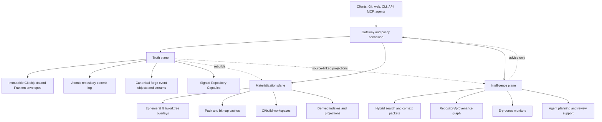

# FrankenGit

> **A Git-compatible, agent-native, repairable code forge designed to make repository state cheaper to serve, harder to lose, easier to verify, and dramatically easier for humans and autonomous software agents to collaborate on.**

[](#project-status)
[](#implementation-doctrine)
[](#git-compatibility-is-a-constitutional-constraint)
[](#deployment-models)
[](LICENSE)

**FrankenGit is a design-stage project. No production implementation exists yet.** This repository begins with the architecture, invariants, protocols, evidence requirements, and execution plan needed to build the system without lying to ourselves about what has already been proved.

The primary design document is:

- [**Comprehensive Plan for the Design of FrankenGit**](COMPREHENSIVE_PLAN_FOR_THE_DESIGN_OF_FRANKENGIT.md)

Supporting contracts:

- [Architecture](ARCHITECTURE.md)
- [Verification Specification](VERIFY_SPEC.md)
- [Security Threat Model](SECURITY_THREAT_MODEL.md)
- [Roadmap](ROADMAP.md)
- [Agent Collaboration Protocol](docs/AGENT_PROTOCOL.md)
- [RaptorQ Permeation Map](docs/RAPTORQ_PERMEATION_MAP.md)
- [Canonical-State ADR](docs/ADR-0001-CANONICAL-STATE.md)
- [Research Provenance](docs/RESEARCH_PROVENANCE.md)
- [Terminology](docs/TERMINOLOGY.md)
- [Initial Public Issue Backlog](docs/INITIAL_ISSUE_BACKLOG.md)
- [Contributor and Agent Instructions](AGENTS.md)
- [Contributing](CONTRIBUTING.md)
- [Security Policy](SECURITY.md)

---

## The thesis

Git is extraordinarily good at representing source history. A modern forge is not merely Git.

A forge must safely coordinate mutable references, pull requests, reviews, issues, build graphs, caches, artifacts, packages, identities, policies, webhooks, search indexes, dependency relationships, thousands of concurrent automation jobs, and an emerging population of software agents that read and modify code continuously. Existing systems generally make one of two compromises:

1. They preserve ordinary Git repositories as the durable unit of truth, then pay the operational cost of keeping those mutable directory trees fast, replicated, backed up, and mutually consistent.
2. They redesign storage for scale, but narrow compatibility, centralize too much coordination, or treat repairability, provenance, and agent behavior as secondary concerns.

FrankenGit takes a third path:

> **Preserve Git semantics at every compatibility boundary, but make the service's durable truth a small, immutable, content-addressed object fabric plus fenced, auditable transactions over references and forge state. Treat POSIX Git repositories, worktrees, indexes, graph projections, and search structures as disposable materializations.**

This is inspired in part by Cursor's account of operating Git at very large scale: ordinary Git is run against disposable local materializations, while immutable object storage and a linearizable write-ahead log provide durable truth. FrankenGit keeps the most important insight—**separating durable truth from disposable Git execution state**—then pushes it further:

- Git object writes are immutable and parallel.
- Read-only work never requires a repository-wide lease.
- Mutable references use narrow, serializable **RefTxns** with explicit read and write sets instead of a coarse repository lock.
- An atomic **Repository Commit Record** can admit the ref delta and canonical forge events together, so a merge decision cannot detach from the branch movement it authorized.
- A signed **Repository Capsule** commits to the recoverable repository state.
- Repository segments, snapshots, backups, and large artifacts have explicit RaptorQ repair contracts.
- Every derived structure is rebuildable from canonical events and immutable objects.
- Agent actions are scoped, budgeted, attributable, replayable, and evidence-carrying.
- Statistical systems such as conformal e-processes may detect drift and gate reversible automation, but never define source-control correctness.
- Every compatibility claim, durability claim, and performance claim must advance through an executable evidence ladder.

FrankenGit aims to be useful in three forms:

1. a single-binary forge for one developer or a small team;
2. a self-hosted, horizontally scalable forge for organizations;
3. a managed service at **FrankenGit.com**, with global object delivery, managed repository cells, elastic agent workspaces, CI, compliance, and operational support.

The self-hosted system is not intended to be a crippled lead-generation edition. Managed FrankenGit should earn revenue by making an intrinsically hard system painless to operate, not by withholding basic correctness.

---

## What FrankenGit is

FrankenGit is intended to become a complete code-collaboration platform:

- Git over SSH and smart HTTP, including protocol v2;
- clone, fetch, push, shallow and partial clone, filters, promisor semantics, LFS interoperability, bundles, and packfile URIs;
- repositories, organizations, teams, permissions, deploy keys, protected refs, and policy rules;
- pull requests, reviews, merge queues, stacked changes, issues, discussions, releases, packages, webhooks, and notifications;
- integrated CI with hermetic execution, deterministic cache keys, attestations, artifact retention, and repairable artifact storage;
- lexical, structural, semantic, historical, and graph-aware search;
- code ownership, dependency and provenance graphs, impact analysis, and source-linked retrieval;
- first-class agent identities, workspaces, intent records, context packets, machine-readable reviews, budgets, and evidence;
- one-node, clustered, multi-region, offline/local-first, and hosted deployment profiles;
- import from and export to ordinary Git without proprietary history conversion.

It is also a research program in how to build a forge whose correctness story remains understandable after the system becomes large.

---

## What FrankenGit is not

FrankenGit is **not**:

- a new source-control language that requires users to abandon Git;
- a blockchain;
- a CRDT reinterpretation of branch heads;
- a claim that RaptorQ replaces hashes, signatures, replication, or backups;
- a claim that e-values prove correctness or identify malicious actors;
- an AI agent with unrestricted access to repositories or secrets;
- a monolithic application database pretending repository bytes are ordinary rows;
- a wrapper around a network filesystem;
- a promise that every GitHub API or workflow will be compatible on day one;
- a pile of named innovations without adversarial tests and measured wins.

The architecture deliberately distinguishes **deterministic truth mechanisms** from **statistical decision support**. Hashes, signatures, transaction preconditions, state-machine rules, and durable acknowledgements determine correctness. Learned systems and e-processes can rank, predict, detect, and recommend; they cannot silently redefine truth.

---

## Project status

| Area | Status | Meaning |
|---|---:|---|
| Product thesis | Drafted | Stable enough for public critique |
| Canonical-state model | Proposed | Invariants specified; formal model not yet checked |
| RefTxn protocol | Proposed | State machine and conflict rules specified |
| Git compatibility | Planned | Conformance matrix defined; no implementation |
| RaptorQ object fabric | Proposed | Permeation and exemption policy drafted |
| Agent protocol | Proposed | Identity, intent, context, evidence, and budget model drafted |
| Security model | Drafted | Threats and trust boundaries enumerated |
| Verification program | Drafted | Evidence ladder and failure campaigns specified |
| Rust implementation | Not started | No production crates yet |
| Hosted service | Not started | Deployment and economic model only |

The word **proposed** is load-bearing. It means “specific enough to attack,” not “already validated.”

---

## Three planes, one narrow truth

FrankenGit separates the system into three planes.



### 1. Truth plane

The truth plane contains only state that cannot be thrown away:

- exact Git object bytes and their Git object identifiers;
- immutable Franken object envelopes and segment manifests;
- admitted ref/forge intents and atomic Repository Commit Records;
- canonical forge event objects and streams for repositories, reviews, issues, policies, identities, artifacts, and packages;
- signatures, attestations, retention records, and legal holds;
- signed Repository Capsules and checkpoint roots.

The truth plane fails closed. A missing precondition, unverifiable object, ambiguous policy version, or broken durability acknowledgement rejects the mutation.

### 2. Materialization plane

The materialization plane exists to make ordinary Git and build tools fast:

- bare repositories;
- packfiles, indexes, commit graphs, reachability bitmaps, and multi-pack indexes;
- sparse and partial worktrees;
- writable overlays for users and agents;
- CI sandboxes;
- local NVMe caches;
- derived relational views.

Every item is disposable. Losing the entire materialization fleet must be an availability event, not a data-loss event.

### 3. Intelligence plane

The intelligence plane helps humans and agents understand the system:

- lexical, fuzzy, structural, semantic, and historical search;
- symbol, dependency, ownership, provenance, review, and build graphs;
- source-linked context packets;
- risk and reviewer routing;
- anomaly and drift monitors;
- bounded autonomous workflows.

It is useful but non-authoritative. Intelligence outputs carry source references, model/configuration identity, uncertainty, and freshness. Stale or failed intelligence may reduce convenience, never mutate canonical history by itself.

---

## Core abstractions

### Franken Object Envelope

Git object identity remains exact. FrankenGit stores an additional immutable envelope around an object or segment:

```text
FrankenObjectEnvelope {
    envelope_version
    repository_namespace
    git_object_format          // sha1 or sha256
    git_oid
    object_type                // blob, tree, commit, tag
    uncompressed_length
    payload_codec
    payload_location
    blake3_payload_digest
    segment_manifest_id?
    merkle_path?
    raptorq_profile?
    encryption_domain?
    provenance
}
```

The envelope does **not** alter the Git object. It adds a fast internal digest, placement and repair metadata, provenance, and cryptographic binding to storage structures. Import and export reproduce the exact Git-visible bytes.

### RefTxn

A `RefTxn` is the sole canonical mechanism for changing one or more references:

```text
RefTxn {
    protocol_version
    repository_id
    transaction_id
    base_capsule
    read_set[]                 // ref -> expected value/absence
    write_set[]                // ref -> new value/delete
    required_objects_root
    actor_capability
    policy_snapshot_hash
    evidence_root?
    idempotency_key
    client_hlc
    signature
}
```

A commit succeeds only if:

1. all named objects are admitted and durably available under the selected acknowledgement profile;
2. authentication and capability checks pass;
3. the exact policy snapshot authorizes the operation;
4. every read-set precondition still holds;
5. no committed overlapping transaction wins first;
6. the atomic Repository Commit Record, its canonical event/ref effects, and resulting capsule become durable;
7. the result is returned idempotently for retries.

Transactions whose read, write, and invariant sets are disjoint do not create false semantic conflicts: they may admit objects, compute effects, prepare, and write independent shard state in parallel. Every accepted transaction still has a precise linearization point; the first implementation may use a tiny per-cell sequencer before a proven sharded-MVCC path is admitted. Atomic multi-ref updates remain atomic, and stale writers are fenced by cell epochs and transaction identity.

The public RefTxn is a command. The canonical result is an internal `RepositoryCommitRecord` that may contain a ref delta, a canonical forge-event batch, or both. For example, merging a pull request commits the protected branch update and `MergeCommitted` event together; search, notifications, webhooks, and CI scheduling remain asynchronous outbox work.

### Repository Capsule

A Repository Capsule is a signed, content-addressed root over recoverable repository state:

```text
RepositoryCapsule {
    capsule_version
    repository_id
    previous_capsule?
    ref_state_root
    object_manifest_root
    forge_stream_roots
    policy_epoch
    retention_epoch
    created_hlc
    signer_set
    signatures
}
```

Capsules make backup, replication, audit, recovery, and migration converge on the same unit. A capsule is not a giant snapshot containing all data; it is a compact commitment to immutable manifests and event positions.

### Evidence-Carrying Change

A pull request or agent change may carry a signed evidence bundle:

- exact base and head capsules;
- intent and declared scope;
- changed paths and semantic symbols;
- build/test commands and hermetic environment identity;
- test results and coverage deltas;
- static-analysis findings;
- generated artifacts and provenance;
- reviewer decisions;
- policy evaluation;
- model/tool identities for agent-generated reasoning;
- unresolved uncertainty and exceptions.

The evidence bundle is additive. It does not make bad code good, and it does not replace human judgment. It makes claims inspectable and reusable.

### Agent Intent Run

An agent never receives “the repository” as an unbounded ambient capability. It receives an `IntentRun`:

```text
IntentRun {
    objective
    constraints
    base_capsule
    allowed_repositories
    allowed_refs
    path_scope
    tool_capabilities
    network_policy
    secret_capabilities
    compute_budget
    token_budget
    wall_budget
    evidence_requirements
    publication_policy
}
```

Every side effect is attributable to the run. Context, tool calls, generated changes, tests, failures, and publication attempts form an immutable lineage.

### Context Packet

A Context Packet is a bounded, source-linked answer to “what does this worker need to know?” It may combine:

- exact file ranges;
- relevant symbols and callers;
- recent changes and reviews;
- ownership and policy;
- issues and incidents;
- build/test dependencies;
- architecture documentation;
- explicit omissions and retrieval budgets.

Packets are generated by FrankenSearch and FrankenGraphDB projections, normalized through safe Markdown structures, and pinned to a Repository Capsule so the recipient can detect staleness.

---

## Why this should be better for agents

GitHub and conventional forges were designed around a human opening a browser, reading a diff, and initiating a small number of workflows. Agents change the workload shape:

- many short-lived workers inspect the same repository;
- speculative branches vastly outnumber merged branches;
- context extraction can dominate useful work;
- each worker needs a narrow writable view rather than a complete clone;
- automated reviews need stable, machine-readable evidence;
- branch, build, and artifact churn becomes enormous;
- ambient credentials and untrusted repository instructions create new security hazards;
- retry and cancellation behavior must be exact because agents are routinely interrupted;
- the system must tell the difference between a claim, a test result, an inference, and a durable fact.

FrankenGit addresses that workload directly:

1. **Instant workspaces from immutable bases.** A worker receives a sparse, copy-on-write overlay backed by local cache and promisor fetch, not a full clone.
2. **Repository-aware context service.** Search and graph projections produce compact, cited packets instead of repeatedly scanning the tree.
3. **Capability security.** A worker can read one capsule, modify selected refs and paths, use selected tools, and spend a bounded budget without receiving a universal token.
4. **Structured concurrency.** Agent jobs, CI children, fetches, subprocesses, leases, uploads, and cleanup obligations live in explicit Asupersync regions. Cancellation cannot orphan untracked work.
5. **Evidence as a protocol.** Tests, provenance, reviews, and uncertainty are addressable records rather than prose hidden in a comment.
6. **Cheap speculation.** Immutable object deduplication, overlay workspaces, parallel object admission, and delayed materialization make abandoned branches inexpensive.
7. **Deterministic replay.** A failed run can be replayed against the same capsule, policies, tool versions, and inputs.
8. **Separation of proposer and verifier.** Policies can require independent agents, humans, or hermetic jobs to verify a change before publication.
9. **Prompt-injection containment.** Repository content is tainted data, not system instruction. Tool grants and publication authority are out-of-band capabilities.
10. **No agent-only lock-in.** Every accepted result is ordinary Git content and forge state that humans can inspect and export.

---

## Durability and repair

FrankenGit does not equate “uploaded once” with “durable.”

Each deployment defines explicit acknowledgement profiles, for example:

| Profile | Push acknowledgement requirement | Intended use |
|---|---|---|
| `local-dev` | local fsync plus verified journal | laptop and test deployments |
| `single-region-safe` | canonical log plus replicated object durability across failure domains | normal self-hosted/hosted default |
| `multi-region-safe` | home-region commit plus verified remote capsule/object threshold | high-value repositories |
| `archive` | immutable retention copy plus independently verifiable recovery material | releases, legal and disaster recovery |

For bulk data, FrankenGit uses a **repair-aware object fabric**:

- source bytes remain directly readable because RaptorQ is systematic;
- repair symbols are generated for repository segments, checkpoint objects, large artifacts, and transfer batches;
- symbols are placed across declared failure domains;
- repair budgets adapt to observed loss, latency, and cost;
- every decode is verified against BLAKE3/Merkle commitments and, where required, signatures;
- a full reconstruction test—not merely parity generation—is required before a format can claim repairability.

RaptorQ is not forced onto tiny objects or latency-sensitive metadata where replication and a transaction log are superior. Every durable byte channel is classified as `MUST_ENCODE`, `MAY_ENCODE`, or `EXEMPT_WITH_JUSTIFICATION` in the [permeation map](docs/RAPTORQ_PERMEATION_MAP.md).

Scrubbing, reconstruction, and migration are ordinary background protocols. `frankengit doctor` is expected to prove whether a capsule is recoverable, identify missing or suspect material, fetch or reconstruct it, and emit a signed repair report.

---

## Conformal e-processes: useful, bounded, non-magical

FrankenGit inherits the Franken family’s interest in conformal inference and e-values, but gives them a narrow charter.

E-processes are useful for continuously monitored questions such as:

- has object corruption or repair demand increased?
- did a new packer or cache policy worsen tail latency?
- is a CI test becoming flaky?
- did a merge policy increase rollback incidence?
- is an index generation drifting from the control?
- is a tenant’s workload showing a statistically unusual abuse pattern?

An e-process can remain valid under continuous observation and optional stopping, which is valuable for services that inspect metrics indefinitely. But it cannot prove a repository is correct, authenticate a user, or establish malicious intent.

Every automated response driven by statistical evidence must declare:

- the null and alternative;
- calibration and exchangeability assumptions;
- evidence process and reset/version rules;
- action thresholds;
- maximum reversible action;
- escalation and human override;
- source metrics and missingness behavior;
- replayable decision record.

Irreversible actions such as deleting canonical data, permanently banning an identity, or publishing an unreviewed protected-branch change cannot rest solely on a statistical detector.

---

## Git compatibility is a constitutional constraint

FrankenGit intends to interoperate with normal Git clients and repositories.

The compatibility boundary includes:

- exact blob, tree, commit, and tag semantics;
- SHA-1 and SHA-256 repository formats, with explicit mappings rather than a hidden hash substitution;
- receive-pack and upload-pack behavior;
- protocol v2 capability negotiation;
- atomic push semantics and push certificates where supported;
- shallow and partial clone;
- promisor remotes and demand fetching;
- pack, bundle, LFS, and packfile-URI interoperability;
- hooks and policy adapters;
- deterministic import/export and `git fsck` compatibility.

FrankenGit may use BLAKE3, canonical CBOR, Merkle trees, RaptorQ manifests, signatures, and event logs internally. None of those change a Git object’s externally visible bytes or identifier.

The compatibility doctrine is:

> **Innovate around Git's durable serving model, forge semantics, verification, and agent interfaces; do not casually fork the object model users depend on.**

Where native FrankenGit protocols offer stronger capabilities, they are additive. The escape hatch remains a standard Git repository.

---

## Concurrency model

Cursor’s large-scale architecture describes a lease around repository operations. FrankenGit’s target is narrower coordination:

- immutable object admission is parallel and idempotent;
- read-only operations are lease-free and snapshot-pinned;
- independent workspaces are isolated overlays;
- ref mutations declare read/write sets;
- disjoint ref transactions do not conflict semantically, while the implementation preserves an explicit linearization point;
- overlapping transactions are serialized by deterministic conflict resolution;
- policy evaluation is pinned to a policy snapshot;
- multi-ref invariants are represented explicitly;
- derived projections consume committed events asynchronously.

This is not “lock-free Git.” Some operations genuinely conflict. The goal is to coordinate only the mutable names and policies that require coordination, rather than treating an entire repository as one mutex.

A future parallel-delta path may execute multiple Git operations against a shared base and merge their declared effects only after deterministic conflict checks. It will not be admitted until its semantics are observationally equivalent to the reference path across the conformance corpus.

---

## Deployment models

### Personal

One process, one local metadata database, one object directory, optional FUSE/workspace service, built-in web UI, and local runners. The personal profile should remain understandable and backupable with ordinary files.

### Team

A small set of stateless gateways and workers, FrankenSQLite metadata where appropriate, S3-compatible object storage, local NVMe caches, and optional external identity provider.

### Clustered

Repository Cells partition canonical ownership. Each cell has:

- a small ref/forge sequencer quorum or a storage primitive satisfying the required conditional-write contract;
- object admission and validation workers;
- capsule/checkpoint production;
- local materialization workers;
- cache and scrub services;
- explicit failure-domain placement.

Cells bound blast radius. Cross-cell services consume immutable events and cannot mutate repository truth directly.

### Multi-region

The first safe multi-region profile assigns each repository a home region for strongly ordered mutations while allowing global immutable-object reads, cached materializations, search, and read-only operations. Remote durability acknowledgements are explicit.

More aggressive branch-home or multi-writer regional schemes are research items, not launch assumptions. They require a proof that atomic multi-ref semantics, policy evaluation, and failover remain understandable.

### Managed FrankenGit.com

The managed service adds:

- global routing and object delivery;
- managed repository cells and upgrades;
- elastic workspace and CI fleets;
- managed encryption keys or BYOK;
- compliance, audit export, retention, and legal hold;
- global repair monitoring;
- managed runners and artifact caches;
- SSO, SCIM, policy packs, and support;
- metering and budget controls;
- migration tooling and compatibility support.

The economic objective is to charge for durable bytes, active compute, transfer, CI, advanced operations, and support in ways that map to actual cost. Seat pricing may exist for enterprise packaging, but idle human accounts should not be the only unit of value in an agent-heavy world.

---

## Implementation doctrine

The planned implementation is Rust 2024 with a deliberately layered workspace.

The constitutional defaults are:

- `unsafe_code = "forbid"` at the workspace level;
- named, tiny, separately audited unsafe boundary crates only when measurement proves they are necessary;
- no C or C++ dependency in the canonical core;
- Asupersync rather than Tokio for structured concurrency, cancellation, budgets, capabilities, deterministic simulation, and obligations;
- typed refusals instead of panics in service paths;
- canonical encodings for every hashed or signed structure;
- dependency admission by explicit marginal-value and supply-chain review;
- no production crate until it owns a real vertical slice;
- deterministic test clocks, RNG streams, and fault schedules;
- no silent fallback from a strong durability or policy mode to a weaker one;
- source-compatible schemas with versioned migrations;
- generated API clients from checked-in schemas;
- separate truth, materialization, and intelligence dependency layers.

A prospective crate map appears in the comprehensive plan. Names are not commitments until the relevant vertical slice is ready.

---

## Verification before velocity

FrankenGit’s claims will use an evidence ladder:

| Level | Evidence |
|---|---|
| E0 | design statement with assumptions and falsifier |
| E1 | unit, golden, property, and parser/codec tests |
| E2 | deterministic simulation with crashes, cancellation, loss, delay, and reorder |
| E3 | differential and conformance testing against Git/reference implementations |
| E4 | multi-node fault campaigns, storage faults, partitions, and recovery drills |
| E5 | production canaries, SLO evidence, independently recoverable backups, and rollback history |

A feature’s maturity is the lowest evidence level across its critical claims.

Examples:

- “RaptorQ enabled” is not evidence. A corrupted/missing-symbol reconstruction followed by digest verification is.
- “Git compatible” is not evidence. A versioned corpus of fetch/push/merge/filter/shallow/partial/signature behaviors is.
- “Crash safe” is not evidence. Exhaustive or systematically sampled crash points with deterministic replay are.
- “Agent safe” is not evidence. Capability-boundary, prompt-injection, secret-exfiltration, cancellation, and publication tests are.
- “Faster” is not evidence. Reproducible workloads, hardware, baselines, confidence intervals, and cost accounting are.

See [VERIFY_SPEC.md](VERIFY_SPEC.md).

---

## Target SLOs

These are design targets, not current measurements.

| Operation | Initial target |
|---|---:|
| Cached ref read, p99 | < 10 ms within region |
| Cached small-file read, p99 | < 20 ms within region |
| Read-only workspace creation from cached capsule, p99 | < 250 ms |
| Writable sparse overlay creation, p99 | < 500 ms |
| RefTxn commit, single-region-safe p99 | < 150 ms excluding client upload |
| Push acknowledgement after required objects arrive, p99 | < 500 ms for metadata phase |
| Cell failover RTO | < 10 s |
| Acknowledged canonical RPO | 0 by contract |
| Derived search freshness, p99 | < 5 s |
| Context Packet from warm indexes, p95 | < 1 s |
| Capsule verification for 99% of repos | < 1 s metadata-only |
| Lost-cache rebuild | bounded by object fetch; no canonical loss |
| Quarterly full recovery exercise | 100% of sampled capsules recoverable |

No target is a promise until an evidence artifact records the workload, environment, and result.

---

## Economic model

FrankenGit is designed around a simple observation: repository **truth** is usually small relative to all of the copies, packs, worktrees, CI directories, indexes, and artifacts created to operate on it.

Let:

- \(B_c\) be canonical immutable bytes;
- \(B_r\) be replication and repair overhead;
- \(B_m\) be materialized/cached bytes;
- \(C_o\) be object-store cost;
- \(C_n\) be NVMe/cache cost;
- \(C_x\) be compute cost;
- \(H_m\) be cache hit rate;
- \(A\) be active operations.

A conventional always-materialized system tends toward cost proportional to persistent copies of \(B_c + B_m\). FrankenGit targets:

\[
C \approx C_o(B_c + B_r) + C_n(B_m^{hot}) + C_x(A, 1-H_m)
\]

The architecture wins only if:

1. canonical segments avoid pathological small-object overhead;
2. cache hit rates are high enough to keep ordinary Git fast;
3. materialization is incremental and partial;
4. repair overhead is lower than equivalent full-copy replication for the relevant failure model;
5. coordination does not serialize unrelated work;
6. background indexing and agent context avoid repeatedly re-reading the world;
7. operations and recovery remain simpler than the cost they remove.

The benchmark program will measure dollars as well as latency.

---

## Repository layout

```text
frankengit/
├── README.md
├── COMPREHENSIVE_PLAN_FOR_THE_DESIGN_OF_FRANKENGIT.md
├── ARCHITECTURE.md
├── VERIFY_SPEC.md
├── SECURITY_THREAT_MODEL.md
├── SECURITY.md
├── ROADMAP.md
├── AGENTS.md
├── CONTRIBUTING.md
├── LICENSE
├── bootstrap_github_repo.sh
└── docs/
    ├── ADR-0001-CANONICAL-STATE.md
    ├── AGENT_PROTOCOL.md
    ├── RAPTORQ_PERMEATION_MAP.md
    ├── RESEARCH_PROVENANCE.md
    ├── TERMINOLOGY.md
    └── INITIAL_ISSUE_BACKLOG.md
```

Implementation crates will be added only as their first vertical slices are accepted.

---

## Near-term design questions

The plan deliberately leaves several choices open until prototypes and formal models produce evidence:

1. Which minimal linearizable primitive should back RefTxn commits across supported object stores?
2. Should the first distributed metadata engine use FrankenSQLite with a replicated log, a purpose-built sequencer, or both behind a conformance interface?
3. What segment sizes and RaptorQ profiles minimize cost without damaging small-object latency?
4. How much of receive-pack should be implemented directly in Rust versus executed through a sandboxed reference Git path during bootstrapping?
5. Which GitHub API and Actions behaviors are sufficiently important to emulate exactly?
6. What is the smallest useful offline/local-first forge state that can causally merge without weakening ref semantics?
7. How should source-linked Context Packets expose retrieval uncertainty and omitted context?
8. Which evidence is mandatory for autonomous merge under each policy class?
9. What multi-region semantics are worth their operational complexity?
10. Which parts of the project-family license should be revisited before a stable release to make the intended open-source and commercial posture unambiguous?

Open questions are tracked as decisions with owners, evidence requirements, and expiration conditions—not buried as TODOs.

---

## Principles for public iteration

A proposal is welcome when it does at least one of the following:

- identifies a violated invariant or unhandled failure;
- reduces the trusted computing base;
- preserves semantics with less coordination or lower cost;
- strengthens recovery or conformance evidence;
- improves agent or human ergonomics without weakening authority boundaries;
- supplies a reproducible benchmark;
- replaces a statistical guess with a deterministic mechanism;
- narrows an overbroad claim;
- demonstrates that an innovation does not earn its complexity.

Proposals that merely add another subsystem, acronym, model, database, or abstraction should expect a high burden of proof.

See [CONTRIBUTING.md](CONTRIBUTING.md).

---

## Lineage

FrankenGit is a synthesis of lessons from:

- [Asupersync](https://github.com/Dicklesworthstone/asupersync): structured concurrency, capabilities, typed outcomes, obligations, deterministic simulation, evidence and decision modules, and adaptive RaptorQ transfer;
- [FrankenSQLite](https://github.com/Dicklesworthstone/frankensqlite): transactional storage, MVCC, WAL discipline, critical invariants, repair contracts, and RaptorQ permeation;
- [FrankenFS](https://github.com/Dicklesworthstone/frankenfs): immutable blocks, snapshots, versioned state, signed roots, conflict and repair tooling, and filesystem materialization;
- [FrankenSearch](https://github.com/Dicklesworthstone/frankensearch): hybrid retrieval, evidence fusion, source-linked answer windows, tiered storage, durable indexes, and bounded agentic retrieval;
- [Franken Markdown](https://github.com/Dicklesworthstone/franken_markdown): deterministic safe parsing/rendering, source maps, human/agent/compact profiles, resource caps, and structured document extraction;
- [FrankenGraphDB](https://github.com/Dicklesworthstone/frankengraphdb): event-sourced causal state, canonical encoding, content-addressed segments, checkpoints, graph projections, calibration, evidence registries, and spec-first systems engineering;
- [Cursor, “Git at Any Scale”](https://cursor.com/blog/git-at-any-scale): disposable Git materializations backed by immutable object storage and a durable linearizable log;
- Git’s own protocol, partial-clone, pack, commit-graph, and hash-transition designs;
- RaptorQ as standardized in [RFC 6330](https://www.rfc-editor.org/rfc/rfc6330.html);
- the anytime-valid inference literature on e-values, e-processes, and confidence sequences.

The goal is not to paste these systems together. It is to extract their strongest invariants, give each mechanism a sharply bounded job, and produce a forge whose whole is simpler to reason about than an accidental stack of services.

---

## License

This repository uses the same **MIT License with OpenAI/Anthropic Rider** used by the related Franken projects. The rider adds restrictions beyond the standard MIT license; read [LICENSE](LICENSE) before use or redistribution.

The licensing posture is itself an explicit design topic before stable release because “open source,” broad ecosystem adoption, hosted-service defensibility, and the existing family rider are not automatically the same objective. The repository does not conceal that tension.

---

## Current call to action

Read the [comprehensive plan](COMPREHENSIVE_PLAN_FOR_THE_DESIGN_OF_FRANKENGIT.md) critically.

The most valuable early contributions are counterexamples:

- an execution history that breaks RefTxn semantics;
- a Git behavior the compatibility model cannot express;
- an object-loss pattern the repair contract cannot recover;
- a multi-region failure that creates ambiguous truth;
- a capability path that lets an agent exceed its authority;
- an economic workload where the design is predictably worse;
- a simpler architecture that preserves the same guarantees.

FrankenGit should earn its ambition one falsifiable claim at a time.
